## General  
- percentage sterile females (%S) = (number of sterile females/total number of females)*100
    - stage 2-4 females are sterile
- mean Female Penis Length (FPL)
- mean Male Penis Length (MPL)
For N. lapillus,
- Relative Penis Size Index (RPSI) = (FPL)3/(MPL)3*100 
- imposex index (VDSI) = (sum of the values of imposex stages (ranged 0 to 5) in all females/the number of females collected)  
For B. undatum
- Penis Classification Index (PCI) after Strand and Jacobsen (2002)

## Figures  
- All figures have 'FIG' in the filename (and so can easily be searched)

#### Modification 1  
From Merete 20.11.2019
Du er absolutt ikke tungnem, Dag. Det er heller jeg som ikke har fullstendig oversikt når jeg ikke har jobbet med det på en stund. Jeg har kikket nærmere på dette, og vi bør beholde PRL (prostatalengde), men heller kalle det FPrL (average female prostate length= sum of prostate lengths (mm) of all sampled/number of females) i figurene 3 b og c. Vi bytter TBT fra y-aksen til x-aksen i figur 3 c (det fungerte godt i imposex-artikkelen vår).

Hannen til strandsneglen kan kaste penis, derfor tror jeg ikke at det blir brukt RPLI (Relative Penis Length Index). Men det ser ut til å være en peniskjertelindeks (PKI) som Lise har regnet ut. PKI = Σ ant. peniskjertler hos alle innsamlede hanner/antall hanner. Vi kan vente litt med dette og evt. heller ta det med i artikkelen. Jeg kommer ikke til å ta det med i abstractet til SETAC

Hvis du har tid, er det signifikante trender for både TBT og ISI (der hvor det er nok data for utregning)?
Er det god korrelasjon (Kendall?) mellom TBT og ISI, TBT og FPrL og ISI og FPrL?

Så spennende å være på møte med TBT-ekspert. Jeg skal tenke på om jeg har noen spørsmål. Her går det i justering av MILKYS-rapport.

Takk for god hjelp, Dag! 😊


#### Modification 2  
From: Merete Schøyen  
Sent: tirsdag 7. april 2020 17:08  
  
Jeg lurer på om du kan justere figuren nedenfor. Følgende må gjøres:  
1. Vi slår sammen st. 5 og st. 5B og kaller stasjonen «Skjeviga».   
2. Vi tar bort alle stasjonsnummerene, og kaller Håøya for «Reference station», Hasseldalen for «Outer Vikkilen», «Shipyard» og «Inner Vikkilen» heter det samme.  
3. Vi tar bort den stiplede røde linjen for 2016. Den markerer sedimenttiltak, men nedgangen skjer før tiltaket i 2016. Nedgangen skyldes heller forbudet i 2008, og redusert aktivitet på verftet frem til fjerning av tørrdokka i 2012.  
4. Vi vil gjerne at avstanden måles fra Shipyard, slik at denne er 0 km. Vi har et TBT-resultat til for Skjeviga, og når den slås sammen med Båtstø så får vi inn stiplet svart linje.  

#### Modification 3a  
From: Merete Schøyen <merete.schoyen@niva.no> 
Sent: fredag 12. juni 2020 16:35

Jeg jobber (i sommervarmen) med intersex-artikkelen for Vikkilen, og lurer på om du kan justere korrelasjonsfigurene nedenfor ved å slå sammen stasjonene 5 og 5 b, slik du gjorde for ISI-TBT i SETAC-presentasjonen? Da skal stasjonene hete: Reference station, Outer Vikkilen, Skjeviga, Shipyard og Inner Vikkilen. Kendall korrelasjonene vil kanskje endre seg da.
`06_Correlations_Litt_ISI_vs_PRL_col.png`
(Part 4 'PRL_mean vs. ISI')
`06_Correlations_Litt_PRL_vs_TBT_col.png`
(Part 4 'PRL_mean vs. TBT')

Har du også mulighet for å slå sammen 5 og 5 b for all biota samlet? Jeg tror at vi lar stasjonene 2 og 3 med kun blåskjell utgå. Samme stasjonsnavn her: Reference station (5.5 km), Outer Vikkilen (1.5 km), Skjeviga (0.1 km), Shipyard (0 km) og Inner Vikkilen (0.5 km).
`06_Timeseries_allsp_TBT_2_log.png`
(Part 8 'Plot biota TBT at all stations (logistic)')

#### Modification 3b  

From: Merete Schøyen <merete.schoyen@niva.no> 
Sent: torsdag 18. juni 2020 15:23

Dette var fint! Kan du likevel justere figurene mht. dette:
•	ISI og ikke ISE (på korrelasjonsfiguren ISI-FPrL).
•	Ikke mean TBT, er vel bare basert på kun én blandprøve, så dropp mean. Det kan også bare stå ISI og FPrL og ikke mean (det ligger i definisjonene).
•	Figurtekst L. littorea. N. reticulatus, B. undatum, N. lapillus ( i denne rekkefølgen), istedenfor Buccinum, Littorina, Nassarius og Nucella. Dropp Station i figurtekstene.

Kan du også lage en ny korrelasjonsfigur med samme layout for ISI og TBT?
Hva er Kendall korrelasjonene nå for ISI-TBT, ISI-FPrL og FPrL-TBT?


#### Modification 4 (Dec 2020)  
Se mail, mappe 'Oppdatering sept2020' og notater i 'Manuscript intersex-versjon37.docx'   
* Difference in data: 
    - added 71G to 'dat_intersex_litt_summ' (section 3 c1b)  
    - also changed station levels (section 0d, plus the script "06_Tables_graphs_functions.R" used in section 6-8)  


#### Updated list of figures     
* All figure file names have "FIG" in name, e.g. '06_Correlations_combined_color_FIG5.png'   

Changes done before this version (may still be some wrong numbers used):   
* Old 2a changed to just "2"
* Old 2b changed to "4"
* adding new "timeseries of ISI and VDSI" figure as new "Fig. 3"   
* figures 4-6 -> 5-7  

* Fig. 1 - map    
* Fig. 2 (old 2a)     
    - 06_Timeseries_Comb_ISI_TBT_bw_FIG2.png  
    - section 7, 'Plot ISI + TBT, B/W'    
* Fig. 3 VDSI for Nassarius reticulatus (nettsnegl)
    - time series for VDSI (N. reticulatus) overlaid with ISI (for Littorina)   
    - section 7, 'Plot ISI + VDSI, B/W'  
* Fig. 4 (old 2b)   
    - section 6, 'Plot PRL at all stations'   
* Fig. 5 (was fig. 3)    
    - section 4, 'Combined plot'  
* Fig. 6 (was fig. 4)   
    - 06_Timeseries_allsp_TBT_2_log.png   
    - section 8, 'Plot biota TBT at all stations (logistic)'   
* Fig. 7a (graph)
    - Script '07_Sediment_newfile_July2020.Rmd'
* Fig. 7b (map)
    - Script '07_Sediment_newfile_July2020.Rmd' + additional text added in Paint 
    

#### Modification 5 (May 2021, asked for in mails 12.04 and 28.04)  

* Figur 2. Kan du erstatte figurtekstene «Reference station 1» med «Reference station Langesundfjord» og «Reference station 2» med «Håøya»? Kan du fjerne linjer i bakgrunnen slik at den blir helt hvit?  **OK** 
*	Figur 3. Kan du lage en figur hvor ISI er på det primære y-aksen og VDSI er på den sekundære y-aksen? Inkludere «Reference station Langesundfjord». Bruke samme rekkefølge som for Figur 1, dvs. fra Inner Vikkilen til Reference station Langesundfjord. Samme layout som Figur 1. **OK**
*	Figur 4, samme bakgrunn og layout (på alle figurer). **OK**
*	Figur 5, fjerne grå bakgrunn.  **OK**  
*	Figur 6
    - reversere stasjonene og bytte «Reference station 2» med «Håøya»
    - Inkludere TBT i L. littorea fra referansestasjon Langesundfjord.   
    - Benevning/enhet mangler på y-aksen. 
    - Bytte ut «TBT concentration» med «µg TBT/kg w.w.». 
    - Fjerne grå bakgrunn. 
    - Fjerne kongssnegl og purpursnegl (behlde strandsnegl og nettsnegl N. reticulatus)  
*	Figur 7, fjerne grå bakgrunn på grafene. Bytte ut «Wharf» med «Shipyard».

Jeg vil gjerne sette inn %I i Tabell 1. Har du disse tallene et sted slik at jeg kan sette dem inn i? Jeg kunne også tenkt meg å sjekke at verdiene i gult samsvarer med de som du har brukt. Jeg kan sjekke dette selv hvis du sender meg stien til dataene dine.  

#### Modification 6 (June 2021, asked for in mail 31.05.2021)  

* Added intersex data for 2021  
    - Mail from Lise 25.5.2021 (forwarded from Merete 31.05)  
    - Data from four stations collected, Intersex = 0 for all
    - Collection dates: st. 4 and 7 5.5.2021, st 1 Håøya and st. 6 Nymo collected 16.5.2021   
    - Data added to summary data in part 3.c2
    - TBT not analysed yet (checked using '03_Check_chemistry_data_update2021.R')      

#### Modification 7 (3. July 2021)
    - added 2013 data for N reticulatus - see 1c 

## 0. Libraries

```r
library(dplyr)
```

```
## 
## Attaching package: 'dplyr'
```

```
## The following objects are masked from 'package:stats':
## 
##     filter, lag
```

```
## The following objects are masked from 'package:base':
## 
##     intersect, setdiff, setequal, union
```

```r
library(purrr)    # transpose
library(ggplot2)
library(tidyr)
library(forcats)
library(cowplot)
```

```
## 
## ********************************************************
```

```
## Note: As of version 1.0.0, cowplot does not change the
```

```
##   default ggplot2 theme anymore. To recover the previous
```

```
##   behavior, execute:
##   theme_set(theme_cowplot())
```

```
## ********************************************************
```

```r
library(readxl)

# install.packages("openxlsx")
library(openxlsx)

source("06_Tables_graphs_functions.R")
```

## 0b. Settings

```r
save_plots <- TRUE
save_plots <- FALSE

# Back up table (if needed)
if (FALSE){
  
  file.copy("Figures/06_Littorina_tables.xlsx", "Figures/06_Littorina_tables_back_2021-06-21.xlsx")
  
}
```


## 0c. Make 5-color palette  

```r
# library("colorspace") 
# The line below: run it in the Console (bottom window), NOT here (RStudio will hang)
# pal <-choose_palette()

library(pals)

if (FALSE){
  labs=c('alphabet','alphabet2', 'glasbey','kelly','polychrome', 
         'stepped', 'stepped2', 'stepped3', 'tol', 'watlington')
  op=par(mar=c(0,5,3,1))
  pal.bands(alphabet(), alphabet2(), glasbey(), kelly(), polychrome(), 
            stepped(), stepped2(), stepped3(), tol(), watlington(), 
            labels=labs, show.names=FALSE)

  pal.bands(tol(5), glasbey(5), kelly(7)[3:7])
  pal.bands(brewer.blues(4), brewer.reds(4))

  }


station_cols <- c(
  brewer.blues(4)[c(4,3,2)], 
  brewer.reds(6)[c(6,4,2)])
pal.bands(station_cols)
```

<!-- -->

## 0d. Station names    
* 'Station_name' mostly used  
* 'Station_name2' used in part 8 ('TBT - all species')    

```r
# OLD (before we combined st. 5 and 5b)
st_names <- data.frame(
  Station = c("1", "4", "5", "5b", "6", "7"),
  Station_name = c("St. 1 Håøya, Outer fjord", "St. 4 Hasseldalen", "St. 5 Skjeviga", 
              "St. 5B Båtstø", "St. 6 Shipyard", "St. 7 Inner Vikkilen")
)

# NEW (after combining st. 5 and 5b)
# NOTE: tuis was also changed in the script "06_Tables_graphs_functions.R", used from section 6 onwards
st_names <- data.frame(
  Station = c("71G", "1", "4", 
              "5", "6", "7"),
  Station_name = c("Reference station\nLangesundfjord (100 km)", "Håøya (5.5 km)", "Outer Vikkilen (2.5 km)", 
                   "Skjeviga (0.6 km)", "Shipyard (0 km)", "Inner Vikkilen (0.5 km)"),
  Station_name2 = c("Reference station\nLangesundfjord (100 km)", "Håøya (4-6 km)", "Outer Vikkilen (2 km)", 
                    "Mid Vikkilen (0.8 km)", "Shipyard (0 km)", "Inner Vikkilen (0.5 km)"),
  stringsAsFactors = FALSE
  ) %>%
  mutate(
    Station_name = fct_inorder(Station_name),  # set as factor, for correct order
    Station_name2 = fct_inorder(Station_name2)
  )

# Reverse direction
st_names$Station_name <- factor(st_names$Station_name, 
                                levels = rev(levels(st_names$Station_name)))
st_names$Station_name2 <- factor(st_names$Station_name2, 
                                levels = rev(levels(st_names$Station_name2)))

names(station_cols) <- st_names$Station_name

st_names_mytilus <- tibble::tribble(
    ~Station_Myt, ~Station_name,  ~Station_name2, 
    "b1", "Rivingen (6.4 km)",          "Håøya (4-6 km)", 
    "b2", "Groos (4.0 km)",             "Håøya (4-6 km)",
    "b3", "Grimstadodden (2.4 km)",     "Outer Vikkilen (2 km)",
    "b4", "Biodden (2.1 km)",           "Outer Vikkilen (2 km)",
    "b5", "Kjellviga (1.6 km)" ,        "Outer Vikkilen (2 km)",
    "b6", "Naksbø (1.1 km)",            "Mid Vikkilen (0.8 km)",
    "b7", "Bie (0.8 km)",               "Mid Vikkilen (0.8 km)",
    "b8", "Gjømle/Skjevika (0.6 km)",   "Mid Vikkilen (0.8 km)",
    "b9", "Shipyard (0 km)",            "Shipyard (0 km)", 
    "b10", "Inner Vikkilen (0.5 km)",   "Inner Vikkilen (0.5 km)"
  ) %>%
  mutate(
    Station_name = fct_inorder(Station_name),  # set as factor, for correct order
    Station_name2 = fct_inorder(Station_name2)
  )
```


## 1. Data

### a. Intersex and TBT data  
16 April 2020: 
- Combine 5 and 5B

```r
#
# Data made in script 02
#
dat_intersex_litt <- readRDS(file = "Data/02_Strandsnegl_intersex_2005_2018.RData") %>%
  mutate(Station = case_when(Station %in% "St6" ~ "6",
                             TRUE ~ Station),
         Sex = case_when(tolower(Sex) %in% "f" ~ "f",
                         tolower(Sex) %in% "m" ~ "m",
                         TRUE ~ "x")
         )

#
# Data made in script 05
#
dat_tbt <- readRDS(file = "Data/05_TBT.RData")

# Summarise TBT
dat_tbt_mean <- dat_tbt %>% 
  mutate(Station = case_when(
    Station %in% "5b" ~ "5",
    Station != "5b" ~ Station
  )) %>% # View()
  group_by(Species, Station, Year) %>%
  summarise(TBT_mean = mean(TBT, na.rm = TRUE), TBT_flag = mean(TBT_flag %in% "<"),
            .groups = "drop")

cat("TBT in Littorina, raw data \n")
```

```
## TBT in Littorina, raw data
```

```r
dat_tbt %>% 
  filter(Station %in% c("1","4","5","5b","6","7") & Species == "Littorina") %>%
  xtabs(~Year + Station, .)
```

```
##       Station
## Year   1 4 5 5b 6 7
##   2005 0 1 0  0 1 1
##   2007 0 0 0  1 1 1
##   2009 0 0 0  0 1 0
##   2010 0 0 0  1 1 1
##   2011 1 1 1  1 1 1
##   2013 0 1 0  0 1 1
##   2014 0 1 0  0 1 1
##   2016 1 1 0  0 1 1
##   2018 1 1 0  0 1 1
```

```r
cat("\n")
```

```r
cat("TBT in Littorina, number of means, 5 and 5B combined \n")
```

```
## TBT in Littorina, number of means, 5 and 5B combined
```

```r
dat_tbt_mean %>% 
  filter(Station %in% c("1","4","5","5b","6","7") & Species == "Littorina") %>%
  xtabs(~Year + Station, .)
```

```
##       Station
## Year   1 4 5 6 7
##   2005 0 1 0 1 1
##   2007 0 0 1 1 1
##   2009 0 0 0 1 0
##   2010 0 0 1 1 1
##   2011 1 1 1 1 1
##   2013 0 1 0 1 1
##   2014 0 1 0 1 1
##   2016 1 1 0 1 1
##   2018 1 1 0 1 1
```

```r
# str(dat_tbt_mean)
```


### b. Add station names, snails + sediment only      
Don't include Mytilus (blue mussel, because they use a seperate set of stations, Station_Myt, see script 05)  

```r
dat_tbt_mean_snails <- dat_tbt_mean %>%
  filter(!Species %in% "Mytilus") %>%
  left_join(st_names, by = "Station")

str(dat_tbt_mean_snails)
```

```
## tibble[,7] [94 x 7] (S3: tbl_df/tbl/data.frame)
##  $ Species      : chr [1:94] "Buccinum" "Buccinum" "Buccinum" "Buccinum" ...
##  $ Station      : chr [1:94] "4" "4" "6" "6" ...
##  $ Year         : num [1:94] 2013 2014 2013 2014 2011 ...
##  $ TBT_mean     : num [1:94] 4.2 3.1 19.9 201 5 1 1.4 NaN 30.4 31 ...
##  $ TBT_flag     : num [1:94] 0 0 0 0 0 0 0 0 0 0 ...
##  $ Station_name : Factor w/ 6 levels "Inner Vikkilen (0.5 km)",..: 4 4 2 2 5 5 5 4 4 4 ...
##  $ Station_name2: Factor w/ 6 levels "Inner Vikkilen (0.5 km)",..: 4 4 2 2 5 5 5 4 4 4 ...
```

### c. Imposex in N. reticulatus (nettsnegl)   

2013 data  
* Supplied later, in a separate file  

```r
colnames <- c("Nr", "Code", "SH", "AH", 
"Te", "VS", "Pr", "Vd", "Pe_gl", "Gen_excr", "Other_excr", 
"Paras",
"O", "Od", "Ag", "Ig", "Cg", "Vag", "in.Od", "stage", "type", 
"male", "Kommentar")

columntypes <- c(Nr = "numeric", Code = "text", 
                   SH = "numeric", SB = "numeric", yr = "numeric", VS = "text", 
                   Pr = "text", Vd = "text", Pe_gl = "numeric", P_P = "numeric", 
                   Gen_excr = "numeric", Other_excr = "numeric", O = "text", 
                   Od = "text", Ag = "text", Ig = "text", Cg = "text", 
                   Vag = "text", in.Od = "text", stage = "numeric", type = "text", 
                   male = "numeric", Kommentar = "text")


fn <- "Input_data/Nettsnegl-Nassarius-Hinia/imposexskjema 2013_hinia.xls"

sheet <- "7_13"
df_07 <- read_excel(fn, sheet = sheet, range = "A8:W58", 
                    col_names = colnames, col_types = columntypes) %>%
  mutate(Sheet = sheet, 
         Station = "7",
         Year = 2013,
         Nr = as.character(Nr),
         .before = everything())

sheet <- "st6_13"
df_06 <- read_excel(fn, sheet = sheet, range = "A8:W58", 
                    col_names = colnames, col_types = columntypes) %>%
  mutate(Sheet = sheet, 
         Station = "6",
         Year = 2013,
         Nr = as.character(Nr),
         .before = everything())

sheet <- "st5b"
df_05b <- read_excel(fn, sheet = sheet, range = "A8:W58", 
                    col_names = colnames, col_types = columntypes) %>%
  mutate(Sheet = sheet, 
         Station = "5b",
         Year = 2013,
         Nr = as.character(Nr),
         .before = everything())

sheet <- "st5"
df_05 <- read_excel(fn, sheet = sheet, range = "A8:W57", 
                    col_names = colnames, col_types = columntypes) %>%
  mutate(Sheet = sheet, 
         Station = "5",
         Year = 2013,
         Nr = as.character(Nr),
         .before = everything())

sheet <- "st1"
df_01 <- read_excel(fn, sheet = sheet, range = "A8:W57", 
                    col_names = colnames, col_types = columntypes) %>%
  mutate(Sheet = sheet, 
         Station = "1",
         Year = 2013,
         Nr = as.character(Nr),
         .before = everything())

df_2013 <- bind_rows(df_07, df_06, df_05b, df_05, df_01) %>%
  mutate(
    Sex = case_when(
      male %in% 1 ~ "m",
      TRUE ~ "f"),
    Nr = as.numeric(Nr)
  ) %>% 
  filter(!is.na(Nr)) %>%
  select(-Paras)
```

In this case, we combine station 5b with station 6     
* *Not* combining 5b with 5, as we did for intersex in L. littorea    
* For Figure 4  
* Used in part 7  


```r
dat_imposex_reticul <- readRDS("Data/02_Nettsnegl_intersex_2007_2014.RData") %>%
  bind_rows(df_2013)

# Some tables
if (FALSE){
  table(addNA(dat_imposex_reticul$Sex))
  table(addNA(dat_imposex_reticul$Station))
  table(addNA(dat_imposex_reticul$Station), addNA(dat_imposex_reticul$Year))
  xtabs(~addNA(stage) + Sex, dat_imposex_reticul)
}

dat_imposex_reticul_summ <- dat_imposex_reticul %>%
  mutate(Station = case_when(
    Station %in% "5b" ~ "6",
    Station != "5b" ~ Station)
    ) %>% # View()
  group_by(Station, Year) %>%
  summarize(VDSI = mean(stage, na.rm = TRUE),
            N_VDSI = sum(!is.na(stage)),
            SH = mean(SH, na.rm = TRUE),
            Pe_gl = mean(Pe_gl, na.rm = TRUE),
            .groups = "drop"
            ) %>%
  left_join(st_names, by = "Station")

# 1    4    5   5b    6    7
  
    # mutate(Station = case_when(Station %in% "St6" ~ "6",
    #                          TRUE ~ Station),
    #      Sex = case_when(tolower(Sex) %in% "f" ~ "f",
    #                      tolower(Sex) %in% "m" ~ "m",
    #                      TRUE ~ "x")
    #      )

df <- dat_imposex_reticul_summ %>%
  arrange(Year, Station ) %>%
  select(Station, Year, VDSI) %>%
  mutate(VDSI = round(VDSI, 2)) %>%
  pivot_wider(names_from = "Year", values_from = "VDSI") %>%
  arrange(desc(Station))

writexl::write_xlsx(df,  "Output_excel/06_Imposex_nettsnegl.xlsx")

df
```

```
## # A tibble: 5 x 8
##   Station `2007` `2009` `2010` `2011` `2012` `2013` `2014`
##   <chr>    <dbl>  <dbl>  <dbl>  <dbl>  <dbl>  <dbl>  <dbl>
## 1 7         4         4   3.97   3.94  NA      3.96   3.6 
## 2 6         3.96      4   4      3.96   3.87   3.94   3.19
## 3 5        NA        NA   3.58   3.18   2.65   2.27   1.97
## 4 4         4        NA   2.89   1.71   0.87  NA     NA   
## 5 1        NA        NA   0.81   0.45   0.45   0.37   0.2
```

## 2. TBT - tables of species

```r
xtabs(~Species, dat_tbt_mean)
```

```
## Species
##  Buccinum Littorina   Mytilus Nassarius   Nucella  Sediment 
##         4        29         4        20         1        40
```

```r
xtabs(~Species + Year, dat_tbt_mean)
```

```
##            Year
## Species     2004 2005 2007 2008 2009 2010 2011 2013 2014 2016 2018
##   Buccinum     0    0    0    0    0    0    0    2    2    0    0
##   Littorina    0    3    3    0    1    3    5    3    3    4    4
##   Mytilus      0    1    1    0    0    0    0    0    0    1    1
##   Nassarius    0    0    3    0    1    3    5    4    4    0    0
##   Nucella      0    0    0    0    0    0    1    0    0    0    0
##   Sediment    14    2    3   17    0    0    0    4    0    0    0
```

## 3. Littorina data
### a1. Chemical data  

```r
# xtabs(~Station + df_name, dat_tbt %>% filter(Species %in% "Littorina"))
xtabs(~Station + Year, dat_tbt %>% filter(Species %in% "Littorina"))
```

```
##        Year
## Station 2005 2007 2009 2010 2011 2013 2014 2016 2018
##      1     0    0    0    0    1    0    0    1    1
##      4     1    0    0    0    1    1    1    1    1
##      5     0    0    0    0    1    0    0    0    0
##      5b    0    1    0    1    1    0    0    0    0
##      6     1    1    1    1    1    1    1    1    1
##      7     1    1    0    1    1    1    1    1    1
```

```r
tab_tbt <- dat_tbt_mean_snails %>%
  group_by(Station, Year) %>%
  spread(Year, TBT_mean) %>%
  arrange(Species, desc(Station))

tab_tbt
```

```
## # A tibble: 46 x 16
## # Groups:   Station [33]
##    Species  Station TBT_flag Station_name   Station_name2   `2004` `2005` `2007`
##    <chr>    <chr>      <dbl> <fct>          <fct>            <dbl>  <dbl>  <dbl>
##  1 Buccinum 6              0 Shipyard (0 k~ Shipyard (0 km)     NA     NA   NA  
##  2 Buccinum 4              0 Outer Vikkile~ Outer Vikkilen~     NA     NA   NA  
##  3 Littori~ 7              0 Inner Vikkile~ Inner Vikkilen~     NA    NaN   97.7
##  4 Littori~ 6              0 Shipyard (0 k~ Shipyard (0 km)     NA    148   31.3
##  5 Littori~ 5              0 Skjeviga (0.6~ Mid Vikkilen (~     NA     NA   35.7
##  6 Littori~ 4              0 Outer Vikkile~ Outer Vikkilen~     NA    NaN   NA  
##  7 Littori~ 1              0 Håøya (5.5 km) Håøya (4-6 km)      NA     NA   NA  
##  8 Nassari~ 7              0 Inner Vikkile~ Inner Vikkilen~     NA     NA   53.4
##  9 Nassari~ 6              0 Shipyard (0 k~ Shipyard (0 km)     NA     NA   56.1
## 10 Nassari~ 5              0 Skjeviga (0.6~ Mid Vikkilen (~     NA     NA   18.1
## # ... with 36 more rows, and 8 more variables: 2008 <dbl>, 2009 <dbl>,
## #   2010 <dbl>, 2011 <dbl>, 2013 <dbl>, 2014 <dbl>, 2016 <dbl>, 2018 <dbl>
```

### a2. Save TBT data to excel

```r
if (save_plots){
  
  writexl::write_xlsx(list(
    TBT = tab_tbt,
    Info = data.frame(Source = "Imposex_Littorina_Vikkilen script 06 (original filename: 06_Mean_tbt.xlsx)")
  ),
  "Output_excel/06_Mean_tbt.xlsx")

  # wb <- openxlsx::createWorkbook("DHJ")
  # openxlsx::addWorksheet(wb, "Littorina TBT")
  # openxlsx::writeData(wb, sheet = 1, tab_tbt)
  # openxlsx::saveWorkbook(wb, "Figures/06_Littorina_tables.xlsx", overwrite = TRUE)
}
```


### b. Intersex data, show tables  

```r
dat_intersex_litt %>%
  count(Sex, Female, Male)
```

```
## # A tibble: 2 x 4
##   Sex   Female  Male     n
##   <chr>  <dbl> <dbl> <int>
## 1 f          1     0   982
## 2 m          0     1   916
```

```r
dat_intersex_litt %>%
  count(Station, Year, Sex) %>%
  spread(Sex, n)
```

```
## # A tibble: 39 x 4
##    Station  Year     f     m
##    <chr>   <dbl> <int> <int>
##  1 1        2005    19    12
##  2 1        2011    28    22
##  3 1        2016    29    21
##  4 1        2018    32    16
##  5 4        2005    25    25
##  6 4        2007    12    18
##  7 4        2010    22    28
##  8 4        2011    25    25
##  9 4        2012    27    23
## 10 4        2013    23    27
## # ... with 29 more rows
```

### c1a. Mean data per station/year, and add TBT  
dat_intersex_litt_summ 

- percentage sterile females (%S) = (number of sterile females/total number of females)*100  
    - stage 2-4 females are sterile  
- mean Female Penis Length (FPL)  
- mean Male Penis Length (MPL)  
- For N. lapillus,  
    - Relative Penis Size Index (RPSI) = (FPL)3/(MPL)3*100   
- imposex index (VDSI) = (sum of the values of imposex stages (ranged 0 to 5) in all females/the number of females collected)  
  
16 April 2020: 
- Combine 5 and 5B

```r
dat_intersex_litt_summ <- dat_intersex_litt %>%
  ungroup() %>%
  filter(Sex %in% "f") %>%
  mutate(Station = case_when(
    Station %in% "5b" ~ "5",
    Station != "5b" ~ Station),
    PRL = case_when(
      is.na(PRL) ~ 0,
      !is.na(PRL) ~ PRL),
    ISI = case_when(
      is.na(ISI) ~ 0,
      !is.na(ISI) ~ ISI)
    ) %>% # View()
  group_by(Station, Year) %>%
  summarize(ISI_mean = mean(ISI, na.rm = FALSE),
            N_ISI = sum(!is.na(ISI)),
            Sterile_perc = mean((ISI >= 2)*100, na.rm = TRUE),
            I_perc = mean((ISI > 0)*100, na.rm = TRUE),
            PRL_mean = mean(PRL, na.rm = FALSE),
            .groups = "drop"
            ) %>%
  ungroup()

nrow(dat_intersex_litt_summ)
```

```
## [1] 36
```

```r
# Add TBT_mean, TBT_flag
dat_intersex_litt_summ <- dat_intersex_litt_summ %>%
  left_join(dat_tbt_mean_snails %>% 
              filter(Species %in% "Littorina") %>%
              ungroup() %>%
              select(Station, Year, TBT_mean, TBT_flag), 
            by = c("Station", "Year")
            )

nrow(dat_intersex_litt_summ)
```

```
## [1] 36
```
### c1b. Add 71G data  

```r
dat_71G <- readxl::read_excel("Oppdatering sept2020/06_Littorina_tables_MSC.xlsx", sheet = "71G for R")

dat_intersex_litt_summ <- dat_intersex_litt_summ %>%
  bind_rows(dat_71G) %>%
  mutate(Sex = "f")
```

### c2. Add 2021 data   

* Data only given in Mail from Lise 25.5.2021 (forwarded from Merete 31.05)  
    - Data from four stations collected, Intersex = 0 for all  
    - st. 7 'Vikkilen innerst' and st 4 (hasseldalen) collected 5.5.2021  
    - st 1 Håøya and st. 6 Nymo collected 16.5.2021   
    - TBT not analysed yet (checked using '03_Check_chemistry_data_update2021.R')      

```r
if (FALSE){
  
  dat_intersex_litt_summ %>%
    filter(!is.na(ISI_mean)) %>%
    xtabs(~Year + Station, .)  
  
  dat_intersex_litt_summ %>%
    filter(Year == 2018)  
}

dat_extra <- data.frame(
  Year = rep(2021, 4),
  Station = c("1", "4", "6", "7"),
  Sex = "f",
  ISI_mean = rep(0, 4),
  Sterile_perc = rep(0, 4),
  I_perc = rep(0, 4),
  PRL_mean = rep(0, 4)
)  

# Check if there already are 2021 data  
check <- sum(dat_intersex_litt_summ$Year == 2021)
check
```

```
## [1] 0
```

```r
if (check == 0){
  dat_intersex_litt_summ <- bind_rows(
    dat_intersex_litt_summ,
    dat_extra
  )
}
```


### c3. Add station names  

```r
dat_intersex_litt_summ <- dat_intersex_litt_summ %>%
  left_join(st_names, by = "Station")


# str(dat_intersex_litt_summ)
# dat_intersex_litt_summ$Station
```

### c4. Save intersex data to excel
Add to existing 'wb' excel workbook  

```r
if (save_plots){
  
  # wb <- openxlsx::createWorkbook("DHJ")
  # openxlsx::addWorksheet(wb, "Littorina ISI raw")
  # openxlsx::writeData(wb, sheet = "Littorina ISI raw", dat_intersex_litt)
  # openxlsx::addWorksheet(wb, "Littorina ISI summ")
  # openxlsx::writeData(wb, sheet = "Littorina ISI summ", dat_intersex_litt_summ)
  
  tab1 <- dat_intersex_litt_summ %>%
    select(Station, Station_name, Station_name2, Year, ISI_mean) %>%
    pivot_wider(names_from = Year, values_from = ISI_mean, names_sort = TRUE) %>%
    arrange(desc(Station))

  tab2a <- dat_intersex_litt_summ %>%
    select(Station, Station_name, Station_name2, Year, I_perc) %>%
    mutate(I_perc = round(I_perc, 1)) %>%
    pivot_wider(names_from = Year, values_from = I_perc, names_sort = TRUE) %>%
    arrange(desc(Station))

  tab2b <- dat_intersex_litt_summ %>%
    select(Station, Station_name, Station_name2, Year, Sterile_perc) %>%
    pivot_wider(names_from = Year, values_from = Sterile_perc, names_sort = TRUE) %>%
    arrange(desc(Station))

  tab3 <- dat_intersex_litt_summ %>%
    select(Station, Station_name, Station_name2, Year, PRL_mean) %>%
    pivot_wider(names_from = Year, values_from = PRL_mean, names_sort = TRUE) %>%
    arrange(desc(Station))

  tab4 <- dat_intersex_litt_summ %>%
    select(Station, Station_name, Station_name2, Year, TBT_mean, TBT_flag) %>%
    mutate(TBT = case_when(
      is.na(TBT_flag) ~ as.character(TBT_mean),
      TBT_flag == 0 ~ as.character(TBT_mean),
      TBT_flag == 1 ~ paste("<", TBT_mean))
    ) %>%
    select(-TBT_mean, -TBT_flag) %>%
    pivot_wider(names_from = Year, values_from = TBT, names_sort = TRUE)  %>%
    arrange(desc(Station))

  writexl::write_xlsx(list(
    ISI = tab1,
    I_perc = tab2a,
    Sterile_perc = tab2b,
    PRL_mean = tab3,
    TBT = tab4,
    Info = data.frame(Source = "Imposex_Littorina_Vikkilen script 06 (original filename: 06_Means_Littorina.xlsx)")
  ),
  "Output_excel/06_Means_Littorina.xlsx")

}
```


### d1. Overview tables of mean values

```r
tab_ISI <- dat_intersex_litt_summ %>%
  mutate(ISI_mean = round(ISI_mean, 2)) %>%
  select(Station, Year, ISI_mean) %>%
  spread(Year, ISI_mean)
tab_ISI
```

```
## # A tibble: 6 x 14
##   Station `2005` `2007` `2009` `2010` `2011` `2012` `2013` `2014` `2015` `2016`
##   <chr>    <dbl>  <dbl>  <dbl>  <dbl>  <dbl>  <dbl>  <dbl>  <dbl>  <dbl>  <dbl>
## 1 1         0     NA     NA     NA      0     NA     NA     NA        NA   0   
## 2 4         0.44   0     NA      0      0      0      0     NA        NA   0   
## 3 5         1.67   0.68   0.4    0.52   0      0     NA     NA        NA  NA   
## 4 6         3.05   1.75   1.85   2      0.79   0.76   0.69   0.19     NA   0.22
## 5 7        NA      1.45   1      0.45   0.32   0.06   0     NA        NA   0   
## 6 71G      NA     NA     NA      0      0     NA     NA     NA         0   0   
## # ... with 3 more variables: 2017 <dbl>, 2018 <dbl>, 2021 <dbl>
```

```r
tab_PRL <- dat_intersex_litt_summ %>%
  mutate(PRL_mean = round(PRL_mean, 2)) %>%
  select(Station, Year, PRL_mean) %>%
  filter(!is.na(PRL_mean)) %>%
  spread(Year, PRL_mean)
tab_PRL
```

```
## # A tibble: 6 x 14
##   Station `2005` `2007` `2009` `2010` `2011` `2012` `2013` `2014` `2015` `2016`
##   <chr>    <dbl>  <dbl>  <dbl>  <dbl>  <dbl>  <dbl>  <dbl>  <dbl>  <dbl>  <dbl>
## 1 1         0     NA     NA     NA      0      NA    NA     NA        NA    0  
## 2 4         0.18   0     NA      0      0       0     0     NA        NA    0  
## 3 5         1.84   1.31   0.6    0.84   0       0    NA     NA        NA   NA  
## 4 6         5.24   2.99   3.24   3.15   1.18    0.7   0.64   0.12     NA    0.1
## 5 7        NA      2.5    1.63   0.82   0.62    0     0     NA        NA    0  
## 6 71G      NA     NA     NA     NA     NA      NA    NA     NA         0    0  
## # ... with 3 more variables: 2017 <dbl>, 2018 <dbl>, 2021 <dbl>
```

```r
tab_sterile <- dat_intersex_litt_summ %>%
  mutate(Sterile_perc = round(Sterile_perc, 1)) %>%
  select(Station, Year, Sterile_perc) %>%
  filter(!is.na(Sterile_perc)) %>%
  spread(Year, Sterile_perc)
tab_sterile
```

```
## # A tibble: 6 x 14
##   Station `2005` `2007` `2009` `2010` `2011` `2012` `2013` `2014` `2015` `2016`
##   <chr>    <dbl>  <dbl>  <dbl>  <dbl>  <dbl>  <dbl>  <dbl>  <dbl>  <dbl>  <dbl>
## 1 1            0   NA     NA     NA      0     NA     NA     NA       NA    0  
## 2 4            4    0     NA      0      0      0      0     NA       NA    0  
## 3 5           50   21.1   10     16.1    0      0     NA     NA       NA   NA  
## 4 6           95   56.2   55.6   64.5   25.6   18.2   20.7    3.2     NA    6.2
## 5 7           NA   45.5   25     13.6   10.5    0      0     NA       NA    0  
## 6 71G         NA   NA     NA     NA     NA     NA     NA     NA        0    0  
## # ... with 3 more variables: 2017 <dbl>, 2018 <dbl>, 2021 <dbl>
```

```r
dat_intersex_litt_summ %>%
  mutate(PRL_mean = round(PRL_mean, 2)) %>%
  select(Station, Year, Sex, PRL_mean) %>%
  spread(Sex, PRL_mean)
```

```
## # A tibble: 49 x 3
##    Station  Year     f
##    <chr>   <dbl> <dbl>
##  1 1        2005  0   
##  2 1        2011  0   
##  3 1        2016  0   
##  4 1        2018  0   
##  5 1        2021  0   
##  6 4        2005  0.18
##  7 4        2007  0   
##  8 4        2010  0   
##  9 4        2011  0   
## 10 4        2012  0   
## # ... with 39 more rows
```

```r
tab_tbt
```

```
## # A tibble: 46 x 16
## # Groups:   Station [33]
##    Species  Station TBT_flag Station_name   Station_name2   `2004` `2005` `2007`
##    <chr>    <chr>      <dbl> <fct>          <fct>            <dbl>  <dbl>  <dbl>
##  1 Buccinum 6              0 Shipyard (0 k~ Shipyard (0 km)     NA     NA   NA  
##  2 Buccinum 4              0 Outer Vikkile~ Outer Vikkilen~     NA     NA   NA  
##  3 Littori~ 7              0 Inner Vikkile~ Inner Vikkilen~     NA    NaN   97.7
##  4 Littori~ 6              0 Shipyard (0 k~ Shipyard (0 km)     NA    148   31.3
##  5 Littori~ 5              0 Skjeviga (0.6~ Mid Vikkilen (~     NA     NA   35.7
##  6 Littori~ 4              0 Outer Vikkile~ Outer Vikkilen~     NA    NaN   NA  
##  7 Littori~ 1              0 Håøya (5.5 km) Håøya (4-6 km)      NA     NA   NA  
##  8 Nassari~ 7              0 Inner Vikkile~ Inner Vikkilen~     NA     NA   53.4
##  9 Nassari~ 6              0 Shipyard (0 k~ Shipyard (0 km)     NA     NA   56.1
## 10 Nassari~ 5              0 Skjeviga (0.6~ Mid Vikkilen (~     NA     NA   18.1
## # ... with 36 more rows, and 8 more variables: 2008 <dbl>, 2009 <dbl>,
## #   2010 <dbl>, 2011 <dbl>, 2013 <dbl>, 2014 <dbl>, 2016 <dbl>, 2018 <dbl>
```

### d2. Save summary tables to excel  

```r
if (save_plots){
  
  wb <- openxlsx::createWorkbook("DHJ")
  openxlsx::addWorksheet(wb, "Littorina ISI")
  openxlsx::writeData(wb, sheet = "Littorina ISI", tab_ISI)
  openxlsx::addWorksheet(wb, "Littorina sterile")
  openxlsx::writeData(wb, sheet = "Littorina sterile", tab_ISI)
  openxlsx::addWorksheet(wb, "Littorina PRL")
  openxlsx::writeData(wb, sheet = "Littorina PRL", tab_PRL)
  openxlsx::saveWorkbook(wb, "Figures/06_Littorina_tables.xlsx", overwrite = TRUE)
}
```


## 4. Littorina correlation figures   

Using data 'dat_intersex_litt_summ' made in part 3 (finished in 3.c2)   
* THe same data also used in parts 5, 6 and 7     

Figures:  
* Fig. 5 '06_Correlations_combined_color_FIG5.png'  
    - section: 'Combined plot'

### ISI vs TBT


```r
gg <- ggplot(dat_intersex_litt_summ, aes(TBT_mean, ISI_mean)) +
  geom_smooth(method = "lm", color = "black") +
  labs(x = "TBT (μg/kg w.w.)", y = "ISI")

gg1 <- gg +
  geom_point(aes(fill = Station_name), pch = 21, size = rel(2)) +
  scale_fill_manual("", values = station_cols)

gg2 <- gg +
  geom_point(aes(shape = Station_name), size = rel(2))

if (save_plots){
  ggsave("Figures/06_Correlations_Litt_ISI_vs_TBT_col.png", gg1, 
         width = 7, height = 5, dpi = 500)
  ggsave("Figures/06_Correlations_Litt_ISI_vs_TBT_bw.png", gg2, 
         width = 7, height = 5, dpi = 500)
}
gg1
```

```
## `geom_smooth()` using formula 'y ~ x'
```

```
## Warning: Removed 19 rows containing non-finite values (stat_smooth).
```

```
## Warning: Removed 19 rows containing missing values (geom_point).
```

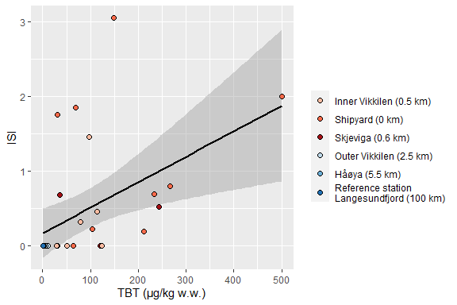<!-- -->

```r
gg2
```

```
## `geom_smooth()` using formula 'y ~ x'
```

```
## Warning: Removed 19 rows containing non-finite values (stat_smooth).

## Warning: Removed 19 rows containing missing values (geom_point).
```

<!-- -->


### PRL_mean vs. TBT


```r
gg <- ggplot(dat_intersex_litt_summ, aes(TBT_mean, PRL_mean)) +
  geom_smooth(method = "lm") +
  labs(x = "TBT (μg/kg w.w.)", y = "FPrL")

gg1 <- gg + scale_color_brewer(palette = "Dark2") +
  geom_point(aes(fill = Station_name), pch = 21, size = rel(2)) +
  scale_fill_manual("", values = station_cols)

gg2 <- gg + scale_color_brewer(palette = "Dark2") +
  geom_point(aes(shape = Station_name), size = rel(2))

if (save_plots){
  ggsave("Figures/06_Correlations_Litt_PRL_vs_TBT_col.png", gg1, 
         width = 7, height = 5, dpi = 500)
  ggsave("Figures/06_Correlations_Litt_PRL_vs_TBT_bw.png", gg2, 
         width = 7, height = 5, dpi = 500)
}
gg1
```

```
## `geom_smooth()` using formula 'y ~ x'
```

```
## Warning: Removed 20 rows containing non-finite values (stat_smooth).
```

```
## Warning: Removed 20 rows containing missing values (geom_point).
```

<!-- -->

```r
gg2
```

```
## `geom_smooth()` using formula 'y ~ x'
```

```
## Warning: Removed 20 rows containing non-finite values (stat_smooth).

## Warning: Removed 20 rows containing missing values (geom_point).
```

<!-- -->


### Sterile vs. ISI

```r
gg <- ggplot(dat_intersex_litt_summ, aes(ISI_mean, Sterile_perc)) +
  geom_smooth(method = "lm", color = "black") +
  labs(x = "ISI", y = "Percentage sterile females (%)")

gg1 <- gg + scale_color_brewer(palette = "Dark2") +
  geom_point(aes(fill = Station_name), pch = 21, size = rel(2)) +
  scale_fill_manual("", values = station_cols)

gg2 <- gg + scale_color_brewer(palette = "Dark2") +
  geom_point(aes(shape = Station_name), size = rel(2))

# save_plots <- TRUE
if (save_plots){
  ggsave("Figures/06_Correlations_Litt_Sterile_vs_ISI_col.png", gg1, 
         width = 7, height = 5, dpi = 500)
  ggsave("Figures/06_Correlations_Litt_Sterile_vs_ISI_bw.png", gg2, 
         width = 7, height = 5, dpi = 500)
}
gg1
```

```
## `geom_smooth()` using formula 'y ~ x'
```

```
## Warning: Removed 5 rows containing non-finite values (stat_smooth).
```

```
## Warning: Removed 5 rows containing missing values (geom_point).
```

<!-- -->

```r
gg2
```

```
## `geom_smooth()` using formula 'y ~ x'
```

```
## Warning: Removed 5 rows containing non-finite values (stat_smooth).

## Warning: Removed 5 rows containing missing values (geom_point).
```

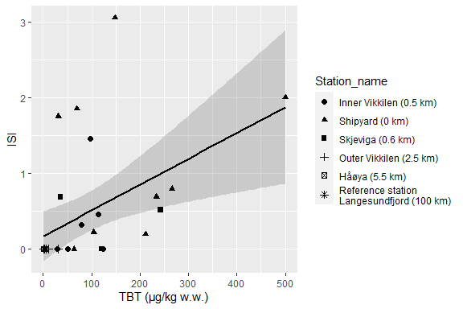<!-- -->

### FIG.5 Combined plot  
For paper (Fig. 5)

```r
plot_margins <- c(0.2, 0.3, 0.5, 0.7)  # top, right, bottom, left

gg_a_withlegend <- ggplot(dat_intersex_litt_summ, aes(TBT_mean, ISI_mean)) +
  geom_smooth(method = "lm", formula = 'y ~ x', color = "black") +
  labs(x = "TBT (μg/kg w.w.)", y = "ISI") +
  geom_point(aes(fill = Station_name), pch = 21, size = rel(2)) +
  scale_fill_manual("", values = station_cols)

gg_a <- gg_a_withlegend +
  theme_bw() +
  theme(legend.position="none", 
        plot.margin = unit(plot_margins, "cm"),
        panel.grid = element_blank())

gg_b <- ggplot(dat_intersex_litt_summ, aes(PRL_mean, ISI_mean)) +
  geom_smooth(method = "lm", formula = 'y ~ x', color = "black") +
  labs(x = "FPrL", y = "ISI") +
  geom_point(aes(fill = Station_name), pch = 21, size = rel(2)) +
  scale_fill_manual("", values = station_cols) +
  theme_bw() +
  theme(legend.position="none", 
        plot.margin = unit(plot_margins, "cm"),
        panel.grid = element_blank())

gg_c <- ggplot(dat_intersex_litt_summ, aes(TBT_mean, PRL_mean)) +
  geom_smooth(method = "lm", formula = 'y ~ x', color = "black") +
  labs(x = "TBT (μg/kg w.w.)", y = "FPrL") +
  geom_point(aes(fill = Station_name), pch = 21, size = rel(2)) +
  scale_fill_manual("", values = station_cols) +
  theme_bw() +
  theme(legend.position="none", 
        plot.margin = unit(plot_margins, "cm"),
        panel.grid = element_blank())

gg_d <- ggplot(dat_intersex_litt_summ, aes(ISI_mean, Sterile_perc)) +
  geom_smooth(method = "lm", formula = 'y ~ x', color = "black") +
  labs(x = "ISI", y = "Percentage sterile females (%)") +
  geom_point(aes(fill = Station_name), pch = 21, size = rel(2)) +
  scale_fill_manual("", values = station_cols) +
  theme_bw() +
  theme(legend.position="none", 
        plot.margin = unit(plot_margins, "cm"),
        panel.grid = element_blank())

legend <- cowplot::get_legend(gg_a_withlegend)
```

```
## Warning: Removed 19 rows containing non-finite values (stat_smooth).
```

```
## Warning: Removed 19 rows containing missing values (geom_point).
```

```r
gg_comb <- cowplot::plot_grid(gg_a, gg_b, NULL, gg_c, gg_d, legend,
                   labels = c("A", "B", NA, "C", "D", NA), 
                   nrow = 2, rel_widths = c(1, 1, .6))
```

```
## Warning: Removed 19 rows containing non-finite values (stat_smooth).

## Warning: Removed 19 rows containing missing values (geom_point).
```

```
## Warning: Removed 5 rows containing non-finite values (stat_smooth).
```

```
## Warning: Removed 5 rows containing missing values (geom_point).
```

```
## Warning: Removed 20 rows containing non-finite values (stat_smooth).
```

```
## Warning: Removed 20 rows containing missing values (geom_point).
```

```
## Warning: Removed 5 rows containing non-finite values (stat_smooth).
```

```
## Warning: Removed 5 rows containing missing values (geom_point).
```

```r
if (save_plots)
  ggsave("Figures/06_Correlations_combined_color_FIG5.png", gg_comb,
         width = 7.8, height = 5.8, dpi = 500)

gg_comb
```

```
## Warning: Removed 1 rows containing missing values (geom_text).
```

```
## Warning: Removed 1 rows containing missing values (geom_text).
```

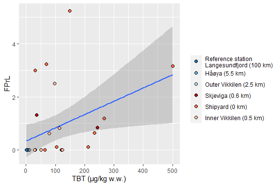<!-- -->


### Correlations

```r
print_correlations <- function(){
  
  cat("=================================\nCorrelation TBT_mean, ISI_mean \n\n")
  with(dat_intersex_litt_summ, cor.test(TBT_mean, ISI_mean, method = "kendall")) %>% print()
  
  cat("=================================\nCorrelation TBT_mean, PRL_mean \n\n")
  with(dat_intersex_litt_summ, cor.test(TBT_mean, PRL_mean, method = "kendall")) %>% print()
  
  cat("=================================\nCorrelation PRL_mean, ISI_mean \n\n")
  with(dat_intersex_litt_summ, cor.test(PRL_mean, ISI_mean, method = "kendall")) %>% print()
  
  cat("=================================\nCorrelation Sterile_perc, ISI_mean \n\n")
  with(dat_intersex_litt_summ, cor.test(Sterile_perc, ISI_mean, method = "kendall")) %>% print()
  
}

# Print to file
fn <- "Figures/06_Kendall_correlations.txt"
con <- file(fn, open = "w")
sink(con)
print_correlations()
```

```
## =================================
## Correlation TBT_mean, ISI_mean
```

```
## Warning in cor.test.default(TBT_mean, ISI_mean, method = "kendall"): Cannot
## compute exact p-value with ties
```

```
## 
## 	Kendall's rank correlation tau
## 
## data:  TBT_mean and ISI_mean
## z = 3.702, p-value = 0.0002139
## alternative hypothesis: true tau is not equal to 0
## sample estimates:
##       tau 
## 0.5191121 
## 
## =================================
## Correlation TBT_mean, PRL_mean
```

```
## Warning in cor.test.default(TBT_mean, PRL_mean, method = "kendall"): Cannot
## compute exact p-value with ties
```

```
## 
## 	Kendall's rank correlation tau
## 
## data:  TBT_mean and PRL_mean
## z = 3.5078, p-value = 0.0004518
## alternative hypothesis: true tau is not equal to 0
## sample estimates:
##       tau 
## 0.4988878 
## 
## =================================
## Correlation PRL_mean, ISI_mean
```

```
## Warning in cor.test.default(PRL_mean, ISI_mean, method = "kendall"): Cannot
## compute exact p-value with ties
```

```
## 
## 	Kendall's rank correlation tau
## 
## data:  PRL_mean and ISI_mean
## z = 7.5036, p-value = 6.209e-14
## alternative hypothesis: true tau is not equal to 0
## sample estimates:
##       tau 
## 0.9394094 
## 
## =================================
## Correlation Sterile_perc, ISI_mean
```

```
## Warning in cor.test.default(Sterile_perc, ISI_mean, method = "kendall"): Cannot
## compute exact p-value with ties
```

```
## 
## 	Kendall's rank correlation tau
## 
## data:  Sterile_perc and ISI_mean
## z = 7.6045, p-value = 2.86e-14
## alternative hypothesis: true tau is not equal to 0
## sample estimates:
##       tau 
## 0.9520401
```

```r
sink()
close(con)

# Show file
# file.show(fn)

# Print to result
cat("\n")
```

```r
print_correlations()
```

```
## =================================
## Correlation TBT_mean, ISI_mean
```

```
## Warning in cor.test.default(TBT_mean, ISI_mean, method = "kendall"): Cannot
## compute exact p-value with ties
```

```
## 
## 	Kendall's rank correlation tau
## 
## data:  TBT_mean and ISI_mean
## z = 3.702, p-value = 0.0002139
## alternative hypothesis: true tau is not equal to 0
## sample estimates:
##       tau 
## 0.5191121 
## 
## =================================
## Correlation TBT_mean, PRL_mean
```

```
## Warning in cor.test.default(TBT_mean, PRL_mean, method = "kendall"): Cannot
## compute exact p-value with ties
```

```
## 
## 	Kendall's rank correlation tau
## 
## data:  TBT_mean and PRL_mean
## z = 3.5078, p-value = 0.0004518
## alternative hypothesis: true tau is not equal to 0
## sample estimates:
##       tau 
## 0.4988878 
## 
## =================================
## Correlation PRL_mean, ISI_mean
```

```
## Warning in cor.test.default(PRL_mean, ISI_mean, method = "kendall"): Cannot
## compute exact p-value with ties
```

```
## 
## 	Kendall's rank correlation tau
## 
## data:  PRL_mean and ISI_mean
## z = 7.5036, p-value = 6.209e-14
## alternative hypothesis: true tau is not equal to 0
## sample estimates:
##       tau 
## 0.9394094 
## 
## =================================
## Correlation Sterile_perc, ISI_mean
```

```
## Warning in cor.test.default(Sterile_perc, ISI_mean, method = "kendall"): Cannot
## compute exact p-value with ties
```

```
## 
## 	Kendall's rank correlation tau
## 
## data:  Sterile_perc and ISI_mean
## z = 7.6045, p-value = 2.86e-14
## alternative hypothesis: true tau is not equal to 0
## sample estimates:
##       tau 
## 0.9520401
```

### TBT vs time, all stations   

```r
# TBT_mean vs. Time, for all stations combined - actually significan 
with(dat_intersex_litt_summ, cor.test(TBT_mean, Year, method = "kendall"))
```

```
## Warning in cor.test.default(TBT_mean, Year, method = "kendall"): Cannot compute
## exact p-value with ties
```

```
## 
## 	Kendall's rank correlation tau
## 
## data:  TBT_mean and Year
## z = -2.6126, p-value = 0.008984
## alternative hypothesis: true tau is not equal to 0
## sample estimates:
##        tau 
## -0.3320401
```

```r
# ANCOVA TBT_mean vs. time, adjusted for station 
mod <- lm(log(TBT_mean) ~ Year + Station, data = dat_intersex_litt_summ)
summary(mod)
```

```
## 
## Call:
## lm(formula = log(TBT_mean) ~ Year + Station, data = dat_intersex_litt_summ)
## 
## Residuals:
##      Min       1Q   Median       3Q      Max 
## -1.67889 -0.34788 -0.00759  0.53806  1.24267 
## 
## Coefficients:
##              Estimate Std. Error t value Pr(>|t|)    
## (Intercept) 101.78010   78.89398   1.290 0.208377    
## Year         -0.05019    0.03915  -1.282 0.211197    
## Station4      2.11520    0.54307   3.895 0.000615 ***
## Station5      3.68650    0.62117   5.935 2.91e-06 ***
## Station6      4.07236    0.49376   8.248 9.94e-09 ***
## Station7      3.52511    0.51191   6.886 2.61e-07 ***
## Station71G   -0.11844    0.48147  -0.246 0.807621    
## ---
## Signif. codes:  0 '***' 0.001 '**' 0.01 '*' 0.05 '.' 0.1 ' ' 1
## 
## Residual standard error: 0.7106 on 26 degrees of freedom
##   (16 observations deleted due to missingness)
## Multiple R-squared:  0.8981,	Adjusted R-squared:  0.8746 
## F-statistic: 38.19 on 6 and 26 DF,  p-value: 1.098e-11
```

```r
visreg::visreg(mod)
```

<!-- --><!-- -->

```r
# As above, excluding the reference station
mod <- lm(log(TBT_mean) ~ Year + Station, data = dat_intersex_litt_summ %>% filter(Station != 1))
summary(mod)
```

```
## 
## Call:
## lm(formula = log(TBT_mean) ~ Year + Station, data = dat_intersex_litt_summ %>% 
##     filter(Station != 1))
## 
## Residuals:
##      Min       1Q   Median       3Q      Max 
## -1.61849 -0.36504  0.04709  0.52794  1.26230 
## 
## Coefficients:
##             Estimate Std. Error t value Pr(>|t|)    
## (Intercept) 76.51587   82.15687   0.931  0.36095    
## Year        -0.03660    0.04078  -0.897  0.37842    
## Station5     1.64152    0.58202   2.820  0.00947 ** 
## Station6     1.99869    0.44468   4.495  0.00015 ***
## Station7     1.43709    0.46573   3.086  0.00506 ** 
## Station71G  -2.23364    0.43500  -5.135 2.96e-05 ***
## ---
## Signif. codes:  0 '***' 0.001 '**' 0.01 '*' 0.05 '.' 0.1 ' ' 1
## 
## Residual standard error: 0.7103 on 24 degrees of freedom
##   (14 observations deleted due to missingness)
## Multiple R-squared:  0.8879,	Adjusted R-squared:  0.8646 
## F-statistic: 38.03 on 5 and 24 DF,  p-value: 1.208e-10
```

```r
visreg::visreg(mod)
```

<!-- --><!-- -->

```r
# As above, excluding years before 2010
mod <- lm(log(TBT_mean) ~ Year + Station, data = dat_intersex_litt_summ %>% filter(Year >= 2010))
summary(mod)
```

```
## 
## Call:
## lm(formula = log(TBT_mean) ~ Year + Station, data = dat_intersex_litt_summ %>% 
##     filter(Year >= 2010))
## 
## Residuals:
##      Min       1Q   Median       3Q      Max 
## -1.11800 -0.22916 -0.06421  0.28263  0.87979 
## 
## Coefficients:
##              Estimate Std. Error t value Pr(>|t|)    
## (Intercept) 324.60763   65.20313   4.978 6.31e-05 ***
## Year         -0.16077    0.03236  -4.968 6.46e-05 ***
## Station4      2.05991    0.33928   6.071 5.03e-06 ***
## Station5      3.76961    0.43044   8.758 1.87e-08 ***
## Station6      4.37176    0.31671  13.804 5.28e-12 ***
## Station7      3.36896    0.32720  10.296 1.16e-09 ***
## Station71G   -0.17373    0.30083  -0.577     0.57    
## ---
## Signif. codes:  0 '***' 0.001 '**' 0.01 '*' 0.05 '.' 0.1 ' ' 1
## 
## Residual standard error: 0.4437 on 21 degrees of freedom
##   (10 observations deleted due to missingness)
## Multiple R-squared:  0.9655,	Adjusted R-squared:  0.9557 
## F-statistic: 98.07 on 6 and 21 DF,  p-value: 2.956e-14
```

```r
visreg::visreg(mod)
```

<!-- --><!-- -->

```r
# Plot 
gg <- ggplot(dat_intersex_litt_summ, aes(Year, TBT_mean)) +
  geom_smooth(method = "lm") + 
  scale_color_brewer(palette = "Dark2") +
  geom_point(aes(shape = Station), size = rel(2))
gg
```

```
## `geom_smooth()` using formula 'y ~ x'
```

```
## Warning: Removed 16 rows containing non-finite values (stat_smooth).
```

```
## Warning: Removed 16 rows containing missing values (geom_point).
```

<!-- -->

```r
# ?visreg::visreg
```

## 5. Littorina time series plots  

None used in plots  

### TBT


```r
ggplot(dat_intersex_litt_summ, aes(Year, TBT_mean)) +
  geom_point() +
  facet_wrap(vars(Station))
```

```
## Warning: Removed 16 rows containing missing values (geom_point).
```

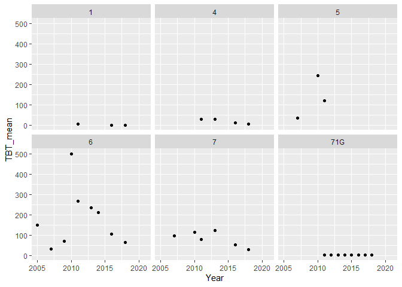<!-- -->

###  ISI

```r
ggplot(dat_intersex_litt_summ, aes(Year, ISI_mean)) +
  geom_point() +
  facet_wrap(vars(Station))
```

```
## Warning: Removed 3 rows containing missing values (geom_point).
```

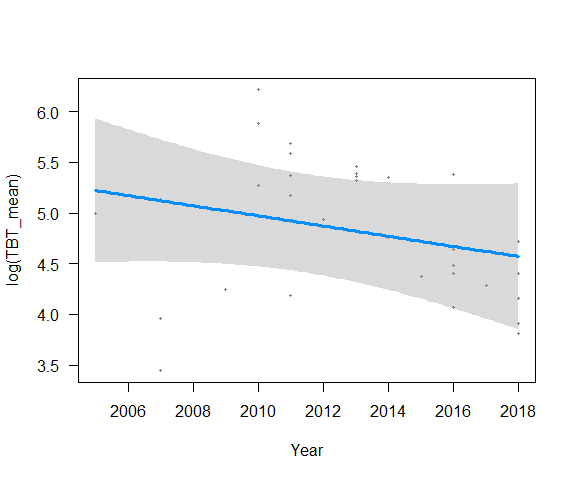<!-- -->

### Mean PRL

```r
ggplot(dat_intersex_litt_summ, aes(Year, PRL_mean)) +
  geom_point() +
  facet_wrap(vars(Station))
```

```
## Warning: Removed 5 rows containing missing values (geom_point).
```

<!-- -->


### Mean PRL

```r
ggplot(dat_intersex_litt_summ, aes(Year, PRL_mean)) +
  geom_point() +
  facet_wrap(vars(Station))
```

```
## Warning: Removed 5 rows containing missing values (geom_point).
```

<!-- -->

## 6. Littorina plots using logistic function   

Graphs:    
* Fig. 4 (old 2b)   
    - section 6, 'Plot PRL at all stations'   
    

```r
source("06_Tables_graphs_functions.R")
```


### Example for TBT 

```r
st <- "7"
df <- dat_intersex_litt_summ %>% filter(Station %in% st & !is.na(TBT_mean))
df_pred <- pred_logistic(df$Year, df$TBT_mean, x_range = c(2005, 2018))

plot(TBT_mean ~ Year, data = df, type = "n", xlab = "", ylab = "") 
with(df_pred$fit, polygon.lines(x, Pred_lo, Pred_hi, border = FALSE)) 
with(df_pred$fit, lines(x, Pred)) 
with(df, points(Year, TBT_mean, pch = 19)) 
```

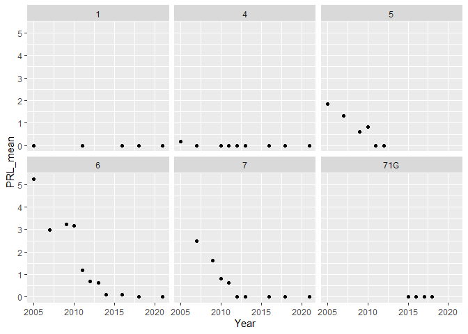<!-- -->


### Example for ISI 

```r
st <- "7"
df <- dat_intersex_litt_summ %>% filter(Station %in% st & !is.na(ISI_mean))
df_pred <- pred_logistic(df$Year, df$ISI_mean, x_range = c(2005, 2018), a = 0.05)

plot(ISI_mean ~ Year, data = df, type = "n", xlab = "", ylab = "") 
with(df_pred$fit, polygon.lines(x, Pred_lo, Pred_hi, border = FALSE)) 
with(df_pred$fit, lines(x, Pred)) 
with(df, points(Year, ISI_mean, pch = 19)) 
```

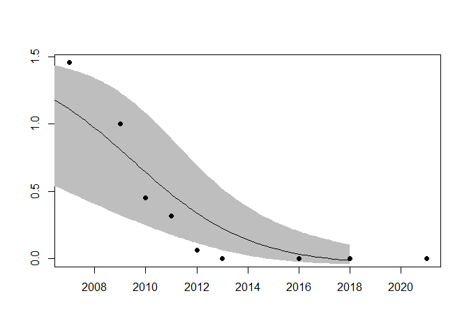<!-- -->

### ISI, ggplot variant

```r
pvalue <- summary(df_pred$model)$coef["x","Pr(>|t|)"]
ggplot() + 
  geom_ribbon(data = df_pred$fit, aes(x, ymin = Pred_lo, ymax = Pred_hi), fill = "grey70") +
  geom_path(data = df_pred$fit, aes(x, y = Pred)) +
  annotate("text", x = 2016, y = 1.3, label = paste("P =", round(pvalue, 4)))
```

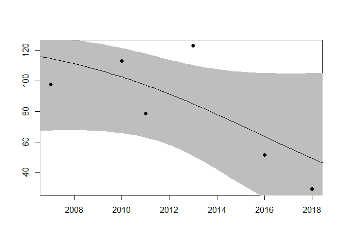<!-- -->

### Plot two stations

```r
predlist <- list(
  pred_logistic_from_stationname("6", "ISI_mean"),
  pred_logistic_from_stationname("7", "ISI_mean")
)

# Combine
df_pred <- bind_rows(predlist[[1]]$fit, predlist[[2]]$fit)
df_pvalue <- bind_rows(predlist[[1]]$pvalue, predlist[[2]]$pvalue)
df <- dat_intersex_litt_summ %>% filter(Station %in% c("6","7") & !is.na(ISI_mean))

# Plot
ggplot() + 
  geom_ribbon(data = df_pred, aes(x, ymin = Pred_lo, ymax = Pred_hi), fill = "grey70") +
  geom_path(data = df_pred, aes(x, y = Pred)) +
  geom_point(data = df, aes(Year, ISI_mean)) +
  geom_text(data = df_pvalue, aes(x = 2016, y = Inf, label = Text), vjust = 1.2) +
  facet_wrap(vars(Station))
```

<!-- -->

### Plot ISI at all stations

```r
sts <- unique(dat_intersex_litt_summ$Station)
df_pred_list <- sts %>% lapply(pred_logistic_from_stationname, variable = "ISI_mean")
```

```
## Warning in summary.lm(pred$model): essentially perfect fit: summary may be
## unreliable

## Warning in summary.lm(pred$model): essentially perfect fit: summary may be
## unreliable
```

```r
names(df_pred_list) <- sts
# df_pred_list[["5b"]]

# Collect data for plotting 
df_pred <- bind_rows(transpose(df_pred_list)$fit)
df_pvalue <- bind_rows(transpose(df_pred_list)$pvalue)
df <- dat_intersex_litt_summ %>% filter(!is.na(ISI_mean))

# Plot
ggplot() + 
  geom_ribbon(data = df_pred, aes(x, ymin = Pred_lo, ymax = Pred_hi), fill = "grey70") +
  #geom_path(data = df_pred, aes(x, y = Pred)) +
  geom_point(data = df, aes(Year, ISI_mean)) +
  #geom_text(data = df_pvalue, aes(x = 2016, y = Inf, label = Text), vjust = 1.2) +
  facet_wrap(vars(Station_name))
```

<!-- -->


### Plot percent sterile at all stations

```r
# Run all stations (as above)
sts <- unique(dat_intersex_litt_summ$Station)
df_pred_list <- sts %>% lapply(pred_logistic_from_stationname, variable = "Sterile_perc")
```

```
## Warning in summary.lm(pred$model): essentially perfect fit: summary may be
## unreliable

## Warning in summary.lm(pred$model): essentially perfect fit: summary may be
## unreliable
```

```r
names(df_pred_list) <- sts

# Check p-values
transpose(df_pred_list)$pvalue %>% bind_rows()
```

```
##   Station       Text     Text.1                               Station_name
## 1       1  P =  0.09  P =  0.09                             Håøya (5.5 km)
## 2       4  P =  0.12  P =  0.12                    Outer Vikkilen (2.5 km)
## 3       5 P =  0.019 P =  0.019                          Skjeviga (0.6 km)
## 4       6 P < 0.0001 P < 0.0001                            Shipyard (0 km)
## 5       7 P =  0.011 P =  0.011                    Inner Vikkilen (0.5 km)
## 6     71G    P =  NA       <NA> Reference station\nLangesundfjord (100 km)
##                                Station_name2
## 1                             Håøya (4-6 km)
## 2                      Outer Vikkilen (2 km)
## 3                      Mid Vikkilen (0.8 km)
## 4                            Shipyard (0 km)
## 5                    Inner Vikkilen (0.5 km)
## 6 Reference station\nLangesundfjord (100 km)
```

```r
# Run 4 using linear regression
df_pred_list[["4"]] <- pred_linear_from_stationname("4", "Sterile_perc")

# Collect data for plotting 
df_pred <- bind_rows(transpose(df_pred_list)$fit)
df_pvalue <- bind_rows(transpose(df_pred_list)$pvalue)
df <- dat_intersex_litt_summ %>% filter(!is.na(Sterile_perc))

# Plot
gg <- ggplot() + 
  geom_ribbon(data = df_pred, aes(x, ymin = Pred_lo, ymax = Pred_hi), fill = "grey70") +
  geom_path(data = df_pred, aes(x, y = Pred)) +
  geom_point(data = df, aes(Year, Sterile_perc)) +
  geom_text(data = df_pvalue, aes(x = 2016, y = Inf, label = Text), vjust = 1.2) +
  facet_wrap(vars(Station_name)) +
  labs(title = "Percent of sterile females", x = "Year", y = "Percent sterile")
if (save_plots)
  ggsave("Figures/06_Timeseries_Litt_sterile.png", gg,
         width = 8, height = 5, dpi = 500)
gg
```

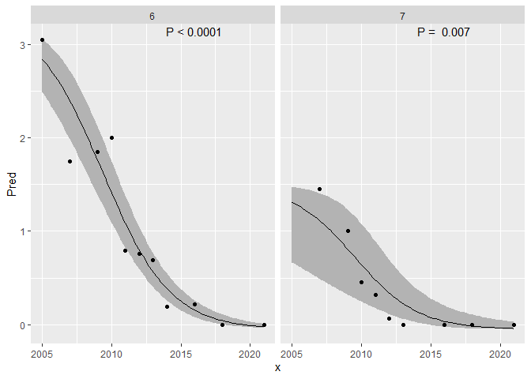<!-- -->


### FIG. 4 Plot PRL at all stations  

* Fig. 4     


```r
# back <- dat_intersex_litt_summ

# dat_intersex_litt_summ <- dat_intersex_litt_summ %>%
#   mutate(Station2 = )

# We make regressions for only two stations
sts <- c("5", "6", "7")
# debugonce(pred_logistic_from_stationname)
df_pred_list <- sts %>% lapply(pred_logistic_from_stationname, variable = "PRL_mean")
names(df_pred_list) <- sts
# df_pred_list[["5b"]]

# Collect data for plotting 
df_pred <- bind_rows(transpose(df_pred_list)$fit)
df_pvalue <- bind_rows(transpose(df_pred_list)$pvalue)
df <- dat_intersex_litt_summ %>% filter(!is.na(PRL_mean))

# Plot
gg <- ggplot() + 
  geom_ribbon(data = df_pred, aes(x, ymin = Pred_lo, ymax = Pred_hi), fill = "grey70") +
  geom_path(data = df_pred, aes(x, y = Pred)) +
  geom_point(data = df, aes(Year, PRL_mean)) +
  geom_text(data = df_pvalue, aes(x = 2018, y = Inf, label = Text), 
            vjust = 1.2, hjust = 1, size = 3.4) +
  geom_vline(xintercept = c(2008), color = "red2", linetype = 2) +
  facet_wrap(vars(Station_name)) +
  labs(x = "Year", y = "FPrL") +
  geom_hline(yintercept = 0) +
  theme_bw() +
  theme(panel.grid = element_blank())
if (save_plots)
  ggsave("Figures/06_Timeseries_Litt_PRL_FIG4.png", gg,
         width = 6, height = 4, dpi = 500)
gg
```

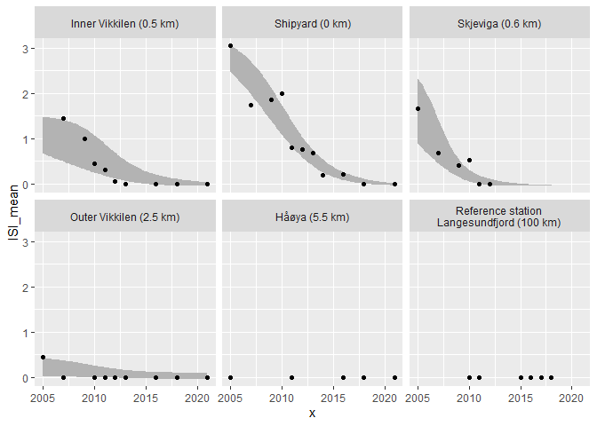<!-- -->


### Plot TBT at all stations  

```r
# Run all stations (as above)
sts_tbt <- dat_intersex_litt_summ %>%
  ungroup() %>%
  filter(!is.na(TBT_mean)) %>%
  count(Station) %>%
  filter(n >= 3) %>%
  pull(Station)

# debugonce(pred_logistic_from_stationname)
df_pred_list <- sts_tbt %>% lapply(pred_logistic_from_stationname, variable = "TBT_mean")
names(df_pred_list) <- sts_tbt

# Run 5b using linear regression
# df_pred_list[["5b"]] <- pred_linear_from_stationname("5b", "ISI_mean")

# Collect data for plotting 
df_pred_tbt <- bind_rows(transpose(df_pred_list)$fit)
df_pvalue_tbt <- bind_rows(transpose(df_pred_list)$pvalue)
df_points_tbt <- dat_intersex_litt_summ %>% filter(!is.na(TBT_mean))

# Plot
gg <- ggplot() + 
  geom_ribbon(data = df_pred_tbt, aes(x, ymin = Pred_lo, ymax = Pred_hi), fill = "grey70") +
  geom_path(data = df_pred_tbt, aes(x, y = Pred)) +
  geom_point(data = df_points_tbt, aes(Year, TBT_mean)) +
  geom_text(data = df_pvalue_tbt, aes(x = 2016, y = Inf, label = Text), vjust = 1.2) +
  facet_wrap(vars(Station_name)) +
  labs(title = "TBT", x = "Year", y = "TBT concentration")

if (save_plots)
  ggsave("Figures/06_Timeseries_Litt_TBT.png", gg,
         width = 8, height = 5, dpi = 500)
gg
```

<!-- -->

## 7. Combined figures for time series  
* ISI + TBT
* ISI + VDSI

* Fig. 2 (old 2a)     
    - section 7, 'Plot ISI + TBT, B/W'     
* Fig. 3 VDSI for Nassarius reticulatus (nettsnegl)
    - time series for VDSI (N. reticulatus) overlaid with ISI (for Littorina)   
    - section 7, 'Plot ISI + VDSI, B/W'   

### Data for plotting ISI     
Just copy-paste from above  

```r
sts <- unique(dat_intersex_litt_summ$Station)
# df_pred_list <- sts %>% lapply(pred_logistic_from_stationname, variable = "ISI_mean")
df_pred_list <- sts %>% lapply(pred_logistic_from_stationname, variable = "ISI_mean",
                               data = dat_intersex_litt_summ)
```

```
## Warning in summary.lm(pred$model): essentially perfect fit: summary may be
## unreliable

## Warning in summary.lm(pred$model): essentially perfect fit: summary may be
## unreliable
```

```r
# table(dat_intersex_litt_summ$Station)
# sts
names(df_pred_list) <- sts
# df_pred_list[["5b"]]

# Collect data for plotting 
df_pred_isi <- bind_rows(transpose(df_pred_list)$fit)
df_pvalue_isi <- bind_rows(transpose(df_pred_list)$pvalue)
df_points_isi <- dat_intersex_litt_summ %>% filter(!is.na(ISI_mean))

# Plot
if (FALSE){
  ggplot() + 
    geom_ribbon(data = df_pred_isi, aes(x, ymin = Pred_lo, ymax = Pred_hi), fill = "grey70") +
    geom_path(data = df_pred_isi, aes(x, y = Pred)) +
    geom_point(data = df_points_isi, aes(Year, ISI_mean)) +
    geom_text(data = df_pvalue_isi, aes(x = 2018, y = Inf, label = paste("ISI:", Text)), 
              vjust = 1.2, hjust = 1) +
    facet_wrap(vars(Station_name))
}
```

### Data for plotting TBT     
As above but we change the curve to 'flat' for stations where tie trend pvalue > 0.05   

```r
# debugonce(pred_logistic_from_stationname)
df_pred_list <- sts_tbt %>% lapply(pred_logistic_from_stationname, variable = "TBT_mean")
names(df_pred_list) <- sts_tbt

# Get p-values for plot
df_pvalue_tbt <- bind_rows(transpose(df_pred_list)$pvalue)

# Check p-values
transpose(df_pred_list)$pvalue %>% bind_rows()
```

```
##   Station      Text    Text.1                               Station_name
## 1       1 P =  0.29 P =  0.29                             Håøya (5.5 km)
## 2       4 P =  0.05 P =  0.05                    Outer Vikkilen (2.5 km)
## 3       5  P =  0.6  P =  0.6                          Skjeviga (0.6 km)
## 4       6  P =  0.9  P =  0.9                            Shipyard (0 km)
## 5       7 P =  0.19 P =  0.19                    Inner Vikkilen (0.5 km)
## 6     71G P =  0.97 P =  0.97 Reference station\nLangesundfjord (100 km)
##                                Station_name2
## 1                             Håøya (4-6 km)
## 2                      Outer Vikkilen (2 km)
## 3                      Mid Vikkilen (0.8 km)
## 4                            Shipyard (0 km)
## 5                    Inner Vikkilen (0.5 km)
## 6 Reference station\nLangesundfjord (100 km)
```

```r
# For these three stations with pvalue > 0.05, so we use a flat line instead for these:
for (st in c("71G", "5","6"))
  df_pred_list[[st]] <- pred_flat_from_stationname(st, "TBT_mean")

# Collect data for plotting 
df_pred_tbt <- bind_rows(transpose(df_pred_list)$fit)
df_points_tbt <- dat_intersex_litt_summ %>% filter(!is.na(TBT_mean))

# Test plot
if (FALSE) {
  gg <- ggplot() + 
    geom_ribbon(data = df_pred_tbt, aes(x, ymin = Pred_lo, ymax = Pred_hi), fill = "grey70") +
    geom_path(data = df_pred_tbt, aes(x, y = Pred)) +
    geom_point(data = df_points_tbt, aes(Year, TBT_mean)) +
    geom_text(data = df_pvalue_tbt, aes(x = 2018, y = Inf, label = paste("TBT:", Text)), 
              vjust = 3.2, hjust = 1) +
    facet_wrap(vars(Station_name)) +
    labs(title = "TBT", x = "Year", y = "TBT concentration")
  gg
  
}
```

###  Data for plotting VDSI  

```r
# Test for one station
if (FALSE){
  # From last chunk:
  x <- pred_logistic_from_stationname("1", variable = "TBT_mean", data = dat_intersex_litt_summ)
  str(x, 1)  
  # We just replace variable and data:
  x <- pred_logistic_from_stationname("1", variable = "VDSI", data = dat_imposex_reticul_summ)
  str(x, 1)  
}

# Stations
sts_vdsi <- unique(dat_imposex_reticul_summ$Station)
# debugonce(pred_logistic_from_stationname)
df_pred_list <- sts_vdsi %>% 
  lapply(pred_logistic_from_stationname, variable = "VDSI", data = dat_imposex_reticul_summ)
names(df_pred_list) <- sts_vdsi

# Get p-values for plot
df_pvalue_vdsi <- bind_rows(transpose(df_pred_list)$pvalue)

# Check p-values
transpose(df_pred_list)$pvalue %>% bind_rows()
```

```
##   Station       Text     Text.1            Station_name           Station_name2
## 1       1 P =  0.015 P =  0.015          Håøya (5.5 km)          Håøya (4-6 km)
## 2       4  P < 0.001 P =  3e-04 Outer Vikkilen (2.5 km)   Outer Vikkilen (2 km)
## 3       5 P < 0.0001 P < 0.0001       Skjeviga (0.6 km)   Mid Vikkilen (0.8 km)
## 4       6  P =  0.12  P =  0.12         Shipyard (0 km)         Shipyard (0 km)
## 5       7  P =  0.09  P =  0.09 Inner Vikkilen (0.5 km) Inner Vikkilen (0.5 km)
```

```r
# For this station with pvalue > 0.05, so we use a flat line instead for these:
for (st in c("6"))
  df_pred_list[[st]] <- pred_flat_from_stationname(st, 
                                                   variable = "VDSI",
                                                   data = dat_imposex_reticul_summ)

# Collect data for plotting 
df_pred_vdsi <- bind_rows(transpose(df_pred_list)$fit)
df_points_vdsi <- dat_imposex_reticul_summ %>% filter(!is.na(VDSI))

# Delete predictions after 2015, and before 2009 for some stations  
df_pred_vdsi <- df_pred_vdsi %>%
  filter(x <= 2016) %>%
  filter(!(x <= 2009 & Station %in% c("1","5")))

# Test plot
if (FALSE) {
  gg <- ggplot() + 
    geom_ribbon(data = df_pred_vdsi, aes(x, ymin = Pred_lo, ymax = Pred_hi), fill = "grey70") +
    geom_path(data = df_pred_vdsi, aes(x, y = Pred)) +
    geom_point(data = df_points_vdsi, aes(Year, VDSI)) +
    geom_text(data = df_pvalue_vdsi, aes(x = 2018, y = Inf, label = paste("VDSI:", Text)), 
              vjust = 3.2, hjust = 1) +
    facet_wrap(vars(Station_name)) +
    labs(title = "VDSI", x = "Year", y = "VDSI concentration")
  gg
  
}
```

### FIG. 2 Plot ISI + TBT, B/W  

* Fig. 2 in paper


```r
# For transformation of TBT
ylim.prim <- c(0, 3.5)     # ISI
ylim.sec <- c(0, 510)    # TBT
b <- diff(ylim.prim)/diff(ylim.sec)
a <- b*(ylim.prim[1] - ylim.sec[1])


# nchar("Outer Vikkilen (2.5 km)") 
# 23 characters, let's breeak label when lines are longer than this

# Colors

# df_pred_isi <- df_pred_isi %>%
#   mutate(Station_name = fct_recode(
#     Station_name,
#     `Reference station\nLangesundfjord (100 km)` = "Reference station Langesundfjord (100 km)"
#   )
#   )
# 
# df_pred_tbt <- df_pred_tbt %>%
#   mutate(Station_name = fct_recode(
#     Station_name,
#     `Reference station\nLangesundfjord (100 km)` = "Reference station Langesundfjord (100 km)"
#   )
#   )


cols2 <- c("black", "black")

gg <- ggplot() + 
  # ISI data
  geom_ribbon(data = df_pred_isi, aes(x, ymin = Pred_lo, ymax = Pred_hi), 
              fill = "grey70", alpha = 0.5) +
  geom_path(data = df_pred_isi, aes(x, y = Pred), color = cols2[1]) +
  geom_point(data = df_points_isi, aes(Year, ISI_mean), color = cols2[1]) +
  # TBT data
  geom_ribbon(data = df_pred_tbt, aes(x, ymin = a + b*Pred_lo, ymax = a + b*Pred_hi), 
              fill = "grey70", alpha = 0.5) +
  geom_path(data = df_pred_tbt, aes(x, y = a + b*Pred), color = cols2[2],
            linetype = 2) +
  geom_point(data = df_points_isi, aes(Year, a + b*TBT_mean), color = cols2[2],
             shape = 2) +
  scale_y_continuous("ISI (circles)", 
                     sec.axis = sec_axis(~ (. - a)/b, name = "TBT (triangles)")) +
  # P-values
    geom_text(data = df_pvalue_isi, aes(x = 2018, y = Inf, label = paste("ISI:", Text)), 
              vjust = 1.4, hjust = 1, size = 3.4) +
    geom_text(data = df_pvalue_tbt, aes(x = 2018, y = Inf, label = paste("TBT:", Text)), 
              vjust = 3.0, hjust = 1, size = 3.4) +
  # X axis
  geom_hline(yintercept = 0) +
  # Vertical dashed line 
  geom_vline(xintercept = c(2008), color = "red2", linetype = 2) +
  facet_wrap(vars(Station_name)) +      # labeller = label_wrap_gen(width = 28)
  labs(x = "Year") + 
  theme_bw() +
    theme(
        panel.grid = element_blank(),
        axis.line.y.left = element_line(color = cols2[1]), 
        axis.ticks.y.left = element_line(color = cols2[1]),
        axis.text.y.left = element_text(color = cols2[1]), 
        axis.title.y.left = element_text(color = cols2[1], vjust = 1.5),
        axis.line.y.right = element_line(color = cols2[2]), 
        axis.ticks.y.right = element_line(color = cols2[2]),
        axis.text.y.right = element_text(color = cols2[2]), 
        axis.title.y.right = element_text(color = cols2[2], vjust = 2)
        )

if (save_plots){
  ggsave("Figures/06_Timeseries_Comb_ISI_TBT_bw_FIG2.png", gg,
         width = 7, height = 5, dpi = 500)
  ggsave("Figures/06_Timeseries_Comb_ISI_TBT_bw_FIG2.svg", gg,
         width = 7, height = 5, dpi = 500)
}

gg
```

```
## Warning: Removed 16 rows containing missing values (geom_point).
```

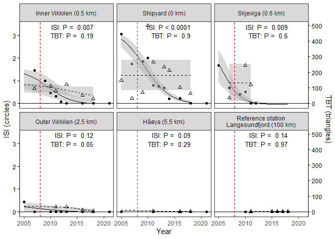<!-- -->


### Plot ISI + TBT, color

```r
# Colors
cols2 <- c("blue2", "red3")

# The rest is copy-paste from previous (except file name)

gg <- ggplot() + 
  # ISI data
  geom_ribbon(data = df_pred_isi, aes(x, ymin = Pred_lo, ymax = Pred_hi), 
              fill = "grey70", alpha = 0.5) +
  geom_path(data = df_pred_isi, aes(x, y = Pred), color = cols2[1]) +
  geom_point(data = df_points_isi, aes(Year, ISI_mean), color = cols2[1]) +
  # TBT data
  geom_ribbon(data = df_pred_tbt, aes(x, ymin = a + b*Pred_lo, ymax = a + b*Pred_hi), 
              fill = "grey70", alpha = 0.5) +
  geom_path(data = df_pred_tbt, aes(x, y = a + b*Pred), color = cols2[2],
            linetype = 2) +
  geom_point(data = df_points_isi, aes(Year, a + b*TBT_mean), color = cols2[2],
             shape = 17) +
  scale_y_continuous("ISI (circles)", 
                     sec.axis = sec_axis(~ (. - a)/b, name = "TBT (triangles)")) +
  # P-values
    geom_text(data = df_pvalue_isi, aes(x = 2018, y = Inf, label = paste("ISI:", Text)), 
              vjust = 1.4, hjust = 1, size = 3.4) +
    geom_text(data = df_pvalue_tbt, aes(x = 2018, y = Inf, label = paste("TBT:", Text)), 
              vjust = 3.0, hjust = 1, size = 3.4) +
  # Vertical dashed line 
  geom_vline(xintercept = c(2008), color = "red2", linetype = 2) +
  facet_wrap(vars(Station_name)) +
  labs(title = "ISI and TBT", x = "Year") + 
  theme_bw() +
    theme(
        axis.line.y.left = element_line(color = cols2[1]), 
        axis.ticks.y.left = element_line(color = cols2[1]),
        axis.text.y.left = element_text(color = cols2[1]), 
        axis.title.y.left = element_text(color = cols2[1], vjust = 1.5),
        axis.line.y.right = element_line(color = cols2[2]), 
        axis.ticks.y.right = element_line(color = cols2[2]),
        axis.text.y.right = element_text(color = cols2[2]), 
        axis.title.y.right = element_text(color = cols2[2], vjust = 2)
        )

if (save_plots)
  ggsave("Figures/06_Timeseries_Comb_ISI_TBT_.png", gg,
         width = 7, height = 5, dpi = 500)

gg
```

```
## Warning: Removed 16 rows containing missing values (geom_point).
```

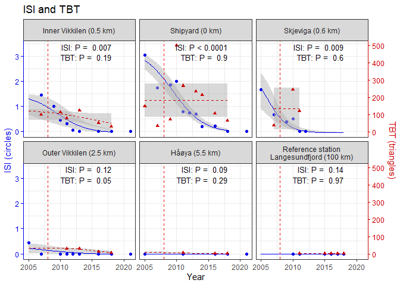<!-- -->

### FIG. 3 Plot ISI + VDSI, B/W  

* Fig. 3 in paper


```r
# For transformation of VDSI
ylim.prim <- c(0, 3.5)     # ISI
ylim.sec <- c(0, 6.2)    # VDSI
b <- diff(ylim.prim)/diff(ylim.sec)
a <- b*(ylim.prim[1] - ylim.sec[1])

# Fix one P-value (just NA now - as all values are zero, there is no variation in the data)
sel <- df_pvalue_isi$Station == "1"
df_pvalue_isi$Text[sel] <- "P = n.a."
  
cols2 <- c("black", "black")

gg <- ggplot() + 
  # ISI data
  geom_ribbon(data = df_pred_isi, aes(x, ymin = Pred_lo, ymax = Pred_hi), 
              fill = "grey70", alpha = 0.5) +
  geom_path(data = df_pred_isi, aes(x, y = Pred), color = cols2[1]) +
  geom_point(data = df_points_isi, aes(Year, ISI_mean), color = cols2[1]) +
  # VDSI data
  geom_ribbon(data = df_pred_vdsi, aes(x, ymin = a + b*Pred_lo, ymax = a + b*Pred_hi), 
              fill = "grey70", alpha = 0.5) +
  geom_path(data = df_pred_vdsi, aes(x, y = a + b*Pred), color = cols2[2],
            linetype = 2) +
  geom_point(data = df_points_vdsi, aes(Year, a + b*VDSI), color = cols2[2],
             shape = 2) +
  scale_y_continuous("ISI (circles)", 
                     sec.axis = sec_axis(~ (. - a)/b, name = "VDSI (triangles)")) +
  # P-values
    geom_text(data = df_pvalue_isi, aes(x = 2018, y = Inf, label = paste("ISI:", Text)), 
              vjust = 1.4, hjust = 1, size = 3.4) +
    geom_text(data = df_pvalue_vdsi, aes(x = 2018, y = Inf, label = paste("VDSI:", Text)), 
              vjust = 3.0, hjust = 1, size = 3.4) +
  # X axis
  geom_hline(yintercept = 0) +
  # Vertical dashed line 
  geom_vline(xintercept = c(2008), color = "red2", linetype = 2) +
  facet_wrap(vars(Station_name)) +      # labeller = label_wrap_gen(width = 28)
  labs(x = "Year") + 
  theme_bw() +
    theme(
        panel.grid = element_blank(),
        axis.line.y.left = element_line(color = cols2[1]), 
        axis.ticks.y.left = element_line(color = cols2[1]),
        axis.text.y.left = element_text(color = cols2[1]), 
        axis.title.y.left = element_text(color = cols2[1], vjust = 1.5),
        axis.line.y.right = element_line(color = cols2[2]), 
        axis.ticks.y.right = element_line(color = cols2[2]),
        axis.text.y.right = element_text(color = cols2[2]), 
        axis.title.y.right = element_text(color = cols2[2], vjust = 2)
        )

if (save_plots){
  ggsave("Figures/06_Timeseries_Comb_ISI_VDSI_bw_FIG3.png", gg,
         width = 7, height = 5, dpi = 500)
  ggsave("Figures/06_Timeseries_Comb_ISI_VDSI_bw_FIG3.svg", gg,
         width = 7, height = 5, dpi = 500)
}

gg
```

<!-- -->


## 8. TBT - all species   

* Data: 'dat_tbt_mean_snails' made in part 1 (finished in 1b) 
  
* Fig. 6 (was fig. 4)   
    - 06_Timeseries_allsp_TBT_2_log.png   
    - section 8, 'Plot biota TBT at all stations (logistic)'   

### a. Blue mussel only    

#### Make 'dat_tbt_mean_mytilus'  
Includes 'Station_name' based on 'Station_Myt' 

```r
xtabs(~Station_name + Species, dat_tbt_mean_snails)
```

```
##                                             Species
## Station_name                                 Buccinum Littorina Nassarius
##   Inner Vikkilen (0.5 km)                           0         8         5
##   Shipyard (0 km)                                   2         9         5
##   Skjeviga (0.6 km)                                 0         3         5
##   Outer Vikkilen (2.5 km)                           2         6         1
##   Håøya (5.5 km)                                    0         3         4
##   Reference station\nLangesundfjord (100 km)        0         0         0
##                                             Species
## Station_name                                 Nucella Sediment
##   Inner Vikkilen (0.5 km)                          0        1
##   Shipyard (0 km)                                  0        3
##   Skjeviga (0.6 km)                                0        2
##   Outer Vikkilen (2.5 km)                          0        3
##   Håøya (5.5 km)                                   1        1
##   Reference station\nLangesundfjord (100 km)       0        0
```

```r
# Summarise TBT
dat_tbt_mean_mytilus <- dat_tbt %>%
  filter(Species %in% "Mytilus") %>%
  group_by(Species, Station_Myt, Year) %>%
  summarise(TBT_mean = mean(TBT, na.rm = TRUE), TBT_flag = mean(TBT_flag %in% "<"),
            .groups = "drop") %>% # View()
  left_join(st_names_mytilus)
```

```
## Joining, by = "Station_Myt"
```

```r
dat_tbt_mean_mytilus %>%
  count(Station_Myt, Station_name)
```

```
## # A tibble: 10 x 3
##    Station_Myt Station_name                 n
##    <chr>       <fct>                    <int>
##  1 b1          Rivingen (6.4 km)            1
##  2 b10         Inner Vikkilen (0.5 km)      1
##  3 b2          Groos (4.0 km)               1
##  4 b3          Grimstadodden (2.4 km)       1
##  5 b4          Biodden (2.1 km)             4
##  6 b5          Kjellviga (1.6 km)           1
##  7 b6          Naksbø (1.1 km)              2
##  8 b7          Bie (0.8 km)                 1
##  9 b8          Gjømle/Skjevika (0.6 km)     1
## 10 b9          Shipyard (0 km)              1
```

```r
#str(dat_tbt_mean_snails)
str(dat_tbt_mean_mytilus)
```

```
## tibble[,7] [14 x 7] (S3: tbl_df/tbl/data.frame)
##  $ Species      : chr [1:14] "Mytilus" "Mytilus" "Mytilus" "Mytilus" ...
##  $ Station_Myt  : chr [1:14] "b1" "b10" "b2" "b3" ...
##  $ Year         : num [1:14] 2005 2005 2005 2005 2005 ...
##  $ TBT_mean     : num [1:14] 20 850 29 180 150 53.5 16.6 8.3 12 130 ...
##  $ TBT_flag     : num [1:14] 0 0 0 0 0 0 0 0 0 0 ...
##  $ Station_name : Factor w/ 10 levels "Rivingen (6.4 km)",..: 1 10 2 3 4 4 4 4 5 6 ...
##  $ Station_name2: Factor w/ 5 levels "Håøya (4-6 km)",..: 1 5 1 2 2 2 2 2 2 3 ...
```

```r
# names(dat_tbt_mean_mytilus) %>% dput

# levels(dat_tbt_mean_snails$Station_name)
levels(dat_tbt_mean_mytilus$Station_name)
```

```
##  [1] "Rivingen (6.4 km)"        "Groos (4.0 km)"          
##  [3] "Grimstadodden (2.4 km)"   "Biodden (2.1 km)"        
##  [5] "Kjellviga (1.6 km)"       "Naksbø (1.1 km)"         
##  [7] "Bie (0.8 km)"             "Gjømle/Skjevika (0.6 km)"
##  [9] "Shipyard (0 km)"          "Inner Vikkilen (0.5 km)"
```

#### Plot blue mussel TBT at all stations  

* Fig. 5A  

All stations (Station_name)   

```r
# Run all stations (as above)
gg <- dat_tbt_mean_mytilus %>%
  filter(Species %in% "Mytilus") %>%
  filter(!is.na(TBT_mean)) %>%
  ggplot(aes(Year, TBT_mean)) +
    geom_point(color = "black") + 
    geom_smooth(method = "lm", se = FALSE, color = "black") +
    facet_wrap(vars(Station_name)) +
    theme(legend.position = "none")
  


if (save_plots)
  ggsave("Figures/06_Timeseries_TBT_bluemussel_log_1.png", gg + scale_y_log10(),
         width = 7, height = 5, dpi = 500)

gg
```

```
## `geom_smooth()` using formula 'y ~ x'
```

<!-- -->

```r
gg + scale_y_log10()
```

```
## `geom_smooth()` using formula 'y ~ x'
```

<!-- -->

Lumping stations (Station_name2)   

```r
# Run all stations (as above)
gg <- dat_tbt_mean_mytilus %>%
  filter(Species %in% "Mytilus") %>%
  filter(!is.na(TBT_mean)) %>%
  ggplot(aes(Year, TBT_mean)) +
    geom_point(color = "black") + 
    geom_smooth(method = "lm", se = FALSE, color = "black") +
    facet_wrap(vars(Station_name2)) +
    theme(legend.position = "none")
  


if (save_plots)
  ggsave("Figures/06_Timeseries_TBT_bluemussel_log_2.png", gg + scale_y_log10(),
         width = 7, height = 5, dpi = 500)

gg
```

```
## `geom_smooth()` using formula 'y ~ x'
```

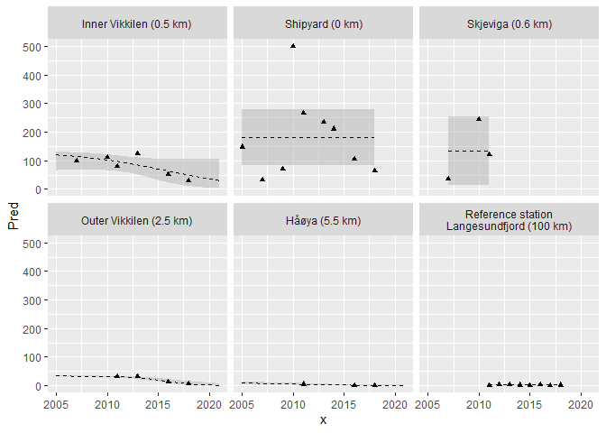<!-- -->

```r
gg + scale_y_log10()
```

```
## `geom_smooth()` using formula 'y ~ x'
```

<!-- -->


### b. Biota TBT combined  

#### Data set

```r
# levels(dat_tbt_mean_snails$Station_name2)
# levels(dat_tbt_mean_mytilus$Station_name2)

# Modify data for Littorina in 71G     
dat_71G_2 <- dat_71G %>%
  mutate(Species = "Littorina") %>%
  left_join(st_names)
```

```
## Joining, by = "Station"
```

```r
vars <- c("Species", "Station_name2", "Year", "TBT_mean", "TBT_flag")

dat_tbt_mean_comb <- bind_rows(
  dat_tbt_mean_snails[vars],
  dat_71G_2[vars],
  dat_tbt_mean_mytilus[vars]
)


dat_tbt_mean_comb %>%
  count((Species == "Sediment"), Station_name2)
```

```
## # A tibble: 12 x 3
##    `(Species == "Sediment")` Station_name2                                    n
##    <lgl>                     <fct>                                        <int>
##  1 FALSE                     "Inner Vikkilen (0.5 km)"                       14
##  2 FALSE                     "Shipyard (0 km)"                               17
##  3 FALSE                     "Mid Vikkilen (0.8 km)"                         12
##  4 FALSE                     "Outer Vikkilen (2 km)"                         15
##  5 FALSE                     "Håøya (4-6 km)"                                10
##  6 FALSE                     "Reference station\nLangesundfjord (100 km)"     9
##  7 TRUE                      "Inner Vikkilen (0.5 km)"                        1
##  8 TRUE                      "Shipyard (0 km)"                                3
##  9 TRUE                      "Mid Vikkilen (0.8 km)"                          2
## 10 TRUE                      "Outer Vikkilen (2 km)"                          3
## 11 TRUE                      "Håøya (4-6 km)"                                 1
## 12 TRUE                       <NA>                                           30
```


#### Add 'Species2' (actual species name, not genus)   

```r
dat_tbt_mean_comb <- dat_tbt_mean_comb %>%
  mutate(Species2 =
           case_when(
             Species %in% "Buccinum" ~ "B. undatum",
             Species %in% "Littorina" ~ "L. littorea",
             Species %in% "Nassarius" ~ "N. reticulatus",
             Species %in% "Nucella" ~ "N. lapillus",
             Species %in% "Mytilus" ~ "M. edulis",
             Species %in% "Sediment" ~ "Sediment"
           ),
         Species2 = factor(Species2, 
                           levels = c("L. littorea", "N. reticulatus", 
                                      "B. undatum", "N. lapillus", "M. edulis",
                                      "Sediment"))
         ) 


dat_tbt_mean_comb %>%
  count(Species, Species2)
```

```
## # A tibble: 6 x 3
##   Species   Species2           n
##   <chr>     <fct>          <int>
## 1 Buccinum  B. undatum         4
## 2 Littorina L. littorea       38
## 3 Mytilus   M. edulis         14
## 4 Nassarius N. reticulatus    20
## 5 Nucella   N. lapillus        1
## 6 Sediment  Sediment          40
```

#### Plot biota TBT, all stations, linear

```r
# Run all stations (as above)
gg <- dat_tbt_mean_comb %>%
  filter(!Species %in% c("Sediment", "Mytilus")) %>%
  filter(!is.na(TBT_mean)) %>%
  ggplot(aes(Year, TBT_mean)) +
    geom_point(aes(color = Species2)) + 
    geom_smooth(method = "lm") +
    facet_wrap(vars(Station_name2))

if (save_plots){
  ggsave("Figures/06_Timeseries_allsp_TBT_1.png", gg)
  ggsave("Figures/06_Timeseries_allsp_TBT_1_log.png", gg + scale_y_log10())
}

gg
```

```
## `geom_smooth()` using formula 'y ~ x'
```

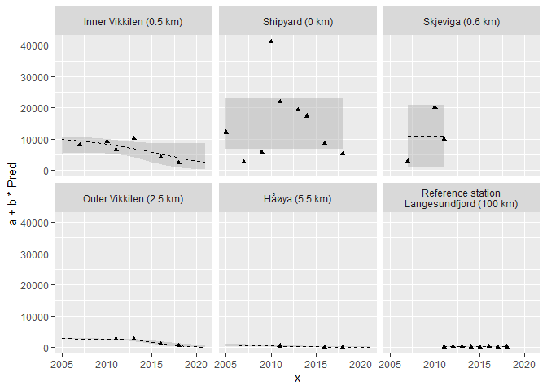<!-- -->

```r
gg + scale_y_log10()
```

```
## `geom_smooth()` using formula 'y ~ x'
```

<!-- -->


#### Plot biota TBT, all stations, logistic

* Fig. 6 in paper, old version    


```r
df <- dat_tbt_mean_comb %>%
  filter(!Species %in% c("Sediment", "Mytilus")) %>%
  filter(!is.na(TBT_mean))
sts <- unique(df$Station_name2)

get_logistic_result <- function(st, data) {
    df_station <- data %>% filter(Station_name2 %in% st)
    result <- pred_logistic_from_data(df_station, variable = "TBT_mean")
    result$fit$Station_name2 <- st
    result$pvalue$Station_name2 <- st
    result
}
# debugonce(get_logistic_result)
# debugonce(pred_logistic_from_data)
# get_logistic_result("Outer Vikkilen (2 km)", df)

# sts <- c("1", "4", "5", "6", "7")
pred_list <- sts %>% lapply(get_logistic_result, data = df)
names(pred_list) <- sts

str(pred_list, 1)       # List of 5
```

```
## List of 6
##  $ Outer Vikkilen (2 km)                     :List of 2
##  $ Shipyard (0 km)                           :List of 2
##  $ Håøya (4-6 km)                            :List of 2
##  $ Mid Vikkilen (0.8 km)                     :List of 2
##  $ Inner Vikkilen (0.5 km)                   :List of 2
##  $ Reference station
## Langesundfjord (100 km):List of 2
```

```r
str(pred_list[[1]], 1)  # List of 2: $fit  and $pvalue
```

```
## List of 2
##  $ fit   :'data.frame':	100 obs. of  5 variables:
##  $ pvalue:'data.frame':	1 obs. of  2 variables:
```

```r
# Collect data for plotting 
df_pred <- bind_rows(transpose(pred_list)$fit)
df_pvalue <- bind_rows(transpose(pred_list)$pvalue)

# Plot
gg <- ggplot() + 
  geom_ribbon(data = df_pred, aes(x, ymin = Pred_lo, ymax = Pred_hi), fill = "grey70") +
  geom_path(data = df_pred, aes(x, y = Pred)) +
  geom_point(data = df, aes(Year, TBT_mean, fill = Species2), size = 2, pch = 21) +
  scale_fill_discrete("") +
  geom_text(data = df_pvalue, aes(x = 2018, y = 8000, label = Text), 
            vjust = 1.2, hjust = 1, size = 3.4) +
  # Vertical dashed line 
  geom_vline(xintercept = c(2008), color = "red2", linetype = 2) +
  facet_wrap(vars(Station_name2)) +
  labs(x = "Year", y = "TBT concentration")
gg + scale_y_log10(limits = c(0.3, 8000))
```

<!-- -->

```r
if (save_plots){
  ggsave("Figures/06_Timeseries_allsp_TBT_2.png", 
         gg,
         width = 8, height = 5, dpi = 500)
  ggsave("Figures/06_Timeseries_allsp_TBT_2_log.png", 
         gg + scale_y_log10(limits = c(0.3, 900)),
         width = 8, height = 5, dpi = 500)
}

gg
```

<!-- -->

```r
gg + scale_y_log10(limits = c(0.3, 1100))
```

```
## Warning: Removed 6 rows containing missing values (geom_text).
```

<!-- -->

#### FIG. 6 Plot biota TBT, littorea + reticulatus, logistic

* Fig. 6 in paper  


```r
# I% text label is made here
df_ipercent <- dat_intersex_litt_summ %>%
  filter(!is.na(I_perc)) %>%
  group_by(Station_name2) %>%
  arrange(Year) %>%
  summarise(Text_Iperc = paste0(
    "I%: ", 
    round(first(I_perc), 0), " (", first(Year), ") - ",
    round(last(I_perc), 0), " (", last(Year), ")"
  ))


get_logistic_result <- function(st) {
    df_station <- df %>% filter(Station_name2 %in% st)
    result <- pred_logistic_from_data(df_station, variable = "TBT_mean")
    result$fit$Station_name2 <- st
    result$pvalue$Station_name2 <- st
    result
}

df <- dat_tbt_mean_comb %>%
  filter(Species %in% c("Littorina", "Nassarius")) %>%     # only changed this
  filter(!is.na(TBT_mean))
sts <- unique(df$Station_name2) 
# sts <- levels(sts)[as.numeric(sts)]
# sts <- c("1", "4", "5", "6", "7")

# test
# get_logistic_result(2)

pred_list <- sts %>% lapply(get_logistic_result)
names(pred_list) <- sts

str(pred_list, 1)       # List of 5
```

```
## List of 6
##  $ Håøya (4-6 km)                            :List of 2
##  $ Outer Vikkilen (2 km)                     :List of 2
##  $ Mid Vikkilen (0.8 km)                     :List of 2
##  $ Shipyard (0 km)                           :List of 2
##  $ Inner Vikkilen (0.5 km)                   :List of 2
##  $ Reference station
## Langesundfjord (100 km):List of 2
```

```r
str(pred_list[[1]], 1)  # List of 2: $fit  and $pvalue
```

```
## List of 2
##  $ fit   :'data.frame':	100 obs. of  5 variables:
##  $ pvalue:'data.frame':	1 obs. of  2 variables:
```

```r
# Collect data for plotting 
df_pred <- bind_rows(transpose(pred_list)$fit)
df_pvalue <- bind_rows(transpose(pred_list)$pvalue)

# Cut off predictions at 1 year before first + 1 year after last observation   
df_pred <- df_pred %>%
  # Add min/max year per station, which we get from the observations ('df') 
  left_join(
    df %>%
      group_by(Station_name2) %>%
      summarise(min_year = min(Year - 1), max_year = max(Year) + 1, .groups = "drop")
  ) %>%
  filter(x >= min_year & x <= max_year)
```

```
## Joining, by = "Station_name2"
```

```r
# Plot
gg <- ggplot() + 
  geom_ribbon(data = df_pred, aes(x, ymin = Pred_lo, ymax = Pred_hi), fill = "grey70") +
  geom_path(data = df_pred, aes(x, y = Pred)) +
  geom_point(data = df, aes(Year, TBT_mean, 
                            fill = Species2, shape = Species2), size = 2) +
  scale_fill_discrete("") +
  scale_shape_manual("", values = c(21, 24)) +
  # P-value text
  geom_text(data = df_pvalue, aes(x = 2018, y = 8000, label = paste("Slope: ", Text)), 
            vjust = 1.2, hjust = 1, size = 3.4) +
  # I% text
  geom_text(data = df_ipercent, aes(x = 2018, y = 2500, label = Text_Iperc), 
            vjust = 1.2, hjust = 1, size = 2.8) +
  geom_segment(
    data = data.frame(
      x = 2008,
      xend = 2008,
      y = 0.5,
      yend = 700
    ), aes(x=x, y = y, xend = xend, yend= yend), color = "red", linetype = 2) +
  facet_wrap(vars(Station_name2)) +
  labs(x = "Year", y = expression(mu*g~TBT/kg~w.w)) +
  theme_bw() +
  theme(
    panel.grid = element_blank())

# save_plots <- TRUE
if (save_plots){
  ggsave("Figures/06_Timeseries_allsp_TBT_3_log_FIG6.png", 
         gg + scale_y_log10(limits = c(0.3, 8000), breaks = c(1,10,100)),
         width = 6.6, height = 4.2, dpi = 500)
}

# gg
gg + scale_y_log10(limits = c(0.3, 8000), breaks = c(1,10,100))
```

<!-- -->


### c. Plot TBT in blue mussel vs. TBT in Littorina   

* Fig. 5A  

#### Table  

```r
df <- dat_tbt_mean_comb %>%
  filter(Species %in% c("Littorina", "Mytilus")) %>%
  filter(!is.na(TBT_mean))

xtabs(~Station_name2 + Year + Species, df)
```

```
## , , Species = Littorina
## 
##                                             Year
## Station_name2                                2005 2007 2009 2010 2011 2012 2013
##   Inner Vikkilen (0.5 km)                       0    1    0    1    1    0    1
##   Shipyard (0 km)                               1    1    1    1    1    0    1
##   Mid Vikkilen (0.8 km)                         0    1    0    1    1    0    0
##   Outer Vikkilen (2 km)                         0    0    0    0    1    0    1
##   Håøya (4-6 km)                                0    0    0    0    1    0    0
##   Reference station\nLangesundfjord (100 km)    0    0    0    0    1    1    1
##                                             Year
## Station_name2                                2014 2015 2016 2017 2018
##   Inner Vikkilen (0.5 km)                       1    0    1    0    1
##   Shipyard (0 km)                               1    0    1    0    1
##   Mid Vikkilen (0.8 km)                         0    0    0    0    0
##   Outer Vikkilen (2 km)                         1    0    1    0    1
##   Håøya (4-6 km)                                0    0    1    0    1
##   Reference station\nLangesundfjord (100 km)    1    1    1    1    1
## 
## , , Species = Mytilus
## 
##                                             Year
## Station_name2                                2005 2007 2009 2010 2011 2012 2013
##   Inner Vikkilen (0.5 km)                       1    0    0    0    0    0    0
##   Shipyard (0 km)                               0    0    0    0    0    0    0
##   Mid Vikkilen (0.8 km)                         1    2    0    0    0    0    0
##   Outer Vikkilen (2 km)                         2    1    0    0    0    0    0
##   Håøya (4-6 km)                                2    0    0    0    0    0    0
##   Reference station\nLangesundfjord (100 km)    0    0    0    0    0    0    0
##                                             Year
## Station_name2                                2014 2015 2016 2017 2018
##   Inner Vikkilen (0.5 km)                       0    0    0    0    0
##   Shipyard (0 km)                               0    0    0    0    1
##   Mid Vikkilen (0.8 km)                         0    0    0    0    1
##   Outer Vikkilen (2 km)                         0    0    1    0    2
##   Håøya (4-6 km)                                0    0    0    0    0
##   Reference station\nLangesundfjord (100 km)    0    0    0    0    0
```


#### Plot as time series, color

```r
# Run all stations (as above)
gg <- ggplot(df, aes(Year, TBT_mean)) +
    geom_point(aes(color = Species2)) + 
    geom_smooth(method = "lm") +
    facet_wrap(vars(Station_name2))

gg + scale_y_log10()
```

```
## `geom_smooth()` using formula 'y ~ x'
```

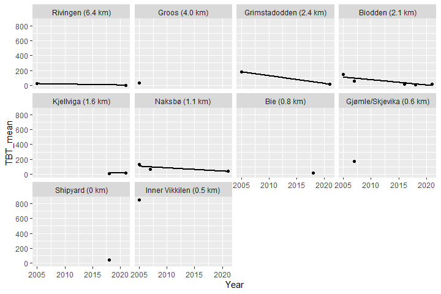<!-- -->

#### Plot as time series, b/w 

```r
# Run all stations (as above)
gg <- ggplot(df, aes(Year, TBT_mean)) +
  geom_point(aes(shape = Species2)) + 
  scale_shape_manual("", values = c(16,2)) +
  geom_smooth(method = "lm") +
  facet_wrap(vars(Station_name2)) +
  #¤ labs(y = expression(DCB~(mu*g/kg~våtvekt)))
  labs(y = expression(Mean~TBT~concentration~(mu*g/kg~w.w.)))

if (save_plots)
  ggsave("Figures/06_Timeseries_Litt_Myt_TBT.png", 
         gg + scale_y_log10(),
         width = 8, height = 5, dpi = 500)
  
gg + scale_y_log10()
```

```
## `geom_smooth()` using formula 'y ~ x'
```

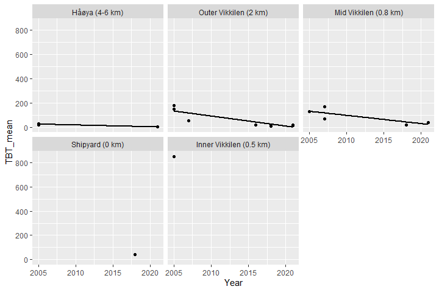<!-- -->

#### Plot against each other    

* Fig. 5 B  
 

```r
df_2_species <- df %>%
  group_by(Species, Station_name2, Year) %>%
  summarise(TBT_mean = mean(TBT_mean, na.rm = TRUE), .groups = "drop") %>%
  tidyr::pivot_wider(names_from = Species, values_from = "TBT_mean") 
  
# Run all stations (as above)
gg <- df_2_species %>%
  filter(!is.na(Littorina) & !is.na(Mytilus)) %>%
  ggplot(aes(Littorina, Mytilus)) +
  geom_point() + 
  # geom_smooth(method = "lm", se = FALSE) +
  geom_abline(intercept = 0, slope = 1, linetype = "dashed") +
  labs(
    x = expression(Littorina~TBT~concentration~(mu*g/kg~w.w.)),
    y = expression(Mytilus~TBT~concentration~(mu*g/kg~w.w.)))

gg1 <- gg
gg2 <- gg +
  geom_text(aes(x = Littorina + 2, label = paste(Station_name2, Year)), hjust = 0, size = 3) +
  coord_cartesian(xlim = c(0, 100))

if (save_plots){
  ggsave("Figures/06_Correlations_TBT_bluemussel_vs_Littorina_1.png", 
         gg,
         width = 4, height = 4, dpi = 500)
  ggsave("Figures/06_Correlations_TBT_bluemussel_vs_Littorina_2.png", 
         gg2,
         width = 4, height = 4, dpi = 500)
}

gg1
```

<!-- -->

```r
gg2
```

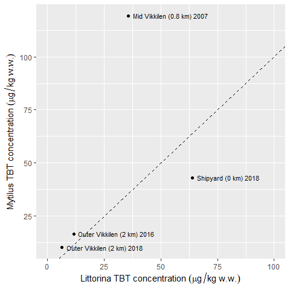<!-- -->


### d. Plot sediment TBT at all stations  

* Fig. 6A  

```r
# Run all stations (as above)
gg <- dat_tbt_mean_snails %>%
  filter(Species %in% "Sediment") %>%
  # group_by(Species, Station, Year) %>%
  # summarise(TBT_mean = mean(TBT, na.rm = TRUE), TBT_flag = mean(TBT_flag %in% "<"),
  #           .groups = "drop") %>%
  filter(!is.na(TBT_mean)) %>%
  ggplot(aes(Year, TBT_mean)) +
    geom_point(aes(color = Species)) + 
    geom_smooth(method = "lm", se = FALSE) +
    facet_wrap(vars(Station_name2))

gg
```

```
## `geom_smooth()` using formula 'y ~ x'
```

<!-- -->

```r
gg + scale_y_log10()
```

```
## `geom_smooth()` using formula 'y ~ x'
```

<!-- -->

```r
if (save_plots)
  ggsave("Figures/06_Timeseries_TBT_sediment_log.png", gg + scale_y_log10())
gg
```

```
## `geom_smooth()` using formula 'y ~ x'
```

<!-- -->


### e. Plot TBT in blue mussel vs. TBT in Littorina   

* (old Fig. 5B)     


```r
factor_to_character <- function(x) levels(x)[as.numeric(x)]

df1 <- dat_tbt %>%
  filter(Species %in% "Littorina") %>%
  left_join(st_names, by = "Station") %>%
  mutate(Station_name = factor_to_character(Station_name))

# FIX STATIONS IN THIS ONE  - now there are no 
df2 <- dat_tbt %>%
  filter(Species %in% "Mytilus") %>%
  left_join(st_names, by = "Station") %>%
  mutate(Station_name = factor_to_character(Station_name))

vars <- c("Species", "Station_name", "Year", "TBT", "TBT_flag")

dat_tbt_mean_2species <- bind_rows(df1[vars], df2[vars]) %>%
  mutate(Station_name2 = case_when(
    grepl("Reference station 2", Station_name) ~ "Reference station 2 (6 km)",
    grepl("Skjeviga", Station_name) ~ "Bie/Skjeviga (0.6 km)",
    grepl("Outer Vikkilen", Station_name) ~ "Outer Vikkilen (2.5 km)",
    grepl("Grimstadodden", Station_name) ~ "Outer Vikkilen (2.5 km)",
    grepl("Biodden", Station_name) ~ "Outer Vikkilen (2.5 km)",
    grepl("Naksbø", Station_name) ~ "Outer Vikkilen (2.5 km)",
    grepl("Shipyard", Station_name) ~ "	Shipyard (0 km)",
    TRUE ~ Station_name)
  ) %>%
  group_by(Species, Station_name2, Year) %>%
  summarise(TBT_mean = mean(TBT, na.rm = TRUE), TBT_flag = mean(TBT_flag %in% "<"),
            .groups = "drop")

xtabs(~Species + addNA(Station_name2), dat_tbt_mean_2species)
```

```
##            addNA(Station_name2)
## Species     \tShipyard (0 km) Bie/Skjeviga (0.6 km) Håøya (5.5 km)
##   Littorina                9                     1              3
##   Mytilus                  0                     0              0
##            addNA(Station_name2)
## Species     Inner Vikkilen (0.5 km) Outer Vikkilen (2.5 km) <NA>
##   Littorina                       8                       6    3
##   Mytilus                         0                       0    4
```


```r
df <- dat_tbt_mean_2species %>%
  filter(Species %in% c("Littorina", "Mytilus")) %>%
  filter(!is.na(TBT_mean)) %>%
  # group_by(Species2, Station_name2, Year) %>%
  # mutate(n = n()) %>%
  # filter(n > 1) %>%
  select(Species, Station_name2, Year, TBT_mean) %>%
  # count(Species2, Station_name2, Year) %>% filter(n > 1)    # for checking dublettes
  tidyr::pivot_wider(names_from = Species, values_from = TBT_mean)
nrow(df)
```

```
## [1] 31
```


