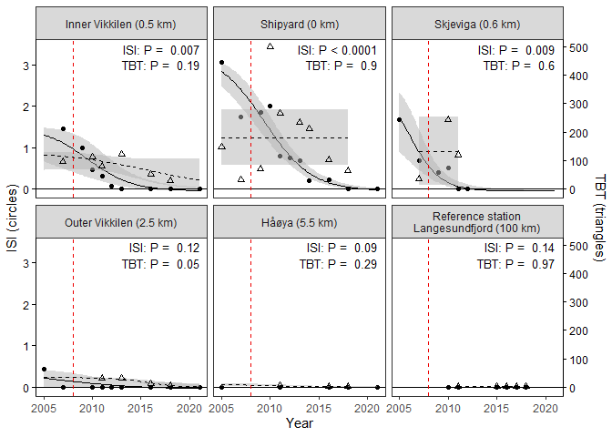
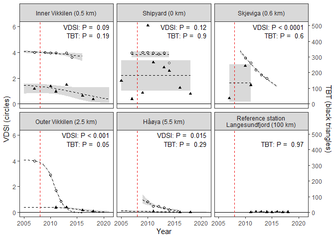
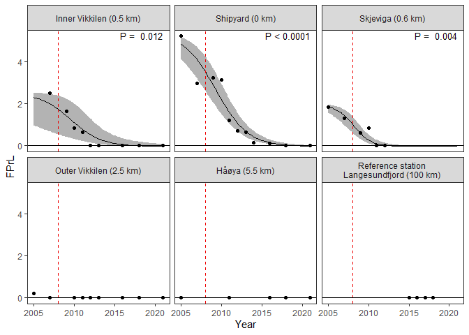
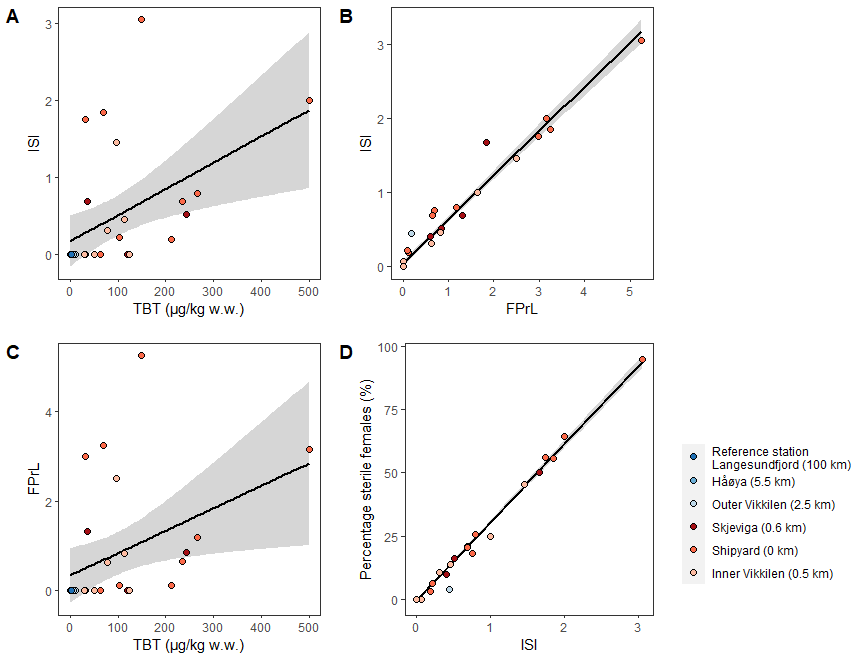

## General  
- percentage sterile females (%S) = (number of sterile females/total number of females)*100
    - stage 2-4 females are sterile
- mean Female Penis Length (FPL)
- mean Male Penis Length (MPL)
For N. lapillus,
- Relative Penis Size Index (RPSI) = (FPL)3/(MPL)3*100 
- imposex index (VDSI) = (sum of the values of imposex stages (ranged 0 to 5) in all females/the number of females collected)  
For B. undatum
- Penis Classification Index (PCI) after Strand and Jacobsen (2002)

## Figures  
- All figures have 'FIG' in the filename (and so can easily be searched)

## Script  
- *This script is a cleaned version of 06_Tables_graphs.Rmd.*  The order of parts 4-6 in this file fits with the order in the MS  

- Figur 7: Er P-verdiene de samme for sedimentene etter at data for 2021 ble inkludert? Hva er prosenten for hele området per år? Vi har ikke noe område 6, så den skal jeg droppe. *Script '07_Sediment_newfile_July2020.Rmd'*   
- Vi droppet figur på TBT-konsentrasjon for blåskjell og strandsnegl, men P var ikke signifikant (P=0,48). Kan du likevel se hva den blir når 2021-dataene er inkludert? Blåskjell skal være en kontroll for strandsnegl, men det gir vel ikke mening hvis det ikke er korrelasjon. *Sections 6 + 8*   
    
    
## 0. Libraries

```r
library(dplyr)
```

```
## 
## Attaching package: 'dplyr'
```

```
## The following objects are masked from 'package:stats':
## 
##     filter, lag
```

```
## The following objects are masked from 'package:base':
## 
##     intersect, setdiff, setequal, union
```

```r
library(purrr)    # transpose
library(ggplot2)
library(tidyr)
library(forcats)
library(cowplot)
library(readxl)
library(stringr)

# install.packages("openxlsx")
library(openxlsx)

source("06_Tables_graphs_functions.R")
```

## 0b. Settings

```r
save_plots <- TRUE
save_plots <- FALSE

last_year <- 2021

# Back up table (if needed)
if (FALSE){
  
  file.copy("Figures/06_Littorina_tables.xlsx", "Figures/06_Littorina_tables_back_2021-06-21.xlsx")
  
}
```


## 0c. Make 5-color palette  

```r
# library("colorspace") 
# The line below: run it in the Console (bottom window), NOT here (RStudio will hang)
# pal <-choose_palette()

library(pals)

if (FALSE){
  labs=c('alphabet','alphabet2', 'glasbey','kelly','polychrome', 
         'stepped', 'stepped2', 'stepped3', 'tol', 'watlington')
  op=par(mar=c(0,5,3,1))
  pal.bands(alphabet(), alphabet2(), glasbey(), kelly(), polychrome(), 
            stepped(), stepped2(), stepped3(), tol(), watlington(), 
            labels=labs, show.names=FALSE)

  pal.bands(tol(5), glasbey(5), kelly(7)[3:7])
  pal.bands(brewer.blues(4), brewer.reds(4))

  }


station_cols <- c(
  brewer.blues(4)[c(4,3,2)], 
  brewer.reds(6)[c(6,4,2)])
pal.bands(station_cols)
```

<!-- -->

## 0d. Station names    
* 'Station_name' mostly used  
* 'Station_name2' used in part 8 ('TBT - all species')    

```r
# OLD (before we combined st. 5 and 5b)
st_names <- data.frame(
  Station = c("1", "4", "5", "5b", "6", "7"),
  Station_name = c("St. 1 Håøya, Outer fjord", "St. 4 Hasseldalen", "St. 5 Skjeviga", 
              "St. 5B Båtstø", "St. 6 Shipyard", "St. 7 Inner Vikkilen")
)

# NEW (after combining st. 5 and 5b)
# NOTE: tuis was also changed in the script "06_Tables_graphs_functions.R", used from section 6 onwards
st_names <- data.frame(
  Station = c("71G", "1", "4", 
              "5", "6", "7"),
  Station_name = c("Reference station\nLangesundfjord (100 km)", "Håøya (5.5 km)", "Outer Vikkilen (2.5 km)", 
                   "Skjeviga (0.6 km)", "Shipyard (0 km)", "Inner Vikkilen (0.5 km)"),
  Station_name2 = c("Reference station\nLangesundfjord (100 km)", "Håøya (4-6 km)", "Outer Vikkilen (2 km)", 
                    "Mid Vikkilen (0.8 km)", "Shipyard (0 km)", "Inner Vikkilen (0.5 km)"),
  stringsAsFactors = FALSE
  ) %>%
  mutate(
    Station_name = fct_inorder(Station_name),  # set as factor, for correct order
    Station_name2 = fct_inorder(Station_name2)
  )

# Reverse direction
st_names$Station_name <- factor(st_names$Station_name, 
                                levels = rev(levels(st_names$Station_name)))
st_names$Station_name2 <- factor(st_names$Station_name2, 
                                levels = rev(levels(st_names$Station_name2)))

names(station_cols) <- st_names$Station_name

st_names_mytilus <- tibble::tribble(
    ~Station_Myt, ~Station_name,  ~Station_name2, 
    "b1", "Rivingen (6.4 km)",          "Håøya (4-6 km)", 
    "b2", "Groos (4.0 km)",             "Håøya (4-6 km)",
    "b3", "Grimstadodden (2.4 km)",     "Outer Vikkilen (2 km)",
    "b4", "Biodden (2.1 km)",           "Outer Vikkilen (2 km)",
    "b5", "Kjellviga (1.6 km)" ,        "Outer Vikkilen (2 km)",
    "b6", "Naksbø (1.1 km)",            "Mid Vikkilen (0.8 km)",
    "b7", "Bie (0.8 km)",               "Mid Vikkilen (0.8 km)",
    "b8", "Gjømle/Skjevika (0.6 km)",   "Mid Vikkilen (0.8 km)",
    "b9", "Shipyard (0 km)",            "Shipyard (0 km)", 
    "b10", "Inner Vikkilen (0.5 km)",   "Inner Vikkilen (0.5 km)"
  ) %>%
  mutate(
    Station_name = fct_inorder(Station_name),  # set as factor, for correct order
    Station_name2 = fct_inorder(Station_name2)
  )
```


## 1. Data

### a1. Intersex and TBT raw data  


```r
#
# Data made in script 02
#
dat_intersex_litt <- readRDS(file = "Data/02_Strandsnegl_intersex_2005_2018.RData") %>%
  mutate(Station = case_when(Station %in% "St6" ~ "6",
                             TRUE ~ Station),
         Sex = case_when(tolower(Sex) %in% "f" ~ "f",
                         tolower(Sex) %in% "m" ~ "m",
                         TRUE ~ "x")
         )

#
# Data made in script 05
#
dat_tbt <- readRDS(file = "Data/05_TBT.RData")
```


### a2. 2021 Littorina data 
- Fetched from Nivabasen using 5. April 2022, see script 21     
- Littorina TBT added to dat_tbt here
- Mytilus TBT added to dat_tbt in part 8
- Intersex not added here, added to 'dat_intersex_litt_summ' in part 3.c1a


```r
dat_2021_biota <- read.csv("Data/21_data_2016-2021_biota.csv")

dat_tbt_2021 <- dat_2021_biota %>%
  filter(MYEAR == 2021,
         LATIN_NAME %in% "Littorina littorea",
         NAME %in% c("Tributyltinn", "Tributyltinn (TBT)")) %>%
  rename(
    Year = MYEAR,
    TBT = VALUE,
    TBT_flag = FLAG1
  ) %>%
  mutate(
    Station = str_extract(STATION_CODE, "[0-9]+"),
    Species = "Littorina"
  ) %>%
  select(Station, Year, Species, TBT, TBT_flag)

cat("dat_tbt_2021:", nrow(dat_tbt_2021), "rows\n")
```

```
## dat_tbt_2021: 4 rows
```

```r
# Add new data to dat_tbt
check <- dat_tbt$Year == 2021
if (sum(check) == 0){
  dat_tbt <- bind_rows(
    dat_tbt, dat_tbt_2021
  )
  
}
```
### a3. Summarise TBT  

16 April 2020: 
- Combine 5 and 5B


```r
# Summarise TBT
dat_tbt_mean <- dat_tbt %>% 
  mutate(Station = case_when(
    Station %in% "5b" ~ "5",
    Station != "5b" ~ Station
  )) %>% # View()
  group_by(Species, Station, Year) %>%
  summarise(TBT_mean = mean(TBT, na.rm = TRUE), TBT_flag = mean(TBT_flag %in% "<"),
            .groups = "drop")

cat("TBT in Littorina, raw data \n")
```

```
## TBT in Littorina, raw data
```

```r
dat_tbt %>% 
  filter(Station %in% c("1","4","5","5b","6","7") & Species == "Littorina") %>%
  xtabs(~Year + Station, .)
```

```
##       Station
## Year   1 4 5 5b 6 7
##   2005 0 1 0  0 1 1
##   2007 0 0 0  1 1 1
##   2009 0 0 0  0 1 0
##   2010 0 0 0  1 1 1
##   2011 1 1 1  1 1 1
##   2013 0 1 0  0 1 1
##   2014 0 1 0  0 1 1
##   2016 1 1 0  0 1 1
##   2018 1 1 0  0 1 1
##   2021 1 1 0  0 1 1
```

```r
cat("\n")
```

```r
cat("TBT in Littorina, number of means, 5 and 5B combined \n")
```

```
## TBT in Littorina, number of means, 5 and 5B combined
```

```r
dat_tbt_mean %>% 
  filter(Station %in% c("1","4","5","5b","6","7") & Species == "Littorina") %>%
  xtabs(~Year + Station, .)
```

```
##       Station
## Year   1 4 5 6 7
##   2005 0 1 0 1 1
##   2007 0 0 1 1 1
##   2009 0 0 0 1 0
##   2010 0 0 1 1 1
##   2011 1 1 1 1 1
##   2013 0 1 0 1 1
##   2014 0 1 0 1 1
##   2016 1 1 0 1 1
##   2018 1 1 0 1 1
##   2021 1 1 0 1 1
```

```r
# str(dat_tbt_mean)
```


### b. Add station names, snails + sediment only      
Don't include Mytilus (blue mussel, because they use a seperate set of stations, Station_Myt, see script 05)  

```r
dat_tbt_mean_snails <- dat_tbt_mean %>%
  filter(!Species %in% "Mytilus") %>%
  left_join(st_names, by = "Station")

str(dat_tbt_mean_snails)
```

```
## tibble [98 x 7] (S3: tbl_df/tbl/data.frame)
##  $ Species      : chr [1:98] "Buccinum" "Buccinum" "Buccinum" "Buccinum" ...
##  $ Station      : chr [1:98] "4" "4" "6" "6" ...
##  $ Year         : num [1:98] 2013 2014 2013 2014 2011 ...
##  $ TBT_mean     : num [1:98] 4.2 3.1 19.9 201 5 1 1.4 3.2 NaN 30.4 ...
##  $ TBT_flag     : num [1:98] 0 0 0 0 0 0 0 0 0 0 ...
##  $ Station_name : Factor w/ 6 levels "Inner Vikkilen (0.5 km)",..: 4 4 2 2 5 5 5 5 4 4 ...
##  $ Station_name2: Factor w/ 6 levels "Inner Vikkilen (0.5 km)",..: 4 4 2 2 5 5 5 5 4 4 ...
```

### c. Imposex in N. reticulatus (nettsnegl)   

2013 data  
* Supplied later, in a separate file  

```r
colnames <- c("Nr", "Code", "SH", "AH", 
"Te", "VS", "Pr", "Vd", "Pe_gl", "Gen_excr", "Other_excr", 
"Paras",
"O", "Od", "Ag", "Ig", "Cg", "Vag", "in.Od", "stage", "type", 
"male", "Kommentar")

columntypes <- c(Nr = "numeric", Code = "text", 
                   SH = "numeric", SB = "numeric", yr = "numeric", VS = "text", 
                   Pr = "text", Vd = "text", Pe_gl = "numeric", P_P = "numeric", 
                   Gen_excr = "numeric", Other_excr = "numeric", O = "text", 
                   Od = "text", Ag = "text", Ig = "text", Cg = "text", 
                   Vag = "text", in.Od = "text", stage = "numeric", type = "text", 
                   male = "numeric", Kommentar = "text")


fn <- "Input_data/Nettsnegl-Nassarius-Hinia/imposexskjema 2013_hinia.xls"

sheet <- "7_13"
df_07 <- read_excel(fn, sheet = sheet, range = "A8:W58", 
                    col_names = colnames, col_types = columntypes) %>%
  mutate(Sheet = sheet, 
         Station = "7",
         Year = 2013,
         Nr = as.character(Nr),
         .before = everything())

sheet <- "st6_13"
df_06 <- read_excel(fn, sheet = sheet, range = "A8:W58", 
                    col_names = colnames, col_types = columntypes) %>%
  mutate(Sheet = sheet, 
         Station = "6",
         Year = 2013,
         Nr = as.character(Nr),
         .before = everything())

sheet <- "st5b"
df_05b <- read_excel(fn, sheet = sheet, range = "A8:W58", 
                    col_names = colnames, col_types = columntypes) %>%
  mutate(Sheet = sheet, 
         Station = "5b",
         Year = 2013,
         Nr = as.character(Nr),
         .before = everything())

sheet <- "st5"
df_05 <- read_excel(fn, sheet = sheet, range = "A8:W57", 
                    col_names = colnames, col_types = columntypes) %>%
  mutate(Sheet = sheet, 
         Station = "5",
         Year = 2013,
         Nr = as.character(Nr),
         .before = everything())

sheet <- "st1"
df_01 <- read_excel(fn, sheet = sheet, range = "A8:W57", 
                    col_names = colnames, col_types = columntypes) %>%
  mutate(Sheet = sheet, 
         Station = "1",
         Year = 2013,
         Nr = as.character(Nr),
         .before = everything())

df_2013 <- bind_rows(df_07, df_06, df_05b, df_05, df_01) %>%
  mutate(
    Sex = case_when(
      male %in% 1 ~ "m",
      TRUE ~ "f"),
    Nr = as.numeric(Nr)
  ) %>% 
  filter(!is.na(Nr)) %>%
  select(-Paras)
```

In this case, we combine station 5b with station 6     
* *Not* combining 5b with 5, as we did for intersex in L. littorea    
* For Figure 4  
* Used in part 7  


```r
dat_imposex_reticul <- readRDS("Data/02_Nettsnegl_intersex_2007_2014.RData") %>%
  bind_rows(df_2013)

# Some tables
if (FALSE){
  table(addNA(dat_imposex_reticul$Sex))
  table(addNA(dat_imposex_reticul$Station))
  table(addNA(dat_imposex_reticul$Station), addNA(dat_imposex_reticul$Year))
  xtabs(~addNA(stage) + Sex, dat_imposex_reticul)
}

dat_imposex_reticul_summ <- dat_imposex_reticul %>%
  mutate(Station = case_when(
    Station %in% "5b" ~ "6",
    Station != "5b" ~ Station)
    ) %>% # View()
  group_by(Station, Year) %>%
  summarize(VDSI = mean(stage, na.rm = TRUE),
            N_VDSI = sum(!is.na(stage)),
            SH = mean(SH, na.rm = TRUE),
            Pe_gl = mean(Pe_gl, na.rm = TRUE),
            .groups = "drop"
            ) %>%
  left_join(st_names, by = "Station")

# 1    4    5   5b    6    7
  
    # mutate(Station = case_when(Station %in% "St6" ~ "6",
    #                          TRUE ~ Station),
    #      Sex = case_when(tolower(Sex) %in% "f" ~ "f",
    #                      tolower(Sex) %in% "m" ~ "m",
    #                      TRUE ~ "x")
    #      )

df <- dat_imposex_reticul_summ %>%
  arrange(Year, Station ) %>%
  select(Station, Year, VDSI) %>%
  mutate(VDSI = round(VDSI, 2)) %>%
  pivot_wider(names_from = "Year", values_from = "VDSI") %>%
  arrange(desc(Station))

writexl::write_xlsx(df,  "Output_excel/06_Imposex_nettsnegl.xlsx")

df
```

```
## # A tibble: 5 x 8
##   Station `2007` `2009` `2010` `2011` `2012` `2013` `2014`
##   <chr>    <dbl>  <dbl>  <dbl>  <dbl>  <dbl>  <dbl>  <dbl>
## 1 7         4         4   3.97   3.94  NA      3.96   3.6 
## 2 6         3.96      4   4      3.96   3.87   3.94   3.19
## 3 5        NA        NA   3.58   3.18   2.65   2.27   1.97
## 4 4         4        NA   2.89   1.71   0.87  NA     NA   
## 5 1        NA        NA   0.81   0.45   0.45   0.37   0.2
```


## 2. TBT - tables of species

```r
xtabs(~Species, dat_tbt_mean)
```

```
## Species
##  Buccinum Littorina   Mytilus Nassarius   Nucella  Sediment 
##         4        33         4        20         1        40
```

```r
xtabs(~Species + Year, dat_tbt_mean)
```

```
##            Year
## Species     2004 2005 2007 2008 2009 2010 2011 2013 2014 2016 2018 2021
##   Buccinum     0    0    0    0    0    0    0    2    2    0    0    0
##   Littorina    0    3    3    0    1    3    5    3    3    4    4    4
##   Mytilus      0    1    1    0    0    0    0    0    0    1    1    0
##   Nassarius    0    0    3    0    1    3    5    4    4    0    0    0
##   Nucella      0    0    0    0    0    0    1    0    0    0    0    0
##   Sediment    14    2    3   17    0    0    0    4    0    0    0    0
```

## 3. Littorina data
### a1. Chemical data  

```r
# xtabs(~Station + df_name, dat_tbt %>% filter(Species %in% "Littorina"))
xtabs(~Station + Year, dat_tbt %>% filter(Species %in% "Littorina"))
```

```
##        Year
## Station 2005 2007 2009 2010 2011 2013 2014 2016 2018 2021
##      1     0    0    0    0    1    0    0    1    1    1
##      4     1    0    0    0    1    1    1    1    1    1
##      5     0    0    0    0    1    0    0    0    0    0
##      5b    0    1    0    1    1    0    0    0    0    0
##      6     1    1    1    1    1    1    1    1    1    1
##      7     1    1    0    1    1    1    1    1    1    1
```

```r
tab_tbt <- dat_tbt_mean_snails %>%
  group_by(Station, Year) %>%
  spread(Year, TBT_mean) %>%
  arrange(Species, desc(Station))

tab_tbt
```

```
## # A tibble: 46 x 17
## # Groups:   Station [33]
##    Species   Station TBT_flag Station_name    Station_name2 `2004` `2005` `2007`
##    <chr>     <chr>      <dbl> <fct>           <fct>          <dbl>  <dbl>  <dbl>
##  1 Buccinum  6              0 Shipyard (0 km) Shipyard (0 ~     NA     NA   NA  
##  2 Buccinum  4              0 Outer Vikkilen~ Outer Vikkil~     NA     NA   NA  
##  3 Littorina 7              0 Inner Vikkilen~ Inner Vikkil~     NA    NaN   97.7
##  4 Littorina 6              0 Shipyard (0 km) Shipyard (0 ~     NA    148   31.3
##  5 Littorina 5              0 Skjeviga (0.6 ~ Mid Vikkilen~     NA     NA   35.7
##  6 Littorina 4              0 Outer Vikkilen~ Outer Vikkil~     NA    NaN   NA  
##  7 Littorina 1              0 Håøya (5.5 km)  Håøya (4-6 k~     NA     NA   NA  
##  8 Nassarius 7              0 Inner Vikkilen~ Inner Vikkil~     NA     NA   53.4
##  9 Nassarius 6              0 Shipyard (0 km) Shipyard (0 ~     NA     NA   56.1
## 10 Nassarius 5              0 Skjeviga (0.6 ~ Mid Vikkilen~     NA     NA   18.1
## # ... with 36 more rows, and 9 more variables: `2008` <dbl>, `2009` <dbl>,
## #   `2010` <dbl>, `2011` <dbl>, `2013` <dbl>, `2014` <dbl>, `2016` <dbl>,
## #   `2018` <dbl>, `2021` <dbl>
```

### a2. Save TBT data to excel

```r
if (save_plots){
  
  writexl::write_xlsx(list(
    TBT = tab_tbt,
    Info = data.frame(Source = "Imposex_Littorina_Vikkilen script 06 (original filename: 06_Mean_tbt.xlsx)")
  ),
  "Output_excel/06_Mean_tbt.xlsx")

  # wb <- openxlsx::createWorkbook("DHJ")
  # openxlsx::addWorksheet(wb, "Littorina TBT")
  # openxlsx::writeData(wb, sheet = 1, tab_tbt)
  # openxlsx::saveWorkbook(wb, "Figures/06_Littorina_tables.xlsx", overwrite = TRUE)
}
```


### b. Intersex data, show tables  

```r
dat_intersex_litt %>%
  count(Sex, Female, Male)
```

```
## # A tibble: 2 x 4
##   Sex   Female  Male     n
##   <chr>  <dbl> <dbl> <int>
## 1 f          1     0   982
## 2 m          0     1   916
```

```r
dat_intersex_litt %>%
  count(Station, Year, Sex) %>%
  spread(Sex, n)
```

```
## # A tibble: 39 x 4
##    Station  Year     f     m
##    <chr>   <dbl> <int> <int>
##  1 1        2005    19    12
##  2 1        2011    28    22
##  3 1        2016    29    21
##  4 1        2018    32    16
##  5 4        2005    25    25
##  6 4        2007    12    18
##  7 4        2010    22    28
##  8 4        2011    25    25
##  9 4        2012    27    23
## 10 4        2013    23    27
## # ... with 29 more rows
```

### c1a. Mean intersex per station/year, and add TBT  
dat_intersex_litt_summ 

- percentage sterile females (%S) = (number of sterile females/total number of females)*100  
    - stage 2-4 females are sterile  
- mean Female Penis Length (FPL)  
- mean Male Penis Length (MPL)  
- For N. lapillus,  
    - Relative Penis Size Index (RPSI) = (FPL)3/(MPL)3*100   
- imposex index (VDSI) = (sum of the values of imposex stages (ranged 0 to 5) in all females/the number of females collected)  
  
16 April 2020: 
- Combine 5 and 5B

```r
dat_intersex_litt_summ <- dat_intersex_litt %>%
  ungroup() %>%
  filter(Sex %in% "f") %>%
  mutate(Station = case_when(
    Station %in% "5b" ~ "5",
    Station != "5b" ~ Station),
    PRL = case_when(
      is.na(PRL) ~ 0,
      !is.na(PRL) ~ PRL),
    ISI = case_when(
      is.na(ISI) ~ 0,
      !is.na(ISI) ~ ISI)
    ) %>% # View()
  group_by(Station, Year) %>%
  summarize(ISI_mean = mean(ISI, na.rm = FALSE),
            N_ISI = sum(!is.na(ISI)),
            Sterile_perc = mean((ISI >= 2)*100, na.rm = TRUE),
            I_perc = mean((ISI > 0)*100, na.rm = TRUE),
            PRL_mean = mean(PRL, na.rm = FALSE),
            .groups = "drop"
            ) %>%
  ungroup()

nrow(dat_intersex_litt_summ)
```

```
## [1] 36
```

```r
#
# Add 2021 data
# NOT NEEDED - ALREADY ADDED IN c2!
""
```

```
## [1] ""
```

```r
# Only zeros 
# - taken from 2021 report 7701-2022, page 34, table 20
#
# check <- dat_intersex_litt_summ$Year == 2021
# 
# if (sum(check) == 0){
#   dat_intersex_litt_summ <- bind_rows(
#     dat_intersex_litt_summ,
#     tibble(
#       Station = c("1","4","6","7"),
#       Year = 2021,
#       ISI_mean = 0,
#       N_ISI = 50,
#       Sterile_perc = 0,
#       I_perc = 0,
#       PRL_mean = 0
#     )
#   )
# }


# Add TBT_mean, TBT_flag
dat_intersex_litt_summ <- dat_intersex_litt_summ %>%
  left_join(dat_tbt_mean_snails %>% 
              filter(Species %in% "Littorina") %>%
              ungroup() %>%
              select(Station, Year, TBT_mean, TBT_flag), 
            by = c("Station", "Year")
            )

# Check
# dat_intersex_litt_summ %>% arrange(Year) %>% tail(20)

nrow(dat_intersex_litt_summ)
```

```
## [1] 36
```
### c1b. Add 71G data  

```r
dat_71G <- readxl::read_excel("Oppdatering sept2020/06_Littorina_tables_MSC.xlsx", sheet = "71G for R")

dat_intersex_litt_summ <- dat_intersex_litt_summ %>%
  bind_rows(dat_71G) %>%
  mutate(Sex = "f")
```

### c2. Add 2021 data   

* Data only given in Mail from Lise 25.5.2021 (forwarded from Merete 31.05)  
    - Data from four stations collected, Intersex = 0 for all  
    - st. 7 'Vikkilen innerst' and st 4 (hasseldalen) collected 5.5.2021  
    - st 1 Håøya and st. 6 Nymo collected 16.5.2021   
    - TBT not analysed yet (checked using '03_Check_chemistry_data_update2021.R')      

```r
if (FALSE){
  
  dat_intersex_litt_summ %>%
    filter(!is.na(ISI_mean)) %>%
    xtabs(~Year + Station, .)  
  
  dat_intersex_litt_summ %>%
    filter(Year == 2018)  
}

dat_extra <- data.frame(
  Year = rep(2021, 4),
  Station = c("1", "4", "6", "7"),
  Sex = "f",
  ISI_mean = rep(0, 4),
  Sterile_perc = rep(0, 4),
  I_perc = rep(0, 4),
  PRL_mean = rep(0, 4)
)  

# Check if there already are 2021 data  
check <- sum(dat_intersex_litt_summ$Year == 2021)
check
```

```
## [1] 0
```

```r
if (check == 0){
  dat_intersex_litt_summ <- bind_rows(
    dat_intersex_litt_summ,
    dat_extra
  )
}
```


### c3. Add station names  

```r
dat_intersex_litt_summ <- dat_intersex_litt_summ %>%
  left_join(st_names, by = "Station")


# str(dat_intersex_litt_summ)
# dat_intersex_litt_summ$Station
```

### c4. Save intersex data to excel
Add to existing 'wb' excel workbook  

```r
if (save_plots){
  
  # wb <- openxlsx::createWorkbook("DHJ")
  # openxlsx::addWorksheet(wb, "Littorina ISI raw")
  # openxlsx::writeData(wb, sheet = "Littorina ISI raw", dat_intersex_litt)
  # openxlsx::addWorksheet(wb, "Littorina ISI summ")
  # openxlsx::writeData(wb, sheet = "Littorina ISI summ", dat_intersex_litt_summ)
  
  tab1 <- dat_intersex_litt_summ %>%
    select(Station, Station_name, Station_name2, Year, ISI_mean) %>%
    pivot_wider(names_from = Year, values_from = ISI_mean, names_sort = TRUE) %>%
    arrange(desc(Station))

  tab2a <- dat_intersex_litt_summ %>%
    select(Station, Station_name, Station_name2, Year, I_perc) %>%
    mutate(I_perc = round(I_perc, 1)) %>%
    pivot_wider(names_from = Year, values_from = I_perc, names_sort = TRUE) %>%
    arrange(desc(Station))

  tab2b <- dat_intersex_litt_summ %>%
    select(Station, Station_name, Station_name2, Year, Sterile_perc) %>%
    pivot_wider(names_from = Year, values_from = Sterile_perc, names_sort = TRUE) %>%
    arrange(desc(Station))

  tab3 <- dat_intersex_litt_summ %>%
    select(Station, Station_name, Station_name2, Year, PRL_mean) %>%
    pivot_wider(names_from = Year, values_from = PRL_mean, names_sort = TRUE) %>%
    arrange(desc(Station))

  tab4 <- dat_intersex_litt_summ %>%
    select(Station, Station_name, Station_name2, Year, TBT_mean, TBT_flag) %>%
    mutate(TBT = case_when(
      is.na(TBT_flag) ~ as.character(TBT_mean),
      TBT_flag == 0 ~ as.character(TBT_mean),
      TBT_flag == 1 ~ paste("<", TBT_mean))
    ) %>%
    select(-TBT_mean, -TBT_flag) %>%
    pivot_wider(names_from = Year, values_from = TBT, names_sort = TRUE)  %>%
    arrange(desc(Station))

  writexl::write_xlsx(list(
    ISI = tab1,
    I_perc = tab2a,
    Sterile_perc = tab2b,
    PRL_mean = tab3,
    TBT = tab4,
    Info = data.frame(Source = "Imposex_Littorina_Vikkilen script 06 (original filename: 06_Means_Littorina.xlsx)")
  ),
  "Output_excel/06_Means_Littorina.xlsx")

}
```


### d1. Overview tables of mean values

```r
tab_ISI <- dat_intersex_litt_summ %>%
  mutate(ISI_mean = round(ISI_mean, 2)) %>%
  select(Station, Year, ISI_mean) %>%
  spread(Year, ISI_mean)
tab_ISI
```

```
## # A tibble: 6 x 14
##   Station `2005` `2007` `2009` `2010` `2011` `2012` `2013` `2014` `2015` `2016`
##   <chr>    <dbl>  <dbl>  <dbl>  <dbl>  <dbl>  <dbl>  <dbl>  <dbl>  <dbl>  <dbl>
## 1 1         0     NA     NA     NA      0     NA     NA     NA        NA   0   
## 2 4         0.44   0     NA      0      0      0      0     NA        NA   0   
## 3 5         1.67   0.68   0.4    0.52   0      0     NA     NA        NA  NA   
## 4 6         3.05   1.75   1.85   2      0.79   0.76   0.69   0.19     NA   0.22
## 5 7        NA      1.45   1      0.45   0.32   0.06   0     NA        NA   0   
## 6 71G      NA     NA     NA      0      0     NA     NA     NA         0   0   
## # ... with 3 more variables: `2017` <dbl>, `2018` <dbl>, `2021` <dbl>
```

```r
tab_PRL <- dat_intersex_litt_summ %>%
  mutate(PRL_mean = round(PRL_mean, 2)) %>%
  select(Station, Year, PRL_mean) %>%
  filter(!is.na(PRL_mean)) %>%
  spread(Year, PRL_mean)
tab_PRL
```

```
## # A tibble: 6 x 14
##   Station `2005` `2007` `2009` `2010` `2011` `2012` `2013` `2014` `2015` `2016`
##   <chr>    <dbl>  <dbl>  <dbl>  <dbl>  <dbl>  <dbl>  <dbl>  <dbl>  <dbl>  <dbl>
## 1 1         0     NA     NA     NA      0      NA    NA     NA        NA    0  
## 2 4         0.18   0     NA      0      0       0     0     NA        NA    0  
## 3 5         1.84   1.31   0.6    0.84   0       0    NA     NA        NA   NA  
## 4 6         5.24   2.99   3.24   3.15   1.18    0.7   0.64   0.12     NA    0.1
## 5 7        NA      2.5    1.63   0.82   0.62    0     0     NA        NA    0  
## 6 71G      NA     NA     NA     NA     NA      NA    NA     NA         0    0  
## # ... with 3 more variables: `2017` <dbl>, `2018` <dbl>, `2021` <dbl>
```

```r
tab_sterile <- dat_intersex_litt_summ %>%
  mutate(Sterile_perc = round(Sterile_perc, 1)) %>%
  select(Station, Year, Sterile_perc) %>%
  filter(!is.na(Sterile_perc)) %>%
  spread(Year, Sterile_perc)
tab_sterile
```

```
## # A tibble: 6 x 14
##   Station `2005` `2007` `2009` `2010` `2011` `2012` `2013` `2014` `2015` `2016`
##   <chr>    <dbl>  <dbl>  <dbl>  <dbl>  <dbl>  <dbl>  <dbl>  <dbl>  <dbl>  <dbl>
## 1 1            0   NA     NA     NA      0     NA     NA     NA       NA    0  
## 2 4            4    0     NA      0      0      0      0     NA       NA    0  
## 3 5           50   21.1   10     16.1    0      0     NA     NA       NA   NA  
## 4 6           95   56.2   55.6   64.5   25.6   18.2   20.7    3.2     NA    6.2
## 5 7           NA   45.5   25     13.6   10.5    0      0     NA       NA    0  
## 6 71G         NA   NA     NA     NA     NA     NA     NA     NA        0    0  
## # ... with 3 more variables: `2017` <dbl>, `2018` <dbl>, `2021` <dbl>
```

```r
dat_intersex_litt_summ %>%
  mutate(PRL_mean = round(PRL_mean, 2)) %>%
  select(Station, Year, Sex, PRL_mean) %>%
  spread(Sex, PRL_mean)
```

```
## # A tibble: 49 x 3
##    Station  Year     f
##    <chr>   <dbl> <dbl>
##  1 1        2005  0   
##  2 1        2011  0   
##  3 1        2016  0   
##  4 1        2018  0   
##  5 1        2021  0   
##  6 4        2005  0.18
##  7 4        2007  0   
##  8 4        2010  0   
##  9 4        2011  0   
## 10 4        2012  0   
## # ... with 39 more rows
```

```r
tab_tbt
```

```
## # A tibble: 46 x 17
## # Groups:   Station [33]
##    Species   Station TBT_flag Station_name    Station_name2 `2004` `2005` `2007`
##    <chr>     <chr>      <dbl> <fct>           <fct>          <dbl>  <dbl>  <dbl>
##  1 Buccinum  6              0 Shipyard (0 km) Shipyard (0 ~     NA     NA   NA  
##  2 Buccinum  4              0 Outer Vikkilen~ Outer Vikkil~     NA     NA   NA  
##  3 Littorina 7              0 Inner Vikkilen~ Inner Vikkil~     NA    NaN   97.7
##  4 Littorina 6              0 Shipyard (0 km) Shipyard (0 ~     NA    148   31.3
##  5 Littorina 5              0 Skjeviga (0.6 ~ Mid Vikkilen~     NA     NA   35.7
##  6 Littorina 4              0 Outer Vikkilen~ Outer Vikkil~     NA    NaN   NA  
##  7 Littorina 1              0 Håøya (5.5 km)  Håøya (4-6 k~     NA     NA   NA  
##  8 Nassarius 7              0 Inner Vikkilen~ Inner Vikkil~     NA     NA   53.4
##  9 Nassarius 6              0 Shipyard (0 km) Shipyard (0 ~     NA     NA   56.1
## 10 Nassarius 5              0 Skjeviga (0.6 ~ Mid Vikkilen~     NA     NA   18.1
## # ... with 36 more rows, and 9 more variables: `2008` <dbl>, `2009` <dbl>,
## #   `2010` <dbl>, `2011` <dbl>, `2013` <dbl>, `2014` <dbl>, `2016` <dbl>,
## #   `2018` <dbl>, `2021` <dbl>
```

### d2. Save summary tables to excel  

```r
if (save_plots){
  
  wb <- openxlsx::createWorkbook("DHJ")
  openxlsx::addWorksheet(wb, "Littorina ISI")
  openxlsx::writeData(wb, sheet = "Littorina ISI", tab_ISI)
  openxlsx::addWorksheet(wb, "Littorina sterile")
  openxlsx::writeData(wb, sheet = "Littorina sterile", tab_ISI)
  openxlsx::addWorksheet(wb, "Littorina PRL")
  openxlsx::writeData(wb, sheet = "Littorina PRL", tab_PRL)
  openxlsx::saveWorkbook(wb, "Figures/06_Littorina_tables.xlsx", overwrite = TRUE)
}
```


## 4. Figure 2 and 3

* ISI + TBT
* ISI + VDSI
* Fig. 2 (old 2a)     
    - section 7, 'Plot ISI + TBT, B/W'     
* Fig. 3 VDSI for Nassarius reticulatus (nettsnegl)
    - time series for VDSI (N. reticulatus) overlaid with ISI (for Littorina)   
    - section 7, 'Plot ISI + VDSI, B/W'   

### Data for plotting ISI     
Just copy-paste from above  

```r
# 3. Combined figures for time series  

sts <- unique(dat_intersex_litt_summ$Station)
# df_pred_list <- sts %>% lapply(pred_logistic_from_stationname, variable = "ISI_mean")
df_pred_list <- sts %>% lapply(pred_logistic_from_stationname, variable = "ISI_mean",
                               data = dat_intersex_litt_summ, last_year=last_year)
```

```
## Warning in summary.lm(pred$model): essentially perfect fit: summary may be
## unreliable

## Warning in summary.lm(pred$model): essentially perfect fit: summary may be
## unreliable
```

```r
# table(dat_intersex_litt_summ$Station)
# sts
names(df_pred_list) <- sts
# df_pred_list[["5b"]]

# Collect data for plotting 
df_pred_isi <- bind_rows(transpose(df_pred_list)$fit)
df_pvalue_isi <- bind_rows(transpose(df_pred_list)$pvalue)
df_points_isi <- dat_intersex_litt_summ %>% filter(!is.na(ISI_mean))

# Plot
if (FALSE){
  ggplot() + 
    geom_ribbon(data = df_pred_isi, aes(x, ymin = Pred_lo, ymax = Pred_hi), fill = "grey70") +
    geom_path(data = df_pred_isi, aes(x, y = Pred)) +
    geom_point(data = df_points_isi, aes(Year, ISI_mean)) +
    geom_text(data = df_pvalue_isi, aes(x = last_year, y = Inf, label = paste("ISI:", Text)), 
              vjust = 1.2, hjust = 1) +
    facet_wrap(vars(Station_name))
}
```

### Data for plotting TBT     
As above but we change the curve to 'flat' for stations where tie trend pvalue > 0.05     


```r
sts_tbt <- dat_intersex_litt_summ %>%
  ungroup() %>%
  filter(!is.na(TBT_mean)) %>%
  count(Station) %>%
  filter(n >= 3) %>%
  pull(Station)
```


```r
# debugonce(pred_logistic_from_stationname)
df_pred_list <- sts_tbt %>% lapply(pred_logistic_from_stationname, variable = "TBT_mean", last_year=last_year)
names(df_pred_list) <- sts_tbt

# Get p-values for plot
df_pvalue_tbt <- bind_rows(transpose(df_pred_list)$pvalue)

# Check p-values
transpose(df_pred_list)$pvalue %>% bind_rows()
```

```
##   Station      Text    Text.1                               Station_name
## 1       1 P =  0.29 P =  0.29                             Håøya (5.5 km)
## 2       4 P =  0.05 P =  0.05                    Outer Vikkilen (2.5 km)
## 3       5  P =  0.6  P =  0.6                          Skjeviga (0.6 km)
## 4       6  P =  0.9  P =  0.9                            Shipyard (0 km)
## 5       7 P =  0.19 P =  0.19                    Inner Vikkilen (0.5 km)
## 6     71G P =  0.97 P =  0.97 Reference station\nLangesundfjord (100 km)
##                                Station_name2
## 1                             Håøya (4-6 km)
## 2                      Outer Vikkilen (2 km)
## 3                      Mid Vikkilen (0.8 km)
## 4                            Shipyard (0 km)
## 5                    Inner Vikkilen (0.5 km)
## 6 Reference station\nLangesundfjord (100 km)
```

```r
# For these three stations with pvalue > 0.05, so we use a flat line instead for these:
for (st in c("71G", "5","6"))
  df_pred_list[[st]] <- pred_flat_from_stationname(st, "TBT_mean")

# Collect data for plotting 
df_pred_tbt <- bind_rows(transpose(df_pred_list)$fit)
df_points_tbt <- dat_intersex_litt_summ %>% filter(!is.na(TBT_mean))

# Test plot
if (FALSE) {
  gg <- ggplot() + 
    geom_ribbon(data = df_pred_tbt, aes(x, ymin = Pred_lo, ymax = Pred_hi), fill = "grey70") +
    geom_path(data = df_pred_tbt, aes(x, y = Pred)) +
    geom_point(data = df_points_tbt, aes(Year, TBT_mean)) +
    geom_text(data = df_pvalue_tbt, aes(x = last_year, y = Inf, label = paste("TBT:", Text)), 
              vjust = 3.2, hjust = 1) +
    facet_wrap(vars(Station_name)) +
    labs(title = "TBT", x = "Year", y = "TBT concentration")
  gg
  
}
```

###  Data for plotting VDSI  

```r
# Test for one station
if (FALSE){
  # From last chunk:
  x <- pred_logistic_from_stationname("1", variable = "TBT_mean", data = dat_intersex_litt_summ, last_year=last_year)
  str(x, 1)  
  # We just replace variable and data:
  x <- pred_logistic_from_stationname("1", variable = "VDSI", data = dat_imposex_reticul_summ, last_year=last_year)
  str(x, 1)  
}

# Stations
sts_vdsi <- unique(dat_imposex_reticul_summ$Station)
# debugonce(pred_logistic_from_stationname)
df_pred_list <- sts_vdsi %>% 
  lapply(pred_logistic_from_stationname, variable = "VDSI", data = dat_imposex_reticul_summ, last_year=last_year)
names(df_pred_list) <- sts_vdsi

# Get p-values for plot
df_pvalue_vdsi <- bind_rows(transpose(df_pred_list)$pvalue)

# Check p-values
transpose(df_pred_list)$pvalue %>% bind_rows()
```

```
##   Station       Text     Text.1            Station_name           Station_name2
## 1       1 P =  0.015 P =  0.015          Håøya (5.5 km)          Håøya (4-6 km)
## 2       4  P < 0.001 P =  3e-04 Outer Vikkilen (2.5 km)   Outer Vikkilen (2 km)
## 3       5 P < 0.0001 P < 0.0001       Skjeviga (0.6 km)   Mid Vikkilen (0.8 km)
## 4       6  P =  0.12  P =  0.12         Shipyard (0 km)         Shipyard (0 km)
## 5       7  P =  0.09  P =  0.09 Inner Vikkilen (0.5 km) Inner Vikkilen (0.5 km)
```

```r
# For this station with pvalue > 0.05, so we use a flat line instead for these:
for (st in c("6"))
  df_pred_list[[st]] <- pred_flat_from_stationname(st, 
                                                   variable = "VDSI",
                                                   data = dat_imposex_reticul_summ)

# Collect data for plotting 
df_pred_vdsi <- bind_rows(transpose(df_pred_list)$fit)
df_points_vdsi <- dat_imposex_reticul_summ %>% filter(!is.na(VDSI))

# Delete predictions after 2015, and before 2009 for some stations  
df_pred_vdsi <- df_pred_vdsi %>%
  filter(x <= 2016) %>%
  filter(!(x <= 2009 & Station %in% c("1","5")))

# Test plot
if (FALSE) {
  gg <- ggplot() + 
    geom_ribbon(data = df_pred_vdsi, aes(x, ymin = Pred_lo, ymax = Pred_hi), fill = "grey70") +
    geom_path(data = df_pred_vdsi, aes(x, y = Pred)) +
    geom_point(data = df_points_vdsi, aes(Year, VDSI)) +
    geom_text(data = df_pvalue_vdsi, aes(x = last_year, y = Inf, label = paste("VDSI:", Text)), 
              vjust = 3.2, hjust = 1) +
    facet_wrap(vars(Station_name)) +
    labs(title = "VDSI", x = "Year", y = "VDSI concentration")
  gg
  
}
```

### FIG. 2 Plot ISI + TBT, B/W  

* Fig. 2 in paper


```r
# For transformation of TBT
ylim.prim <- c(0, 3.5)     # ISI
ylim.sec <- c(0, 510)    # TBT
b <- diff(ylim.prim)/diff(ylim.sec)
a <- b*(ylim.prim[1] - ylim.sec[1])


# nchar("Outer Vikkilen (2.5 km)") 
# 23 characters, let's breeak label when lines are longer than this

# Colors

# df_pred_isi <- df_pred_isi %>%
#   mutate(Station_name = fct_recode(
#     Station_name,
#     `Reference station\nLangesundfjord (100 km)` = "Reference station Langesundfjord (100 km)"
#   )
#   )
# 
# df_pred_tbt <- df_pred_tbt %>%
#   mutate(Station_name = fct_recode(
#     Station_name,
#     `Reference station\nLangesundfjord (100 km)` = "Reference station Langesundfjord (100 km)"
#   )
#   )


cols2 <- c("black", "black")

gg <- ggplot() + 
  # ISI data
  geom_ribbon(data = df_pred_isi, aes(x, ymin = Pred_lo, ymax = Pred_hi), 
              fill = "grey70", alpha = 0.5) +
  geom_path(data = df_pred_isi, aes(x, y = Pred), color = cols2[1]) +
  geom_point(data = df_points_isi, aes(Year, ISI_mean), color = cols2[1]) +
  # TBT data
  geom_ribbon(data = df_pred_tbt, aes(x, ymin = a + b*Pred_lo, ymax = a + b*Pred_hi), 
              fill = "grey70", alpha = 0.5) +
  geom_path(data = df_pred_tbt, aes(x, y = a + b*Pred), color = cols2[2],
            linetype = 2) +
  geom_point(data = df_points_isi, aes(Year, a + b*TBT_mean), color = cols2[2],
             shape = 2) +
  scale_y_continuous("ISI (circles)", 
                     sec.axis = sec_axis(~ (. - a)/b, name = "TBT (triangles)")) +
  # P-values
    geom_text(data = df_pvalue_isi, aes(x = last_year, y = Inf, label = paste("ISI:", Text)), 
              vjust = 1.4, hjust = 1, size = 3.4) +
    geom_text(data = df_pvalue_tbt, aes(x = last_year, y = Inf, label = paste("TBT:", Text)), 
              vjust = 3.0, hjust = 1, size = 3.4) +
  # X axis
  geom_hline(yintercept = 0) +
  # Vertical dashed line 
  geom_vline(xintercept = c(2008), color = "red2", linetype = 2) +
  facet_wrap(vars(Station_name)) +      # labeller = label_wrap_gen(width = 28)
  labs(x = "Year") + 
  theme_bw() +
    theme(
        panel.grid = element_blank(),
        axis.line.y.left = element_line(color = cols2[1]), 
        axis.ticks.y.left = element_line(color = cols2[1]),
        axis.text.y.left = element_text(color = cols2[1]), 
        axis.title.y.left = element_text(color = cols2[1], vjust = 1.5),
        axis.line.y.right = element_line(color = cols2[2]), 
        axis.ticks.y.right = element_line(color = cols2[2]),
        axis.text.y.right = element_text(color = cols2[2]), 
        axis.title.y.right = element_text(color = cols2[2], vjust = 2)
        )

if (save_plots){
  ggsave("Figures/06_Timeseries_Comb_ISI_TBT_bw_FIG2.png", gg,
         width = 7, height = 5, dpi = 500)
  ggsave("Figures/06_Timeseries_Comb_ISI_TBT_bw_FIG2.svg", gg,
         width = 7, height = 5, dpi = 500)
}

gg
```

```
## Warning: Removed 16 rows containing missing values (geom_point).
```

<!-- -->


### FIG. 3. TBT + VDSI, VDSI on left (not right) axis 


```r
# For transformation of TBT
ylim.prim <- c(0, 6.2)    # VDSI        # switching axes: this line and the next one were switched
ylim.sec <- c(0, 510)     # TBT
b <- diff(ylim.prim)/diff(ylim.sec)
a <- b*(ylim.prim[1] - ylim.sec[1])
cols2 <- c("black", "black")

gg <- ggplot() + 
  # switching axes: df_pred_vdsi and df_pred_tbt were switched in the two next parts
  # VDSI data
  geom_ribbon(data = df_pred_vdsi, aes(x, ymin = Pred_lo, ymax = Pred_hi), 
              fill = "grey70", alpha = 0.5) +
  geom_path(data = df_pred_vdsi, aes(x, y = Pred), color = cols2[1],
            linetype = 2) +
  geom_point(data = df_points_vdsi, aes(Year, VDSI), color = cols2[1],
             shape = 1) +
  # TBT data
  geom_ribbon(data = df_pred_tbt, aes(x, ymin = a + b*Pred_lo, ymax = a + b*Pred_hi), 
              fill = "grey70", alpha = 0.5) +
  geom_path(data = df_pred_tbt, aes(x, y = a + b*Pred), color = cols2[2],
            linetype = 2) +
  geom_point(data = df_points_tbt, aes(Year, a + b*TBT_mean), color = cols2[2],
             shape = 17) +
  # switching axes: VDSI and TBT were switched in the next line
  scale_y_continuous("VDSI (circles)", 
                     sec.axis = sec_axis(~ (. - a)/b, name = "TBT (black triangles)")) +
  # switching axes: vjust values were switched in the two next lines
  # P-values
    geom_text(data = df_pvalue_tbt, aes(x = last_year, y = Inf, label = paste("TBT:", Text)), 
              vjust = 3.0, hjust = 1, size = 3.4) +
    geom_text(data = df_pvalue_vdsi, aes(x = last_year, y = Inf, label = paste("VDSI:", Text)), 
              vjust = 1.4, hjust = 1, size = 3.4) +
  # X axis
  geom_hline(yintercept = 0) +
  # Vertical dashed line 
  geom_vline(xintercept = c(2008), color = "red2", linetype = 2) +
  # Facetting
  facet_wrap(vars(Station_name)) +
  # Various styling
  labs(x = "Year") + 
  theme_bw() +
    theme(
        panel.grid = element_blank(),
        axis.title.y.left = element_text(vjust = 1.5),
        axis.title.y.right = element_text(vjust = 2)
        )

if (save_plots){
  ggsave("Figures/06_Timeseries_Comb_TBT_VDSI_bw_FIG3.png", gg,
         width = 7, height = 5, dpi = 500)
  ggsave("Figures/06_Timeseries_Comb_TBT_VDSI_bw_FIG3.svg", gg,
         width = 7, height = 5, dpi = 500)
}

gg
```

<!-- -->

## 5. Figure 4


```r
## Was: 6. Littorina plots using logistic function   
```


```r
source("06_Tables_graphs_functions.R")
```


### Plot PRL at all stations  

* Fig. 4     


```r
# back <- dat_intersex_litt_summ

# dat_intersex_litt_summ <- dat_intersex_litt_summ %>%
#   mutate(Station2 = )

# We make regressions for only two stations
sts <- c("5", "6", "7")
# debugonce(pred_logistic_from_stationname)
df_pred_list <- sts %>% lapply(pred_logistic_from_stationname, variable = "PRL_mean", last_year=last_year)
names(df_pred_list) <- sts
# df_pred_list[["5b"]]

# Collect data for plotting 
df_pred <- bind_rows(transpose(df_pred_list)$fit)
df_pvalue <- bind_rows(transpose(df_pred_list)$pvalue)
df <- dat_intersex_litt_summ %>% filter(!is.na(PRL_mean))

# Plot
gg <- ggplot() + 
  geom_ribbon(data = df_pred, aes(x, ymin = Pred_lo, ymax = Pred_hi), fill = "grey70") +
  geom_path(data = df_pred, aes(x, y = Pred)) +
  geom_point(data = df, aes(Year, PRL_mean)) +
  geom_text(data = df_pvalue, aes(x = last_year, y = Inf, label = Text), 
            vjust = 1.2, hjust = 1, size = 3.4) +
  geom_vline(xintercept = c(2008), color = "red2", linetype = 2) +
  facet_wrap(vars(Station_name)) +
  labs(x = "Year", y = "FPrL") +
  geom_hline(yintercept = 0) +
  theme_bw() +
  theme(panel.grid = element_blank())
if (save_plots)
  ggsave("Figures/06_Timeseries_Litt_PRL_FIG4.png", gg,
         width = 6, height = 4, dpi = 500)
gg
```

<!-- -->

## 6. Figure 5  

### Combined plot  


```r
plot_margins <- c(0.2, 0.3, 0.5, 0.7)  # top, right, bottom, left

gg_a_withlegend <- ggplot(dat_intersex_litt_summ, aes(TBT_mean, ISI_mean)) +
  geom_smooth(method = "lm", formula = 'y ~ x', color = "black") +
  labs(x = "TBT (μg/kg w.w.)", y = "ISI") +
  geom_point(aes(fill = Station_name), pch = 21, size = rel(2)) +
  scale_fill_manual("", values = station_cols)

gg_a <- gg_a_withlegend +
  theme_bw() +
  theme(legend.position="none", 
        plot.margin = unit(plot_margins, "cm"),
        panel.grid = element_blank())

gg_b <- ggplot(dat_intersex_litt_summ, aes(PRL_mean, ISI_mean)) +
  geom_smooth(method = "lm", formula = 'y ~ x', color = "black") +
  labs(x = "FPrL", y = "ISI") +
  geom_point(aes(fill = Station_name), pch = 21, size = rel(2)) +
  scale_fill_manual("", values = station_cols) +
  theme_bw() +
  theme(legend.position="none", 
        plot.margin = unit(plot_margins, "cm"),
        panel.grid = element_blank())

gg_c <- ggplot(dat_intersex_litt_summ, aes(TBT_mean, PRL_mean)) +
  geom_smooth(method = "lm", formula = 'y ~ x', color = "black") +
  labs(x = "TBT (μg/kg w.w.)", y = "FPrL") +
  geom_point(aes(fill = Station_name), pch = 21, size = rel(2)) +
  scale_fill_manual("", values = station_cols) +
  theme_bw() +
  theme(legend.position="none", 
        plot.margin = unit(plot_margins, "cm"),
        panel.grid = element_blank())

gg_d <- ggplot(dat_intersex_litt_summ, aes(ISI_mean, Sterile_perc)) +
  geom_smooth(method = "lm", formula = 'y ~ x', color = "black") +
  labs(x = "ISI", y = "Percentage sterile females (%)") +
  geom_point(aes(fill = Station_name), pch = 21, size = rel(2)) +
  scale_fill_manual("", values = station_cols) +
  theme_bw() +
  theme(legend.position="none", 
        plot.margin = unit(plot_margins, "cm"),
        panel.grid = element_blank())

legend <- cowplot::get_legend(gg_a_withlegend)
```

```
## Warning: Removed 19 rows containing non-finite values (stat_smooth).
```

```
## Warning: Removed 19 rows containing missing values (geom_point).
```

```r
gg_comb <- cowplot::plot_grid(gg_a, gg_b, NULL, gg_c, gg_d, legend,
                   labels = c("A", "B", NA, "C", "D", NA), 
                   nrow = 2, rel_widths = c(1, 1, .6))
```

```
## Warning: Removed 19 rows containing non-finite values (stat_smooth).
## Removed 19 rows containing missing values (geom_point).
```

```
## Warning: Removed 5 rows containing non-finite values (stat_smooth).
```

```
## Warning: Removed 5 rows containing missing values (geom_point).
```

```
## Warning: Removed 20 rows containing non-finite values (stat_smooth).
```

```
## Warning: Removed 20 rows containing missing values (geom_point).
```

```
## Warning: Removed 5 rows containing non-finite values (stat_smooth).
```

```
## Warning: Removed 5 rows containing missing values (geom_point).
```

```r
if (save_plots)
  ggsave("Figures/06_Correlations_combined_color_FIG5.png", gg_comb,
         width = 7.8, height = 5.8, dpi = 500)

gg_comb
```

```
## Warning: Removed 1 rows containing missing values (geom_text).
```

```
## Warning: Removed 1 rows containing missing values (geom_text).
```

<!-- -->


### Correlations

```r
print_correlations <- function(){
  
  cat("=================================\nCorrelation TBT_mean, ISI_mean \n\n")
  with(dat_intersex_litt_summ, cor.test(TBT_mean, ISI_mean, method = "kendall")) %>% print()
  
  cat("=================================\nCorrelation TBT_mean, PRL_mean \n\n")
  with(dat_intersex_litt_summ, cor.test(TBT_mean, PRL_mean, method = "kendall")) %>% print()
  
  cat("=================================\nCorrelation PRL_mean, ISI_mean \n\n")
  with(dat_intersex_litt_summ, cor.test(PRL_mean, ISI_mean, method = "kendall")) %>% print()
  
  cat("=================================\nCorrelation Sterile_perc, ISI_mean \n\n")
  with(dat_intersex_litt_summ, cor.test(Sterile_perc, ISI_mean, method = "kendall")) %>% print()
  
}

# Print to file
fn <- "Figures/06_Kendall_correlations.txt"
con <- file(fn, open = "w")
sink(con)
print_correlations()
```

```
## =================================
## Correlation TBT_mean, ISI_mean
```

```
## Warning in cor.test.default(TBT_mean, ISI_mean, method = "kendall"): Cannot
## compute exact p-value with ties
```

```
## 
## 	Kendall's rank correlation tau
## 
## data:  TBT_mean and ISI_mean
## z = 3.702, p-value = 0.0002139
## alternative hypothesis: true tau is not equal to 0
## sample estimates:
##       tau 
## 0.5191121 
## 
## =================================
## Correlation TBT_mean, PRL_mean
```

```
## Warning in cor.test.default(TBT_mean, PRL_mean, method = "kendall"): Cannot
## compute exact p-value with ties
```

```
## 
## 	Kendall's rank correlation tau
## 
## data:  TBT_mean and PRL_mean
## z = 3.5078, p-value = 0.0004518
## alternative hypothesis: true tau is not equal to 0
## sample estimates:
##       tau 
## 0.4988878 
## 
## =================================
## Correlation PRL_mean, ISI_mean
```

```
## Warning in cor.test.default(PRL_mean, ISI_mean, method = "kendall"): Cannot
## compute exact p-value with ties
```

```
## 
## 	Kendall's rank correlation tau
## 
## data:  PRL_mean and ISI_mean
## z = 7.5036, p-value = 6.209e-14
## alternative hypothesis: true tau is not equal to 0
## sample estimates:
##       tau 
## 0.9394094 
## 
## =================================
## Correlation Sterile_perc, ISI_mean
```

```
## Warning in cor.test.default(Sterile_perc, ISI_mean, method = "kendall"): Cannot
## compute exact p-value with ties
```

```
## 
## 	Kendall's rank correlation tau
## 
## data:  Sterile_perc and ISI_mean
## z = 7.6045, p-value = 2.86e-14
## alternative hypothesis: true tau is not equal to 0
## sample estimates:
##       tau 
## 0.9520401
```

```r
sink()
close(con)

# Show file
# file.show(fn)

# Print to result
cat("\n")
```

```r
print_correlations()
```

```
## =================================
## Correlation TBT_mean, ISI_mean
```

```
## Warning in cor.test.default(TBT_mean, ISI_mean, method = "kendall"): Cannot
## compute exact p-value with ties
```

```
## 
## 	Kendall's rank correlation tau
## 
## data:  TBT_mean and ISI_mean
## z = 3.702, p-value = 0.0002139
## alternative hypothesis: true tau is not equal to 0
## sample estimates:
##       tau 
## 0.5191121 
## 
## =================================
## Correlation TBT_mean, PRL_mean
```

```
## Warning in cor.test.default(TBT_mean, PRL_mean, method = "kendall"): Cannot
## compute exact p-value with ties
```

```
## 
## 	Kendall's rank correlation tau
## 
## data:  TBT_mean and PRL_mean
## z = 3.5078, p-value = 0.0004518
## alternative hypothesis: true tau is not equal to 0
## sample estimates:
##       tau 
## 0.4988878 
## 
## =================================
## Correlation PRL_mean, ISI_mean
```

```
## Warning in cor.test.default(PRL_mean, ISI_mean, method = "kendall"): Cannot
## compute exact p-value with ties
```

```
## 
## 	Kendall's rank correlation tau
## 
## data:  PRL_mean and ISI_mean
## z = 7.5036, p-value = 6.209e-14
## alternative hypothesis: true tau is not equal to 0
## sample estimates:
##       tau 
## 0.9394094 
## 
## =================================
## Correlation Sterile_perc, ISI_mean
```

```
## Warning in cor.test.default(Sterile_perc, ISI_mean, method = "kendall"): Cannot
## compute exact p-value with ties
```

```
## 
## 	Kendall's rank correlation tau
## 
## data:  Sterile_perc and ISI_mean
## z = 7.6045, p-value = 2.86e-14
## alternative hypothesis: true tau is not equal to 0
## sample estimates:
##       tau 
## 0.9520401
```
