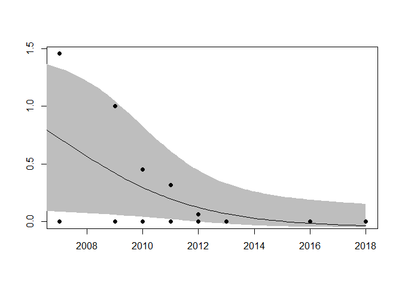
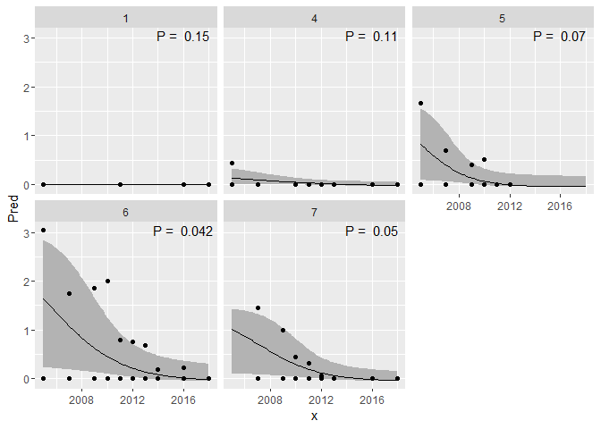
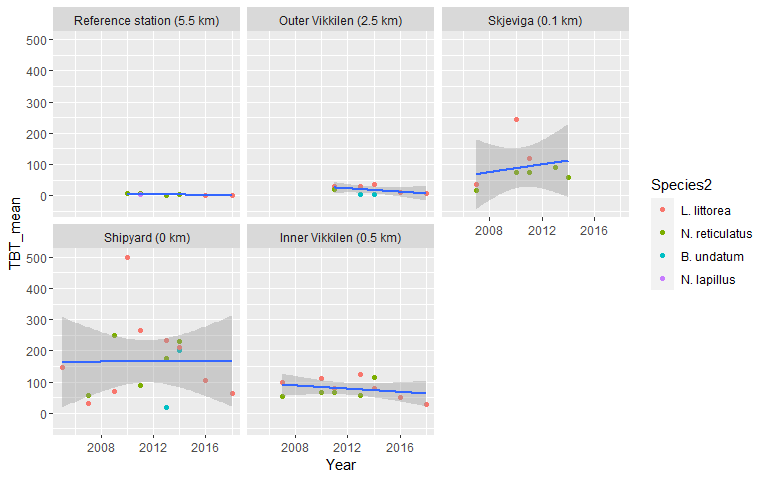

## General
- percentage sterile females (%S) = (number of sterile females/total number of females)*100
    - stage 2-4 females are sterile
- mean Female Penis Length (FPL)
- mean Male Penis Length (MPL)
For N. lapillus,
- Relative Penis Size Index (RPSI) = (FPL)3/(MPL)3*100 
- imposex index (VDSI) = (sum of the values of imposex stages (ranged 0 to 5) in all females/the number of females collected)
For B. undatum
- Penis Classification Index (PCI) after Strand and Jacobsen (2002)


#### Modification 1  
From Merete 20.11.2019
Du er absolutt ikke tungnem, Dag. Det er heller jeg som ikke har fullstendig oversikt når jeg ikke har jobbet med det på en stund. Jeg har kikket nærmere på dette, og vi bør beholde PRL (prostatalengde), men heller kalle det FPrL (average female prostate length= sum of prostate lengths (mm) of all sampled/number of females) i figurene 3 b og c. Vi bytter TBT fra y-aksen til x-aksen i figur 3 c (det fungerte godt i imposex-artikkelen vår).

Hannen til strandsneglen kan kaste penis, derfor tror jeg ikke at det blir brukt RPLI (Relative Penis Length Index). Men det ser ut til å være en peniskjertelindeks (PKI) som Lise har regnet ut. PKI = Σ ant. peniskjertler hos alle innsamlede hanner/antall hanner. Vi kan vente litt med dette og evt. heller ta det med i artikkelen. Jeg kommer ikke til å ta det med i abstractet til SETAC

Hvis du har tid, er det signifikante trender for både TBT og ISI (der hvor det er nok data for utregning)?
Er det god korrelasjon (Kendall?) mellom TBT og ISI, TBT og FPrL og ISI og FPrL?

Så spennende å være på møte med TBT-ekspert. Jeg skal tenke på om jeg har noen spørsmål. Her går det i justering av MILKYS-rapport.

Takk for god hjelp, Dag! 😊


#### Modification 2  
From: Merete Schøyen  
Sent: tirsdag 7. april 2020 17:08  
  
Jeg lurer på om du kan justere figuren nedenfor. Følgende må gjøres:  
1. Vi slår sammen st. 5 og st. 5B og kaller stasjonen «Skjeviga».   
2. Vi tar bort alle stasjonsnummerene, og kaller Håøya for «Reference station», Hasseldalen for «Outer Vikkilen», «Shipyard» og «Inner Vikkilen» heter det samme.  
3. Vi tar bort den stiplede røde linjen for 2016. Den markerer sedimenttiltak, men nedgangen skjer før tiltaket i 2016. Nedgangen skyldes heller forbudet i 2008, og redusert aktivitet på verftet frem til fjerning av tørrdokka i 2012.  
4. Vi vil gjerne at avstanden måles fra Shipyard, slik at denne er 0 km. Vi har et TBT-resultat til for Skjeviga, og når den slås sammen med Båtstø så får vi inn stiplet svart linje.  

#### Modification 3a  
From: Merete Schøyen <merete.schoyen@niva.no> 
Sent: fredag 12. juni 2020 16:35

Jeg jobber (i sommervarmen) med intersex-artikkelen for Vikkilen, og lurer på om du kan justere korrelasjonsfigurene nedenfor ved å slå sammen stasjonene 5 og 5 b, slik du gjorde for ISI-TBT i SETAC-presentasjonen? Da skal stasjonene hete: Reference station, Outer Vikkilen, Skjeviga, Shipyard og Inner Vikkilen. Kendall korrelasjonene vil kanskje endre seg da.
`06_Correlations_Litt_ISI_vs_PRL_col.png`
(Part 4 'PRL_mean vs. ISI')
`06_Correlations_Litt_PRL_vs_TBT_col.png`
(Part 4 'PRL_mean vs. TBT')

Har du også mulighet for å slå sammen 5 og 5 b for all biota samlet? Jeg tror at vi lar stasjonene 2 og 3 med kun blåskjell utgå. Samme stasjonsnavn her: Reference station (5.5 km), Outer Vikkilen (1.5 km), Skjeviga (0.1 km), Shipyard (0 km) og Inner Vikkilen (0.5 km).
`06_Timeseries_allsp_TBT_2_log.png`
(Part 8 'Plot biota TBT at all stations (logistic)')

#### Modification 3b  

From: Merete Schøyen <merete.schoyen@niva.no> 
Sent: torsdag 18. juni 2020 15:23

Dette var fint! Kan du likevel justere figurene mht. dette:
•	ISI og ikke ISE (på korrelasjonsfiguren ISI-FPrL).
•	Ikke mean TBT, er vel bare basert på kun én blandprøve, så dropp mean. Det kan også bare stå ISI og FPrL og ikke mean (det ligger i definisjonene).
•	Figurtekst L. littorea. N. reticulatus, B. undatum, N. lapillus ( i denne rekkefølgen), istedenfor Buccinum, Littorina, Nassarius og Nucella. Dropp Station i figurtekstene.

Kan du også lage en ny korrelasjonsfigur med samme layout for ISI og TBT?
Hva er Kendall korrelasjonene nå for ISI-TBT, ISI-FPrL og FPrL-TBT?


## 0. Libraries

```r
library(dplyr)
```

```
## 
## Attaching package: 'dplyr'
```

```
## The following objects are masked from 'package:stats':
## 
##     filter, lag
```

```
## The following objects are masked from 'package:base':
## 
##     intersect, setdiff, setequal, union
```

```r
library(purrr)    # transpose
library(ggplot2)
library(tidyr)
library(forcats)

# install.packages("openxlsx")
library(openxlsx)
```

## 0b. Settings

```r
save_plots <- TRUE
# save_plots <- FALSE
```


## 0c. Make 5-color palette  

```r
# library("colorspace") 
# The line below: run it in the Console (bottom window), NOT here (RStudio will hang)
# pal <-choose_palette()

library(pals)

if (FALSE){
  labs=c('alphabet','alphabet2', 'glasbey','kelly','polychrome', 
         'stepped', 'stepped2', 'stepped3', 'tol', 'watlington')
  op=par(mar=c(0,5,3,1))
  pal.bands(alphabet(), alphabet2(), glasbey(), kelly(), polychrome(), 
            stepped(), stepped2(), stepped3(), tol(), watlington(), 
            labels=labs, show.names=FALSE)

  pal.bands(tol(5), glasbey(5), kelly(7)[3:7])
  pal.bands(brewer.blues(4), brewer.reds(4))

  }


station_cols <- c(
  brewer.blues(4)[c(4,3,2)], 
  brewer.reds(4)[c(4,2)])
pal.bands(station_cols)
```

<!-- -->

## 0d. Station names

```r
# OLD (before we combined st. 5 and 5b)
st_names <- data.frame(
  Station = c("1", "4", "5", "5b", "6", "7"),
  Station_name = c("St. 1 Håøya, Outer fjord", "St. 4 Hasseldalen", "St. 5 Skjeviga", 
              "St. 5B Båtstø", "St. 6 Shipyard", "St. 7 Inner Vikkilen")
)

# NEW (after combining st. 5 and 5b)
st_names <- data.frame(
  Station = c("1", "4", "5", "6", "7"),
  Station_name = c("Reference station (5.5 km)", "Outer Vikkilen (2.5 km)", 
                   "Skjeviga (0.1 km)", 
                   "Shipyard (0 km)", "Inner Vikkilen (0.5 km)"),
  stringsAsFactors = FALSE
  ) %>%
  mutate(Station_name = fct_inorder(Station_name))  # set as factor, for correct order
  
names(station_cols) <- st_names$Station_name
```


## 1. Data

### a. dat_tbt_mean - all species
16 April 2020: 
- Combine 5 and 5B

```r
dat_intersex_litt <- readRDS(file = "Data/02_Strandsnegl_intersex_2005_2018.RData") %>%
  mutate(Station = case_when(Station %in% "St6" ~ "6",
                             TRUE ~ Station),
         Sex = case_when(tolower(Sex) %in% "f" ~ "f",
                         tolower(Sex) %in% "m" ~ "m",
                         TRUE ~ "x")
         )

dat_tbt <- readRDS(file = "Data/05_TBT.RData")


# Summarise TBT
dat_tbt_mean <- dat_tbt %>% 
  mutate(Station = case_when(
    Station %in% "5b" ~ "5",
    Station != "5b" ~ Station
  )) %>% # View()
  group_by(Species, Station, Year) %>%
  summarise(TBT_mean = mean(TBT, na.rm = TRUE), TBT_flag = mean(TBT_flag %in% "<")) %>%
  ungroup()
```

```
## `summarise()` regrouping output by 'Species', 'Station' (override with `.groups` argument)
```

```r
cat("Raw data \n")
```

```
## Raw data
```

```r
dat_tbt %>% 
  filter(Station %in% c("1","4","5","5b","6","7") & Species == "Littorina") %>%
  xtabs(~Year + Station, .)
```

```
##       Station
## Year   1 4 5 5b 6 7
##   2005 0 0 0  0 1 0
##   2007 0 0 0  1 1 1
##   2009 0 0 0  0 1 0
##   2010 0 0 0  1 1 1
##   2011 1 1 1  1 1 1
##   2013 0 1 0  0 1 1
##   2014 0 1 0  0 1 1
##   2016 1 1 0  0 1 1
##   2018 1 1 0  0 1 1
```

```r
cat("\n")
```

```r
cat("Number of means, 5 and 5B combined \n")
```

```
## Number of means, 5 and 5B combined
```

```r
dat_tbt_mean %>% 
  filter(Station %in% c("1","4","5","5b","6","7") & Species == "Littorina") %>%
  xtabs(~Year + Station, .)
```

```
##       Station
## Year   1 4 5 6 7
##   2005 0 0 0 1 0
##   2007 0 0 1 1 1
##   2009 0 0 0 1 0
##   2010 0 0 1 1 1
##   2011 1 1 1 1 1
##   2013 0 1 0 1 1
##   2014 0 1 0 1 1
##   2016 1 1 0 1 1
##   2018 1 1 0 1 1
```

```r
# str(dat_tbt_mean)
```

### b. Add station names  

```r
dat_tbt_mean <- dat_tbt_mean %>%
  left_join(st_names, by = "Station")

str(dat_tbt_mean)
```

```
## tibble [104 x 6] (S3: tbl_df/tbl/data.frame)
##  $ Species     : chr [1:104] "Buccinum" "Buccinum" "Buccinum" "Buccinum" ...
##  $ Station     : chr [1:104] "4" "4" "6" "6" ...
##  $ Year        : num [1:104] 2013 2014 2013 2014 2011 ...
##  $ TBT_mean    : num [1:104] 4.2 3.1 19.9 201 5 1 1.4 30.4 31 34.7 ...
##  $ TBT_flag    : num [1:104] 0 0 0 0 0 0 0 0 0 0 ...
##  $ Station_name: Factor w/ 5 levels "Reference station (5.5 km)",..: 2 2 4 4 1 1 1 2 2 2 ...
```

## 2. TBT - tables of species

```r
xtabs(~Species, dat_tbt_mean)
```

```
## Species
##  Buccinum Littorina   Mytilus Nassarius   Nucella  Sediment 
##         4        27        16        20         1        36
```

```r
xtabs(~Species + Year, dat_tbt_mean)
```

```
##            Year
## Species     2004 2005 2007 2008 2009 2010 2011 2013 2014 2016 2018
##   Buccinum     0    0    0    0    0    0    0    2    2    0    0
##   Littorina    0    1    3    0    1    3    5    3    3    4    4
##   Mytilus      0    7    3    1    0    0    0    0    0    1    4
##   Nassarius    0    0    3    0    1    3    5    4    4    0    0
##   Nucella      0    0    0    0    0    0    1    0    0    0    0
##   Sediment    14    2    0   16    0    0    0    4    0    0    0
```

## 3. Littorina data
### a1. Chemical data  

```r
# xtabs(~Station + df_name, dat_tbt %>% filter(Species %in% "Littorina"))
xtabs(~Station + Year, dat_tbt %>% filter(Species %in% "Littorina"))
```

```
##        Year
## Station 2005 2007 2009 2010 2011 2013 2014 2016 2018
##      1     0    0    0    0    1    0    0    1    1
##      4     0    0    0    0    1    1    1    1    1
##      5     0    0    0    0    1    0    0    0    0
##      5b    0    1    0    1    1    0    0    0    0
##      6     1    1    1    1    1    1    1    1    1
##      7     0    1    0    1    1    1    1    1    1
```

```r
tab_tbt <- dat_tbt_mean %>%
  filter(Species %in% "Littorina") %>%
  group_by(Station, Year) %>%
  spread(Year, TBT_mean)

tab_tbt
```

```
## # A tibble: 5 x 13
## # Groups:   Station [5]
##   Species Station TBT_flag Station_name `2005` `2007` `2009` `2010` `2011`
##   <chr>   <chr>      <dbl> <fct>         <dbl>  <dbl>  <dbl>  <dbl>  <dbl>
## 1 Littor~ 1              0 Reference s~     NA   NA     NA       NA    5  
## 2 Littor~ 4              0 Outer Vikki~     NA   NA     NA       NA   30.4
## 3 Littor~ 5              0 Skjeviga (0~     NA   35.7   NA      243  120. 
## 4 Littor~ 6              0 Shipyard (0~    148   31.3   69.8    500  266  
## 5 Littor~ 7              0 Inner Vikki~     NA   97.7   NA      113   78.8
## # ... with 4 more variables: `2013` <dbl>, `2014` <dbl>, `2016` <dbl>,
## #   `2018` <dbl>
```

### a2. Save TBT data to excel

```r
if (save_plots){
  wb <- openxlsx::createWorkbook("DHJ")
  openxlsx::addWorksheet(wb, "Littorina TBT")
  openxlsx::writeData(wb, sheet = 1, tab_tbt)
  # openxlsx::saveWorkbook(wb, "Figures/06_Littorina_tables.xlsx", overwrite = TRUE)
}
```


### b. Intersex data, show tables  

```r
dat_intersex_litt %>%
  count(Sex, Female, Male)
```

```
## # A tibble: 2 x 4
##   Sex   Female  Male     n
##   <chr>  <dbl> <dbl> <int>
## 1 f          1     0   982
## 2 m          0     1   916
```

```r
dat_intersex_litt %>%
  count(Station, Year, Sex) %>%
  spread(Sex, n)
```

```
## # A tibble: 39 x 4
##    Station  Year     f     m
##    <chr>   <dbl> <int> <int>
##  1 1        2005    19    12
##  2 1        2011    28    22
##  3 1        2016    29    21
##  4 1        2018    32    16
##  5 4        2005    25    25
##  6 4        2007    12    18
##  7 4        2010    22    28
##  8 4        2011    25    25
##  9 4        2012    27    23
## 10 4        2013    23    27
## # ... with 29 more rows
```

### c1. Mean data per station/year, and add TBT  
dat_intersex_litt_summ 

- percentage sterile females (%S) = (number of sterile females/total number of females)*100  
    - stage 2-4 females are sterile  
- mean Female Penis Length (FPL)  
- mean Male Penis Length (MPL)  
- For N. lapillus,  
    - Relative Penis Size Index (RPSI) = (FPL)3/(MPL)3*100   
- imposex index (VDSI) = (sum of the values of imposex stages (ranged 0 to 5) in all females/the number of females collected)  
  
16 April 2020: 
- Combine 5 and 5B

```r
dat_intersex_litt_summ <- dat_intersex_litt %>%
  ungroup() %>%
  mutate(Station = case_when(
    Station %in% "5b" ~ "5",
    Station != "5b" ~ Station),
    PRL = case_when(
      is.na(PRL) ~ 0,
      !is.na(PRL) ~ PRL),
    ISI = case_when(
      is.na(ISI) ~ 0,
      !is.na(ISI) ~ ISI)
    ) %>% # View()
  group_by(Station, Year, Sex) %>%
  summarize(ISI_mean = mean(ISI, na.rm = FALSE),
            N_ISI = sum(!is.na(ISI)),
            Sterile_perc = mean((ISI >= 2)*100, na.rm = TRUE),
            PRL_mean = mean(PRL, na.rm = FALSE),
            ) %>%
  ungroup()
```

```
## `summarise()` regrouping output by 'Station', 'Year' (override with `.groups` argument)
```

```r
nrow(dat_intersex_litt_summ)
```

```
## [1] 72
```

```r
# Add TBT_mean, TBT_flag
dat_intersex_litt_summ <- dat_intersex_litt_summ %>%
  left_join(dat_tbt_mean %>% 
              ungroup() %>%
              filter(Species %in% "Littorina") %>%
              mutate(Sex = "f") %>%    # to avoid that data are duplicated 
              select(Station, Year, Sex, TBT_mean, TBT_flag), 
            by = c("Station", "Year", "Sex")
            )

nrow(dat_intersex_litt_summ)
```

```
## [1] 72
```

### c2. Add station names  

```r
dat_intersex_litt_summ <- dat_intersex_litt_summ %>%
  left_join(st_names, by = "Station")


# str(dat_intersex_litt_summ)
# dat_intersex_litt_summ$Station
```

### c3. Save intersex data to excel
Add to existing 'wb' excel workbook  

```r
if (save_plots){
  openxlsx::addWorksheet(wb, "Littorina ISI raw")
  openxlsx::writeData(wb, sheet = "Littorina ISI raw", dat_intersex_litt)
  openxlsx::addWorksheet(wb, "Littorina ISI summ")
  openxlsx::writeData(wb, sheet = "Littorina ISI summ", dat_intersex_litt_summ)
}
```


### d1. Overview tables of mean values

```r
tab_ISI <- dat_intersex_litt_summ %>%
  filter(Sex %in% "f") %>%
  mutate(ISI_mean = round(ISI_mean, 2)) %>%
  select(Station, Year, ISI_mean) %>%
  spread(Year, ISI_mean)
tab_ISI
```

```
## # A tibble: 5 x 11
##   Station `2005` `2007` `2009` `2010` `2011` `2012` `2013` `2014` `2016` `2018`
##   <chr>    <dbl>  <dbl>  <dbl>  <dbl>  <dbl>  <dbl>  <dbl>  <dbl>  <dbl>  <dbl>
## 1 1         0     NA     NA     NA      0     NA     NA     NA      0         0
## 2 4         0.44   0     NA      0      0      0      0     NA      0         0
## 3 5         1.67   0.68   0.4    0.52   0      0     NA     NA     NA        NA
## 4 6         3.05   1.75   1.85   2      0.79   0.76   0.69   0.19   0.22      0
## 5 7        NA      1.45   1      0.45   0.32   0.06   0     NA      0         0
```

```r
tab_PRL <- dat_intersex_litt_summ %>%
  filter(Sex %in% "f") %>%
  mutate(PRL_mean = round(PRL_mean, 2)) %>%
  select(Station, Year, PRL_mean) %>%
  filter(!is.na(PRL_mean)) %>%
  spread(Year, PRL_mean)
tab_PRL
```

```
## # A tibble: 5 x 11
##   Station `2005` `2007` `2009` `2010` `2011` `2012` `2013` `2014` `2016` `2018`
##   <chr>    <dbl>  <dbl>  <dbl>  <dbl>  <dbl>  <dbl>  <dbl>  <dbl>  <dbl>  <dbl>
## 1 1         0     NA     NA     NA      0      NA    NA     NA       0        0
## 2 4         0.18   0     NA      0      0       0     0     NA       0        0
## 3 5         1.84   1.31   0.6    0.84   0       0    NA     NA      NA       NA
## 4 6         5.24   2.99   3.24   3.15   1.18    0.7   0.64   0.12    0.1      0
## 5 7        NA      2.5    1.63   0.82   0.62    0     0     NA       0        0
```

```r
tab_sterile <- dat_intersex_litt_summ %>%
  filter(Sex %in% "f") %>%
  mutate(Sterile_perc = round(Sterile_perc, 1)) %>%
  select(Station, Year, Sterile_perc) %>%
  filter(!is.na(Sterile_perc)) %>%
  spread(Year, Sterile_perc)
tab_sterile
```

```
## # A tibble: 5 x 11
##   Station `2005` `2007` `2009` `2010` `2011` `2012` `2013` `2014` `2016` `2018`
##   <chr>    <dbl>  <dbl>  <dbl>  <dbl>  <dbl>  <dbl>  <dbl>  <dbl>  <dbl>  <dbl>
## 1 1            0   NA     NA     NA      0     NA     NA     NA      0        0
## 2 4            4    0     NA      0      0      0      0     NA      0        0
## 3 5           50   21.1   10     16.1    0      0     NA     NA     NA       NA
## 4 6           95   56.2   55.6   64.5   25.6   18.2   20.7    3.2    6.2      0
## 5 7           NA   45.5   25     13.6   10.5    0      0     NA      0        0
```

```r
dat_intersex_litt_summ %>%
  mutate(PRL_mean = round(PRL_mean, 2)) %>%
  select(Station, Year, Sex, PRL_mean) %>%
  spread(Sex, PRL_mean)
```

```
## # A tibble: 36 x 4
##    Station  Year     f     m
##    <chr>   <dbl> <dbl> <dbl>
##  1 1        2005  0        0
##  2 1        2011  0        0
##  3 1        2016  0        0
##  4 1        2018  0        0
##  5 4        2005  0.18     0
##  6 4        2007  0        0
##  7 4        2010  0        0
##  8 4        2011  0        0
##  9 4        2012  0        0
## 10 4        2013  0        0
## # ... with 26 more rows
```

```r
tab_tbt
```

```
## # A tibble: 5 x 13
## # Groups:   Station [5]
##   Species Station TBT_flag Station_name `2005` `2007` `2009` `2010` `2011`
##   <chr>   <chr>      <dbl> <fct>         <dbl>  <dbl>  <dbl>  <dbl>  <dbl>
## 1 Littor~ 1              0 Reference s~     NA   NA     NA       NA    5  
## 2 Littor~ 4              0 Outer Vikki~     NA   NA     NA       NA   30.4
## 3 Littor~ 5              0 Skjeviga (0~     NA   35.7   NA      243  120. 
## 4 Littor~ 6              0 Shipyard (0~    148   31.3   69.8    500  266  
## 5 Littor~ 7              0 Inner Vikki~     NA   97.7   NA      113   78.8
## # ... with 4 more variables: `2013` <dbl>, `2014` <dbl>, `2016` <dbl>,
## #   `2018` <dbl>
```

### d2. Save summary tables to excel  

```r
if (save_plots){
  openxlsx::addWorksheet(wb, "Littorina ISI")
  openxlsx::writeData(wb, sheet = "Littorina ISI", tab_ISI)
  openxlsx::addWorksheet(wb, "Littorina sterile")
  openxlsx::writeData(wb, sheet = "Littorina sterile", tab_ISI)
  openxlsx::addWorksheet(wb, "Littorina PRL")
  openxlsx::writeData(wb, sheet = "Littorina PRL", tab_PRL)
  openxlsx::saveWorkbook(wb, "Figures/06_Littorina_tables.xlsx", overwrite = TRUE)
}
```


## 4. Littorina correlation figures

### ISI vs TBT


```r
gg <- ggplot(dat_intersex_litt_summ, aes(TBT_mean, ISI_mean)) +
  geom_smooth(method = "lm", color = "black") +
  labs(x = "TBT (μg/kg w.w.)", y = "ISI")

gg1 <- gg +
  geom_point(aes(fill = Station_name), pch = 21, size = rel(2)) +
  scale_fill_manual("", values = station_cols)

gg2 <- gg +
  geom_point(aes(shape = Station_name), size = rel(2))

if (save_plots){
  ggsave("Figures/06_Correlations_Litt_ISI_vs_TBT_col.png", gg1, 
         width = 7, height = 5, dpi = 500)
  ggsave("Figures/06_Correlations_Litt_ISI_vs_TBT_bw.png", gg2, 
         width = 7, height = 5, dpi = 500)
}
```

```
## `geom_smooth()` using formula 'y ~ x'
```

```
## Warning: Removed 47 rows containing non-finite values (stat_smooth).
```

```
## Warning: Removed 47 rows containing missing values (geom_point).
```

```
## `geom_smooth()` using formula 'y ~ x'
```

```
## Warning: Removed 47 rows containing non-finite values (stat_smooth).

## Warning: Removed 47 rows containing missing values (geom_point).
```

```r
gg1
```

```
## `geom_smooth()` using formula 'y ~ x'
```

```
## Warning: Removed 47 rows containing non-finite values (stat_smooth).

## Warning: Removed 47 rows containing missing values (geom_point).
```

<!-- -->

```r
gg2
```

```
## `geom_smooth()` using formula 'y ~ x'
```

```
## Warning: Removed 47 rows containing non-finite values (stat_smooth).

## Warning: Removed 47 rows containing missing values (geom_point).
```

<!-- -->

### PRL_mean vs. TBT


```r
gg <- ggplot(dat_intersex_litt_summ, aes(TBT_mean, PRL_mean)) +
  geom_smooth(method = "lm") +
  labs(x = "TBT (μg/kg w.w.)", y = "FPrL")

gg1 <- gg + scale_color_brewer(palette = "Dark2") +
  geom_point(aes(fill = Station_name), pch = 21, size = rel(2)) +
  scale_fill_manual("", values = station_cols)

gg2 <- gg + scale_color_brewer(palette = "Dark2") +
  geom_point(aes(shape = Station_name), size = rel(2))

if (save_plots){
  ggsave("Figures/06_Correlations_Litt_PRL_vs_TBT_col.png", gg1, 
         width = 7, height = 5, dpi = 500)
  ggsave("Figures/06_Correlations_Litt_PRL_vs_TBT_bw.png", gg2, 
         width = 7, height = 5, dpi = 500)
}
```

```
## `geom_smooth()` using formula 'y ~ x'
```

```
## Warning: Removed 47 rows containing non-finite values (stat_smooth).
```

```
## Warning: Removed 47 rows containing missing values (geom_point).
```

```
## `geom_smooth()` using formula 'y ~ x'
```

```
## Warning: Removed 47 rows containing non-finite values (stat_smooth).

## Warning: Removed 47 rows containing missing values (geom_point).
```

```r
gg1
```

```
## `geom_smooth()` using formula 'y ~ x'
```

```
## Warning: Removed 47 rows containing non-finite values (stat_smooth).

## Warning: Removed 47 rows containing missing values (geom_point).
```

<!-- -->

```r
gg2
```

```
## `geom_smooth()` using formula 'y ~ x'
```

```
## Warning: Removed 47 rows containing non-finite values (stat_smooth).

## Warning: Removed 47 rows containing missing values (geom_point).
```

<!-- -->


### Sterile vs. ISI

```r
gg <- ggplot(dat_intersex_litt_summ, aes(ISI_mean, Sterile_perc)) +
  geom_smooth(method = "lm", color = "black") +
  labs(x = "ISI", y = "Percentage sterile females (%)")

gg1 <- gg + scale_color_brewer(palette = "Dark2") +
  geom_point(aes(fill = Station_name), pch = 21, size = rel(2)) +
  scale_fill_manual("", values = station_cols)

gg2 <- gg + scale_color_brewer(palette = "Dark2") +
  geom_point(aes(shape = Station_name), size = rel(2))

# save_plots <- TRUE
if (save_plots){
  ggsave("Figures/06_Correlations_Litt_Sterile_vs_ISI_col.png", gg1, 
         width = 7, height = 5, dpi = 500)
  ggsave("Figures/06_Correlations_Litt_Sterile_vs_ISI_bw.png", gg2, 
         width = 7, height = 5, dpi = 500)
}
```

```
## `geom_smooth()` using formula 'y ~ x'
## `geom_smooth()` using formula 'y ~ x'
```

```r
gg1
```

```
## `geom_smooth()` using formula 'y ~ x'
```

<!-- -->

```r
gg2
```

```
## `geom_smooth()` using formula 'y ~ x'
```

<!-- -->

### Correlations

```r
print_correlations <- function(){
  
  cat("=================================\nCorrelation TBT_mean, ISI_mean \n\n")
  with(dat_intersex_litt_summ, cor.test(TBT_mean, ISI_mean, method = "kendall")) %>% print()
  
  cat("=================================\nCorrelation TBT_mean, PRL_mean \n\n")
  with(dat_intersex_litt_summ, cor.test(TBT_mean, PRL_mean, method = "kendall")) %>% print()
  
  cat("=================================\nCorrelation PRL_mean, ISI_mean \n\n")
  with(dat_intersex_litt_summ, cor.test(PRL_mean, ISI_mean, method = "kendall")) %>% print()
  
  cat("=================================\nCorrelation Sterile_perc, ISI_mean \n\n")
  with(dat_intersex_litt_summ, cor.test(Sterile_perc, ISI_mean, method = "kendall")) %>% print()
  
}

# Print to file
fn <- "Figures/06_Kendall_correlations.txt"
con <- file(fn, open = "w")
sink(con)
print_correlations()
```

```
## =================================
## Correlation TBT_mean, ISI_mean
```

```
## Warning in cor.test.default(TBT_mean, ISI_mean, method = "kendall"): Cannot
## compute exact p-value with ties
```

```
## 
## 	Kendall's rank correlation tau
## 
## data:  TBT_mean and ISI_mean
## z = 3.0305, p-value = 0.002442
## alternative hypothesis: true tau is not equal to 0
## sample estimates:
##       tau 
## 0.4604593 
## 
## =================================
## Correlation TBT_mean, PRL_mean
```

```
## Warning in cor.test.default(TBT_mean, PRL_mean, method = "kendall"): Cannot
## compute exact p-value with ties
```

```
## 
## 	Kendall's rank correlation tau
## 
## data:  TBT_mean and PRL_mean
## z = 2.9311, p-value = 0.003377
## alternative hypothesis: true tau is not equal to 0
## sample estimates:
##       tau 
## 0.4453623 
## 
## =================================
## Correlation PRL_mean, ISI_mean 
## 
## 
## 	Kendall's rank correlation tau
## 
## data:  PRL_mean and ISI_mean
## z = 9.0891, p-value < 2.2e-16
## alternative hypothesis: true tau is not equal to 0
## sample estimates:
##       tau 
## 0.9546601 
## 
## =================================
## Correlation Sterile_perc, ISI_mean 
## 
## 
## 	Kendall's rank correlation tau
## 
## data:  Sterile_perc and ISI_mean
## z = 9.1552, p-value < 2.2e-16
## alternative hypothesis: true tau is not equal to 0
## sample estimates:
##       tau 
## 0.9616094
```

```r
sink()
close(con)

# Show file
# file.show(fn)

# Print to result
cat("\n")
```

```r
print_correlations()
```

```
## =================================
## Correlation TBT_mean, ISI_mean
```

```
## Warning in cor.test.default(TBT_mean, ISI_mean, method = "kendall"): Cannot
## compute exact p-value with ties
```

```
## 
## 	Kendall's rank correlation tau
## 
## data:  TBT_mean and ISI_mean
## z = 3.0305, p-value = 0.002442
## alternative hypothesis: true tau is not equal to 0
## sample estimates:
##       tau 
## 0.4604593 
## 
## =================================
## Correlation TBT_mean, PRL_mean
```

```
## Warning in cor.test.default(TBT_mean, PRL_mean, method = "kendall"): Cannot
## compute exact p-value with ties
```

```
## 
## 	Kendall's rank correlation tau
## 
## data:  TBT_mean and PRL_mean
## z = 2.9311, p-value = 0.003377
## alternative hypothesis: true tau is not equal to 0
## sample estimates:
##       tau 
## 0.4453623 
## 
## =================================
## Correlation PRL_mean, ISI_mean 
## 
## 
## 	Kendall's rank correlation tau
## 
## data:  PRL_mean and ISI_mean
## z = 9.0891, p-value < 2.2e-16
## alternative hypothesis: true tau is not equal to 0
## sample estimates:
##       tau 
## 0.9546601 
## 
## =================================
## Correlation Sterile_perc, ISI_mean 
## 
## 
## 	Kendall's rank correlation tau
## 
## data:  Sterile_perc and ISI_mean
## z = 9.1552, p-value < 2.2e-16
## alternative hypothesis: true tau is not equal to 0
## sample estimates:
##       tau 
## 0.9616094
```

### TBT vs time, all stations   

```r
# TBT_mean vs. Time, for all stations combined - actually significan 
with(dat_intersex_litt_summ, cor.test(TBT_mean, Year, method = "kendall"))
```

```
## Warning in cor.test.default(TBT_mean, Year, method = "kendall"): Cannot compute
## exact p-value with ties
```

```
## 
## 	Kendall's rank correlation tau
## 
## data:  TBT_mean and Year
## z = -2.01, p-value = 0.04443
## alternative hypothesis: true tau is not equal to 0
## sample estimates:
##        tau 
## -0.2992142
```

```r
# ANCOVA TBT_mean vs. time, adjusted for station 
mod <- lm(log(TBT_mean) ~ Year + Station, data = dat_intersex_litt_summ)
summary(mod)
```

```
## 
## Call:
## lm(formula = log(TBT_mean) ~ Year + Station, data = dat_intersex_litt_summ)
## 
## Residuals:
##     Min      1Q  Median      3Q     Max 
## -1.7136 -0.3604 -0.0193  0.5581  1.2314 
## 
## Coefficients:
##              Estimate Std. Error t value Pr(>|t|)    
## (Intercept) 117.51254   92.71008   1.268  0.22028    
## Year         -0.05800    0.04601  -1.261  0.22273    
## Station4      2.11130    0.59616   3.541  0.00218 ** 
## Station5      3.64225    0.68815   5.293 4.15e-05 ***
## Station6      4.04460    0.54511   7.420 5.03e-07 ***
## Station7      3.50559    0.56339   6.222 5.62e-06 ***
## ---
## Signif. codes:  0 '***' 0.001 '**' 0.01 '*' 0.05 '.' 0.1 ' ' 1
## 
## Residual standard error: 0.78 on 19 degrees of freedom
##   (47 observations deleted due to missingness)
## Multiple R-squared:  0.8094,	Adjusted R-squared:  0.7593 
## F-statistic: 16.14 on 5 and 19 DF,  p-value: 2.885e-06
```

```r
visreg::visreg(mod)
```

<!-- --><!-- -->

```r
# As above, excluding the reference station
mod <- lm(log(TBT_mean) ~ Year + Station, data = dat_intersex_litt_summ %>% filter(Station != 1))
summary(mod)
```

```
## 
## Call:
## lm(formula = log(TBT_mean) ~ Year + Station, data = dat_intersex_litt_summ %>% 
##     filter(Station != 1))
## 
## Residuals:
##      Min       1Q   Median       3Q      Max 
## -1.64693 -0.41237  0.02469  0.55534  1.25305 
## 
## Coefficients:
##             Estimate Std. Error t value Pr(>|t|)    
## (Intercept) 89.40958   98.39571   0.909 0.376225    
## Year        -0.04300    0.04884  -0.880 0.390953    
## Station5     1.60845    0.65379   2.460 0.024892 *  
## Station6     1.97913    0.49745   3.979 0.000971 ***
## Station7     1.42429    0.51901   2.744 0.013834 *  
## ---
## Signif. codes:  0 '***' 0.001 '**' 0.01 '*' 0.05 '.' 0.1 ' ' 1
## 
## Residual standard error: 0.7897 on 17 degrees of freedom
##   (42 observations deleted due to missingness)
## Multiple R-squared:  0.5537,	Adjusted R-squared:  0.4487 
## F-statistic: 5.273 on 4 and 17 DF,  p-value: 0.005999
```

```r
visreg::visreg(mod)
```

<!-- --><!-- -->

```r
# As above, excluding years before 2010
mod <- lm(log(TBT_mean) ~ Year + Station, data = dat_intersex_litt_summ %>% filter(Year >= 2010))
summary(mod)
```

```
## 
## Call:
## lm(formula = log(TBT_mean) ~ Year + Station, data = dat_intersex_litt_summ %>% 
##     filter(Year >= 2010))
## 
## Residuals:
##      Min       1Q   Median       3Q      Max 
## -0.44069 -0.20507  0.00678  0.20136  0.44473 
## 
## Coefficients:
##              Estimate Std. Error t value Pr(>|t|)    
## (Intercept) 419.65502   49.78351   8.430 7.41e-07 ***
## Year         -0.20794    0.02471  -8.417 7.55e-07 ***
## Station4      2.03632    0.22836   8.917 3.79e-07 ***
## Station5      3.55735    0.29435  12.085 8.54e-09 ***
## Station6      4.30886    0.21367  20.166 9.61e-12 ***
## Station7      3.30293    0.22076  14.961 5.27e-10 ***
## ---
## Signif. codes:  0 '***' 0.001 '**' 0.01 '*' 0.05 '.' 0.1 ' ' 1
## 
## Residual standard error: 0.2986 on 14 degrees of freedom
##   (30 observations deleted due to missingness)
## Multiple R-squared:  0.9786,	Adjusted R-squared:  0.971 
## F-statistic: 128.2 on 5 and 14 DF,  p-value: 3.531e-11
```

```r
visreg::visreg(mod)
```

<!-- --><!-- -->

```r
# Plot 
gg <- ggplot(dat_intersex_litt_summ, aes(Year, TBT_mean)) +
  geom_smooth(method = "lm") + 
  scale_color_brewer(palette = "Dark2") +
  geom_point(aes(shape = Station), size = rel(2))
gg
```

```
## `geom_smooth()` using formula 'y ~ x'
```

```
## Warning: Removed 47 rows containing non-finite values (stat_smooth).
```

```
## Warning: Removed 47 rows containing missing values (geom_point).
```

<!-- -->

```r
# ?visreg::visreg
```

## 5. Littorina time series plots

  ### TBT


```r
ggplot(dat_intersex_litt_summ, aes(Year, TBT_mean)) +
  geom_point() +
  facet_wrap(vars(Station))
```

```
## Warning: Removed 47 rows containing missing values (geom_point).
```

<!-- -->

###  ISI

```r
ggplot(dat_intersex_litt_summ, aes(Year, ISI_mean)) +
  geom_point() +
  facet_wrap(vars(Station))
```

<!-- -->

### Mean PRL

```r
ggplot(dat_intersex_litt_summ, aes(Year, PRL_mean)) +
  geom_point() +
  facet_wrap(vars(Station))
```

<!-- -->


### Mean PRL

```r
ggplot(dat_intersex_litt_summ, aes(Year, PRL_mean)) +
  geom_point() +
  facet_wrap(vars(Station))
```

<!-- -->

## 6. Littorina plots using logistic function

```r
source("06_Tables_graphs_functions.R")
```


### Example for TBT 

```r
st <- "7"
df <- dat_intersex_litt_summ %>% filter(Station %in% st & !is.na(TBT_mean))
df_pred <- pred_logistic(df$Year, df$TBT_mean, x_range = c(2005, 2018))

plot(TBT_mean ~ Year, data = df, type = "n", xlab = "", ylab = "") 
with(df_pred$fit, polygon.lines(x, Pred_lo, Pred_hi, border = FALSE)) 
with(df_pred$fit, lines(x, Pred)) 
with(df, points(Year, TBT_mean, pch = 19)) 
```

<!-- -->


### Example for ISI 

```r
st <- "7"
df <- dat_intersex_litt_summ %>% filter(Station %in% st & !is.na(ISI_mean))
df_pred <- pred_logistic(df$Year, df$ISI_mean, x_range = c(2005, 2018), a = 0.05)

plot(ISI_mean ~ Year, data = df, type = "n", xlab = "", ylab = "") 
with(df_pred$fit, polygon.lines(x, Pred_lo, Pred_hi, border = FALSE)) 
with(df_pred$fit, lines(x, Pred)) 
with(df, points(Year, ISI_mean, pch = 19)) 
```

<!-- -->

### ISI, ggplot variant

```r
pvalue <- summary(df_pred$model)$coef["x","Pr(>|t|)"]
ggplot() + 
  geom_ribbon(data = df_pred$fit, aes(x, ymin = Pred_lo, ymax = Pred_hi), fill = "grey70") +
  geom_path(data = df_pred$fit, aes(x, y = Pred)) +
  annotate("text", x = 2016, y = 1.3, label = paste("P =", round(pvalue, 4)))
```

<!-- -->

### Plot two stations

```r
predlist <- list(
  pred_logistic_from_stationname("6", "ISI_mean"),
  pred_logistic_from_stationname("7", "ISI_mean")
)

# Combine
df_pred <- bind_rows(predlist[[1]]$fit, predlist[[2]]$fit)
df_pvalue <- bind_rows(predlist[[1]]$pvalue, predlist[[2]]$pvalue)
df <- dat_intersex_litt_summ %>% filter(Station %in% c("6","7") & !is.na(ISI_mean))

# Plot
ggplot() + 
  geom_ribbon(data = df_pred, aes(x, ymin = Pred_lo, ymax = Pred_hi), fill = "grey70") +
  geom_path(data = df_pred, aes(x, y = Pred)) +
  geom_point(data = df, aes(Year, ISI_mean)) +
  geom_text(data = df_pvalue, aes(x = 2016, y = Inf, label = Text), vjust = 1.2) +
  facet_wrap(vars(Station))
```

<!-- -->

### Plot ISI at all stations

```r
sts <- unique(dat_intersex_litt_summ$Station)
df_pred_list <- sts %>% lapply(pred_logistic_from_stationname, variable = "ISI_mean")
```

```
## Warning in summary.lm(pred$model): essentially perfect fit: summary may be
## unreliable
```

```r
names(df_pred_list) <- sts
# df_pred_list[["5b"]]

# Collect data for plotting 
df_pred <- bind_rows(transpose(df_pred_list)$fit)
df_pvalue <- bind_rows(transpose(df_pred_list)$pvalue)
df <- dat_intersex_litt_summ %>% filter(!is.na(ISI_mean))

# Plot
ggplot() + 
  geom_ribbon(data = df_pred, aes(x, ymin = Pred_lo, ymax = Pred_hi), fill = "grey70") +
  geom_path(data = df_pred, aes(x, y = Pred)) +
  geom_point(data = df, aes(Year, ISI_mean)) +
  geom_text(data = df_pvalue, aes(x = 2016, y = Inf, label = Text), vjust = 1.2) +
  facet_wrap(vars(Station))
```

<!-- -->


### Plot percent sterile at all stations

```r
# Run all stations (as above)
sts <- unique(dat_intersex_litt_summ$Station)
df_pred_list <- sts %>% lapply(pred_logistic_from_stationname, variable = "Sterile_perc")
```

```
## Warning in summary.lm(pred$model): essentially perfect fit: summary may be
## unreliable
```

```r
names(df_pred_list) <- sts

# Check p-values
transpose(df_pred_list)$pvalue %>% bind_rows()
```

```
##   Station      Text               Station_name
## 1       1 P =  0.15 St. 1 Håøya, Outer fjord
## 2       4 P =  0.11          St. 4 Hasseldalen
## 3       5 P =  0.08             St. 5 Skjeviga
## 4       6 P =  0.06             St. 6 Shipyard
## 5       7 P =  0.06       St. 7 Inner Vikkilen
```

```r
# Run 4 using linear regression
df_pred_list[["4"]] <- pred_linear_from_stationname("4", "Sterile_perc")

# Collect data for plotting 
df_pred <- bind_rows(transpose(df_pred_list)$fit)
df_pvalue <- bind_rows(transpose(df_pred_list)$pvalue)
df <- dat_intersex_litt_summ %>% filter(!is.na(Sterile_perc))

# Plot
gg <- ggplot() + 
  geom_ribbon(data = df_pred, aes(x, ymin = Pred_lo, ymax = Pred_hi), fill = "grey70") +
  geom_path(data = df_pred, aes(x, y = Pred)) +
  geom_point(data = df, aes(Year, Sterile_perc)) +
  geom_text(data = df_pvalue, aes(x = 2016, y = Inf, label = Text), vjust = 1.2) +
  facet_wrap(vars(Station)) +
  labs(title = "Percent of sterile females", x = "Year", y = "Percent sterile")
if (save_plots)
  ggsave("Figures/06_Timeseries_Litt_sterile.png", gg)
```

```
## Saving 7 x 5 in image
```

```r
gg
```

<!-- -->


### Plot PRL at all stations

```r
# We make regressions for only two stations
sts <- c("6", "7")
df_pred_list <- sts %>% lapply(pred_logistic_from_stationname, variable = "PRL_mean")
names(df_pred_list) <- sts
# df_pred_list[["5b"]]

# Collect data for plotting 
df_pred <- bind_rows(transpose(df_pred_list)$fit)
df_pvalue <- bind_rows(transpose(df_pred_list)$pvalue)
df <- dat_intersex_litt_summ %>% filter(!is.na(PRL_mean))

# Plot
gg <- ggplot() + 
  geom_ribbon(data = df_pred, aes(x, ymin = Pred_lo, ymax = Pred_hi), fill = "grey70") +
  geom_path(data = df_pred, aes(x, y = Pred)) +
  geom_point(data = df, aes(Year, PRL_mean)) +
  geom_text(data = df_pvalue, aes(x = 2016, y = Inf, label = Text), vjust = 1.2) +
  facet_wrap(vars(Station)) +
  labs(x = "Year", y = "FPrL")
if (save_plots)
  ggsave("Figures/06_Timeseries_Litt_PRL.png", gg)
```

```
## Saving 7 x 5 in image
```

```r
gg
```

<!-- -->

### Plot TBT at all stations

```r
# Run all stations (as above)
sts_tbt <- dat_intersex_litt_summ %>%
  ungroup() %>%
  filter(!is.na(TBT_mean)) %>%
  count(Station) %>%
  filter(n >= 3) %>%
  pull(Station)

# debugonce(pred_logistic_from_stationname)
df_pred_list <- sts_tbt %>% lapply(pred_logistic_from_stationname, variable = "TBT_mean")
names(df_pred_list) <- sts_tbt

# Run 5b using linear regression
# df_pred_list[["5b"]] <- pred_linear_from_stationname("5b", "ISI_mean")

# Collect data for plotting 
df_pred_tbt <- bind_rows(transpose(df_pred_list)$fit)
df_pvalue_tbt <- bind_rows(transpose(df_pred_list)$pvalue)
df_points_tbt <- dat_intersex_litt_summ %>% filter(!is.na(TBT_mean))

# Plot
gg <- ggplot() + 
  geom_ribbon(data = df_pred_tbt, aes(x, ymin = Pred_lo, ymax = Pred_hi), fill = "grey70") +
  geom_path(data = df_pred_tbt, aes(x, y = Pred)) +
  geom_point(data = df_points_tbt, aes(Year, TBT_mean)) +
  geom_text(data = df_pvalue_tbt, aes(x = 2016, y = Inf, label = Text), vjust = 1.2) +
  facet_wrap(vars(Station)) +
  labs(title = "TBT", x = "Year", y = "TBT concentration")
if (save_plots)
  ggsave("Figures/06_Timeseries_Litt_TBT.png", gg)
```

```
## Saving 7 x 5 in image
```

```r
gg
```

<!-- -->

## 7. Combined figures, ISI + TBT

### Data

```r
# # OLD (before we combined st. 5 and 5b)
# st_names <- data.frame(
#   Station = c("1", "4", "5", "5b", "6", "7"),
#   Station_name = c("St. 1 Håøya, Outer fjord", "St. 4 Hasseldalen", "St. 5 Skjeviga", 
#               "St. 5B Båtstø", "St. 6 Shipyard", "St. 7 Inner Vikkilen")
# )
# 
# # NEW (after combining st. 5 and 5b)
# st_names <- data.frame(
#   Station = c("1", "4", "5", "6", "7"),
#   Station_name = c("Reference station", "Outer Vikkilen", "Skjeviga", 
#                    "Shipyard", "Inner Vikkilen")
# )
# 
# dat_intersex_litt_summ <- dat_intersex_litt_summ %>%
#   left_join(st_names, by = "Station")
# 
# # In orddr to get correct order in plots
# dat_intersex_litt_summ$Station_name <- factor(dat_intersex_litt_summ$Station_name,
#                                               levels = c("Reference station", "Outer Vikkilen", 
#                                                 "Skjeviga", "Shipyard", "Inner Vikkilen"))
# 
# # dat_intersex_litt_summ$Station
```

### Get predicted (fitted) lines   

```r
#
# ISI
#

sts <- unique(dat_intersex_litt_summ$Station)
df_pred_list <- sts %>% lapply(pred_logistic_from_stationname, variable = "ISI_mean")
```

```
## Warning in summary.lm(pred$model): essentially perfect fit: summary may be
## unreliable
```

```r
names(df_pred_list) <- sts

# Check p-values<
transpose(df_pred_list)$pvalue %>% bind_rows()
```

```
##   Station       Text               Station_name
## 1       1  P =  0.15 St. 1 Håøya, Outer fjord
## 2       4  P =  0.11          St. 4 Hasseldalen
## 3       5  P =  0.07             St. 5 Skjeviga
## 4       6 P =  0.042             St. 6 Shipyard
## 5       7  P =  0.05       St. 7 Inner Vikkilen
```

```r
# For those with pvalue > 0.05, we use a flat line instead for these:
for (st in c("1","4"))
  df_pred_list[[st]] <- pred_flat_from_stationname(st, "ISI_mean")

# Collect data for plotting 
df_pred_isi <- bind_rows(transpose(df_pred_list)$fit)
df_pvalue_isi <- bind_rows(transpose(df_pred_list)$pvalue)
df_points_isi <- dat_intersex_litt_summ %>% filter(!is.na(ISI_mean))

# In orddr to get correct order in plots
# Only needed for df_pred_isi, since that is the one used in ggplot()
df_pred_isi$Station_name <- factor(df_pred_isi$Station_name,
                                   levels = c("Reference station", "Outer Vikkilen", 
                                              "Skjeviga", "Shipyard", "Inner Vikkilen"))


#
# TBT (sts_tbt defined in previous chunk)
#
# debugonce(pred_logistic_from_stationname)
df_pred_list <- sts_tbt %>% lapply(pred_logistic_from_stationname, variable = "TBT_mean")
names(df_pred_list) <- sts_tbt

# Check p-values
transpose(df_pred_list)$pvalue %>% bind_rows()
```

```
##   Station      Text               Station_name
## 1       1 P =  0.29 St. 1 Håøya, Outer fjord
## 2       4 P =  0.05          St. 4 Hasseldalen
## 3       5  P =  0.6             St. 5 Skjeviga
## 4       6  P =  0.9             St. 6 Shipyard
## 5       7 P =  0.19       St. 7 Inner Vikkilen
```

```r
# pvalue > 0.05, so we use a flat line instead for these:
for (st in c("5","6"))
  df_pred_list[[st]] <- pred_flat_from_stationname(st, "TBT_mean")

# Collect data for plotting 
df_pred_tbt <- bind_rows(transpose(df_pred_list)$fit)
df_pvalue_tbt <- bind_rows(transpose(df_pred_list)$pvalue)
df_points_tbt <- dat_intersex_litt_summ %>% filter(!is.na(TBT_mean))

# Test plots for each separately
if (FALSE) {
  ggplot() + 
    # geom_ribbon(data = df_pred_isi, aes(x, ymin = Pred_lo, ymax = Pred_hi), fill = "grey70") +
    geom_path(data = df_pred_isi, aes(x, y = Pred)) +
    geom_point(data = df_points_isi, aes(Year, ISI_mean)) +
    # geom_text(data = df_pvalue_isi, aes(x = 2016, y = Inf, label = Text), vjust = 1.2) +
    facet_wrap(vars(Station)) +
    labs(title = "ISI", x = "Year", y = "ISI")
  
  ggplot() + 
    geom_path(data = df_pred_tbt, aes(x, y = Pred)) +
    geom_point(data = df_points_tbt, aes(Year, TBT_mean)) +
    facet_wrap(vars(Station)) +
    labs(title = "TBT", x = "Year", y = "TBT concentration")
  
}
```

### Plotting ISI + TBT combination   
THIS IS A MESS NOW  - DUE TO DIFFERENT FACTOR LEVELS
Method from https://stackoverflow.com/a/53703152/1734247 

```r
ylim.prim <- c(0, 3.5)     # ISI
ylim.sec <- c(0, 510)    # TBT
cols <- RColorBrewer::brewer.pal(8, "Dark2")

b <- diff(ylim.prim)/diff(ylim.sec)
a <- b*(ylim.prim[1] - ylim.sec[1])

# OLD (before we combined st. 5 and 5b)
df_km <- data.frame(
  Station_name = c("St. 1 Håøya, Outer fjord", "St. 4 Hasseldalen", "St. 5 Skjeviga", 
                   "St. 5B Båtstø", "St. 6 Shipyard", "St. 7 Inner Vikkilen"),
  Km = c("6 km", "2 km", "0.6 km", "0.55 km", "0.5 km", "0 km"),
  stringsAsFactors = FALSE
)

# NEW (for SETAC)
df_km <- data.frame(
  Station_name = c("Reference station", "Outer Vikkilen", "Skjeviga", 
                   "Shipyard", "Inner Vikkilen"),
  Km = c("5.5 km", "1.5 km", "0.1 km", "0 km", "0.5 km"),
  stringsAsFactors = FALSE
)

# For correct order in plot
df_km$Station_name <- factor(df_km$Station_name,
                             levels = c("Reference station", "Outer Vikkilen", 
                                        "Skjeviga", "Shipyard", "Inner Vikkilen"))

gg <- ggplot() + 
  geom_path(data = df_pred_isi, aes(x, y = Pred), color = cols[1]) +
  geom_point(data = df_points_isi, aes(Year, ISI_mean), color = cols[1]) +
  geom_path(data = df_pred_tbt, aes(x, y = a + b*Pred), color = cols[2]) +
  geom_point(data = df_points_isi, aes(Year, a + b*TBT_mean), color = cols[2]) +
  geom_text(data = df_km, aes(x = 2016, y = Inf, label = Km), vjust = 1.2) +
  scale_y_continuous("ISI", sec.axis = sec_axis(~ (. - a)/b, name = "TBT")) +
  facet_wrap(vars(Station_name)) +
  labs(title = "ISI and TBT", x = "Year") + 
  theme_bw() +
    theme(
        axis.line.y.left = element_line(color = cols[1]), 
        axis.ticks.y.left = element_line(color = cols[1]),
        axis.text.y.left = element_text(color = cols[1]), 
        axis.title.y.left = element_text(color = cols[1]),
        axis.line.y.right = element_line(color = cols[2]), 
        axis.ticks.y.right = element_line(color = cols[2]),
        axis.text.y.right = element_text(color = cols[2]), 
        axis.title.y.right = element_text(color = cols[2])
        )

if (save_plots)
  ggsave("Figures/06_Timeseries_Comb_ISI_TBT.png", gg, 
         width = 7, height = 5, dpi = 500)
```

```
## Warning: Removed 47 rows containing missing values (geom_point).
```

```r
gg
```

```
## Warning: Removed 47 rows containing missing values (geom_point).
```

<!-- -->

#### B/W


```r
cols2 <- c("black", "black")

gg <- ggplot() + 
  geom_ribbon(data = df_pred_isi, aes(x, ymin = Pred_lo, ymax = Pred_hi), 
              fill = "grey70", alpha = 0.5) +
  geom_path(data = df_pred_isi, aes(x, y = Pred), color = cols2[1]) +
  geom_point(data = df_points_isi, aes(Year, ISI_mean), color = cols2[1]) +
  geom_ribbon(data = df_pred_tbt, aes(x, ymin = a + b*Pred_lo, ymax = a + b*Pred_hi), 
              fill = "grey70", alpha = 0.5) +
  geom_path(data = df_pred_tbt, aes(x, y = a + b*Pred), color = cols2[2],
            linetype = 2) +
  geom_point(data = df_points_isi, aes(Year, a + b*TBT_mean), color = cols2[2],
             shape = 17) +
  geom_vline(xintercept = c(2008), color = "red2", linetype = 2) +
  geom_text(data = df_km, aes(x = 2016, y = Inf, label = Km), vjust = 1.2) +
  scale_y_continuous("ISI (circles)", 
                     sec.axis = sec_axis(~ (. - a)/b, name = "TBT (triangles)")) +
  facet_wrap(vars(Station_name)) +
  labs(title = "ISI and TBT", x = "Year") + 
  theme_bw() +
    theme(
        axis.line.y.left = element_line(color = cols2[1]), 
        axis.ticks.y.left = element_line(color = cols2[1]),
        axis.text.y.left = element_text(color = cols2[1]), 
        axis.title.y.left = element_text(color = cols2[1]),
        axis.line.y.right = element_line(color = cols2[2]), 
        axis.ticks.y.right = element_line(color = cols2[2]),
        axis.text.y.right = element_text(color = cols2[2]), 
        axis.title.y.right = element_text(color = cols2[2])
        )

if (save_plots)
#  ggsave("Figures/06_Timeseries_Comb_ISI_TBT_bw.png", gg, 
#         width = 7, height = 5, dpi = 500)

gg
```

```
## Warning: Removed 47 rows containing missing values (geom_point).
```

<!-- -->

```r
# ?points
```


## 8. TBT - all species

### Add 'Species2' (actual species name, not genus)   

```r
dat_tbt_mean <- dat_tbt_mean %>%
  mutate(Species2 =
           case_when(
             Species %in% "Buccinum" ~ "B. undatum",
             Species %in% "Littorina" ~ "L. littorea",
             Species %in% "Nassarius" ~ "N. reticulatus",
             Species %in% "Nucella" ~ "N. lapillus",
             Species %in% "Mytilus" ~ "M. edulis"
           ),
         Species2 = factor(Species2, 
                           levels = c("L. littorea", "N. reticulatus", 
                                      "B. undatum", "N. lapillus", "M. edulis"))
         ) 
```

### Plot biota TBT at all stations (linear)

```r
# Run all stations (as above)
gg <- dat_tbt_mean %>%
  filter(!Species %in% c("Sediment", "Mytilus")) %>%
  filter(!is.na(TBT_mean)) %>%
  ggplot(aes(Year, TBT_mean)) +
    geom_point(aes(color = Species2)) + 
    geom_smooth(method = "lm") +
    facet_wrap(vars(Station_name))

if (save_plots){
  ggsave("Figures/06_Timeseries_allsp_TBT_1.png", gg)
  ggsave("Figures/06_Timeseries_allsp_TBT_1_log.png", gg + scale_y_log10())
}
```

```
## Saving 8 x 5 in image
```

```
## `geom_smooth()` using formula 'y ~ x'
```

```
## Saving 8 x 5 in image
```

```
## `geom_smooth()` using formula 'y ~ x'
```

```r
gg
```

```
## `geom_smooth()` using formula 'y ~ x'
```

<!-- -->

```r
gg + scale_y_log10()
```

```
## `geom_smooth()` using formula 'y ~ x'
```

<!-- -->


### Plot biota TBT at all stations (logistic)   


```r
df <- dat_tbt_mean %>%
  filter(!Species %in% c("Sediment", "Mytilus")) %>%
  filter(!is.na(TBT_mean))
sts <- unique(df$Station_name)
# sts <- c("1", "4", "5", "6", "7")
pred_list <- sts %>% lapply(
  function(st) {
    df_station <- df %>% filter(Station_name %in% st)
    result <- pred_logistic_from_data(df_station, variable = "TBT_mean")
    result$fit$Station_name <- st
    result$pvalue$Station_name <- st
    result
  })
names(pred_list) <- sts

str(pred_list, 1)       # List of 5
```

```
## List of 5
##  $ Outer Vikkilen (2.5 km)   :List of 2
##  $ Shipyard (0 km)           :List of 2
##  $ Reference station (5.5 km):List of 2
##  $ Skjeviga (0.1 km)         :List of 2
##  $ Inner Vikkilen (0.5 km)   :List of 2
```

```r
str(pred_list[[1]], 1)  # List of 2: $fit  and $pvalue
```

```
## List of 2
##  $ fit   :'data.frame':	100 obs. of  6 variables:
##  $ pvalue:'data.frame':	1 obs. of  2 variables:
```

```r
# Collect data for plotting 
df_pred <- bind_rows(transpose(pred_list)$fit)
df_pvalue <- bind_rows(transpose(pred_list)$pvalue)

# Plot
gg <- ggplot() + 
  geom_ribbon(data = df_pred, aes(x, ymin = Pred_lo, ymax = Pred_hi), fill = "grey70") +
  geom_path(data = df_pred, aes(x, y = Pred)) +
  geom_point(data = df, aes(Year, TBT_mean, fill = Species2), size = 2, pch = 21) +
  scale_fill_discrete("Species") +
  geom_text(data = df_pvalue, aes(x = 2016, y = Inf, label = Text), vjust = 1.2) +
  facet_wrap(vars(Station_name)) +
  labs(title = "TBT", x = "Year", y = "TBT concentration")

if (save_plots){
  ggsave("Figures/06_Timeseries_allsp_TBT_2.png", 
         gg,
         width = 8, height = 5, dpi = 500)
  ggsave("Figures/06_Timeseries_allsp_TBT_2_log.png", 
         gg + scale_y_log10(limits = c(0.3, 900)),
         width = 8, height = 5, dpi = 500)
}

gg
```

<!-- -->

```r
gg + scale_y_log10(limits = c(0.3, 900))
```

<!-- -->

### Plot sediment TBT at all stations

```r
# Run all stations (as above)
gg <- dat_tbt_mean %>%
  filter(Species %in% "Sediment") %>%
  filter(Station %in% c("1", "2", "3", "4", "5", "6")) %>%
  filter(!is.na(TBT_mean)) %>%
  ggplot(aes(Year, TBT_mean)) +
    geom_point(aes(color = Species)) + 
    geom_smooth(method = "lm", se = FALSE) +
    facet_wrap(vars(Station))

gg
```

```
## `geom_smooth()` using formula 'y ~ x'
```

<!-- -->

```r
gg + scale_y_log10()
```

```
## `geom_smooth()` using formula 'y ~ x'
```

<!-- -->

```r
if (save_plots)
  ggsave("Figures/06_Timeseries_TBT_sediment_log.png", gg + scale_y_log10())
```

```
## Saving 7.5 x 5 in image
## `geom_smooth()` using formula 'y ~ x'
```

```r
gg
```

```
## `geom_smooth()` using formula 'y ~ x'
```

<!-- -->

### Plot blue mussel TBT at all stations

```r
# Run all stations (as above)
gg <- dat_tbt_mean %>%
  filter(Species %in% "Mytilus") %>%
  filter(Station %in% c("1", "2", "3", "4", "5", "6")) %>%
  filter(!is.na(TBT_mean)) %>%
  ggplot(aes(Year, TBT_mean)) +
    geom_point(aes(color = Species)) + 
    geom_smooth(method = "lm", se = FALSE) +
    facet_wrap(vars(Station))

gg
```

```
## `geom_smooth()` using formula 'y ~ x'
```

<!-- -->

```r
gg + scale_y_log10()
```

```
## `geom_smooth()` using formula 'y ~ x'
```

<!-- -->

```r
if (save_plots)
  ggsave("Figures/06_Timeseries_TBT_bluemussel_log.png", gg + scale_y_log10())
```

```
## Saving 7.5 x 5 in image
## `geom_smooth()` using formula 'y ~ x'
```

```r
gg
```

```
## `geom_smooth()` using formula 'y ~ x'
```

<!-- -->


### Plot TBT in blue mussel vs. TBT in Littorina  

```r
# Run all stations (as above)
df <- dat_tbt_mean %>%
  filter(Species %in% c("Littorina", "Mytilus")) %>%
  filter(Station %in% c("1", "4", "5", "6")) %>%
  filter(!is.na(TBT_mean)) %>%
  select(Species2, Station_name, Year, TBT_mean) %>%
  # count(Species2, Station_name, Year) %>% filter(n > 1)    # for checking dublettes
  tidyr::pivot_wider(names_from = Species2, values_from = TBT_mean) %>%
  filter(!is.na(`M. edulis`) & !is.na(`L. littorea`))
nrow(df)
```

```
## [1] 5
```

```r
gg <- ggplot(df, aes(`L. littorea`, `M. edulis`)) +
    geom_point(aes(fill = Station_name), size = 2, pch = 21) +
  scale_fill_manual(values = station_cols) +
    geom_smooth(method = "lm", se = FALSE) +
  labs(x = "TBT in L. littorea (μg/kg w.w.)", 
       y = "TBT in M. edulis (μg/kg w.w.)")

if (save_plots)
  ggsave("Figures/06_Correlations_TBT_bluemussel_vs_Littorina.png", gg,
         width = 7, height = 5, dpi = 500)
```

```
## `geom_smooth()` using formula 'y ~ x'
```

```r
cat("=================================\nCorrelation of TBT values \n\n")
```

```
## =================================
## Correlation of TBT values
```

```r
with(df, cor.test(`L. littorea`, `M. edulis`, method = "kendall"))
```

```
## 
## 	Kendall's rank correlation tau
## 
## data:  L. littorea and M. edulis
## T = 7, p-value = 0.4833
## alternative hypothesis: true tau is not equal to 0
## sample estimates:
## tau 
## 0.4
```

```r
gg
```

```
## `geom_smooth()` using formula 'y ~ x'
```

<!-- -->


